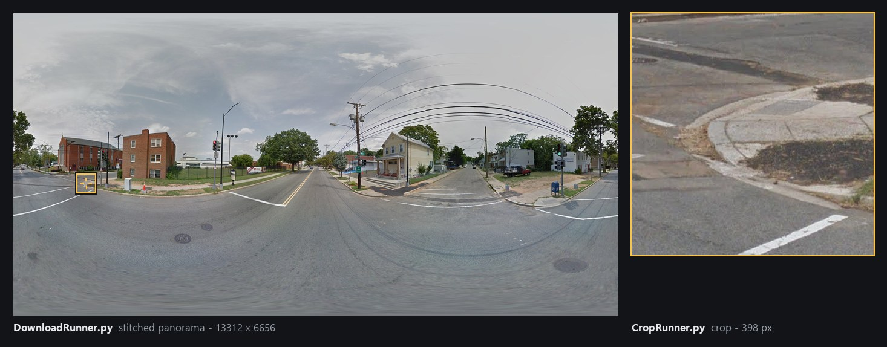

<p align="center">
  
</p>

# sidewalk-panorama-tools

[](https://github.com/ProjectSidewalk/sidewalk-panorama-tools/actions/workflows/tests.yml)
[](https://www.python.org/)

Python tooling that turns [Project Sidewalk](https://github.com/ProjectSidewalk/SidewalkWebpage)'s
crowdsourced accessibility labels into machine-learning data: it downloads the Google Street View and
Mapillary panoramas those labels sit on, downloads Google's depth maps for them, and cuts one image per label
out of the panorama. It runs unattended every night, per city, across ~50 deployments.

| Tool | What it does |
|---|---|
| [`DownloadRunner.py`](docs/downloader.md) | Downloads panoramas and depth maps for one city into a pano store. Actively maintained; this is the one in production. |
| [`CropRunner.py`](docs/cropper.md) | Cuts one crop per label out of the downloaded panoramas. Works, but is being replaced — bugs may linger. |
| [`log_analyzer/analyze.py`](docs/log-analyzer.md) | Watches the nightly run across every city and exits nonzero when one looks broken. |
| [`migrate_depth_artifacts.py`](docs/depth.md#migrating-a-pre-v2-store) | One-off, idempotent rewrite of depth artifacts written before the v2 format. |

## Quick start

```bash
git clone https://github.com/ProjectSidewalk/sidewalk-panorama-tools.git
cd sidewalk-panorama-tools
python3 -m venv .venv
source .venv/bin/activate          # Windows: .venv\Scripts\Activate.ps1
pip install -r requirements.txt
```

Download a city's panoramas and depth maps into `/srv/panos/columbus-oh`:

```bash
python3 DownloadRunner.py sidewalk-columbus.cs.washington.edu /srv/panos/columbus-oh
```

Then cut a crop for every label in that city:

```bash
python3 CropRunner.py -d sidewalk-columbus.cs.washington.edu \
  -s /srv/panos/columbus-oh -o /srv/crops/columbus-oh
```

The server name is any deployed city — visit one to get the dropdown listing the rest. Both tools resume:
re-running skips whatever is already on disk, so an interrupted run costs nothing but the interruption.
Budget a run with `--max-runtime MINUTES`, and see [the downloader docs](docs/downloader.md#nightly-deployment)
for the nightly cron form.

> **Requirements:** Python 3.10+ and ~2 GB RAM (a 16384×8192 panorama is 384 MB decoded). Linux is the
> supported production platform; macOS and Windows are fine for development, though the depth phase's
> `pyfrpc` dependency ships wheels for Linux only. **No Docker** — the image and its sshfs entrypoint were
> [retired in Aug 2026](docs/history.md#the-docker-image-aug-2026).

## Documentation

| | |
|---|---|
| [Downloader](docs/downloader.md) | Install, options, runtime budgets, imagery sources, `config.py`, nightly deployment |
| [Cropper](docs/cropper.md) | Crop geometry, the two preflights, outcome taxonomy, and what to know before training on the crops |
| [Depth maps](docs/depth.md) | The `.npz` artifact format, the plane fields, migration — and **what the depth product is and isn't** |
| [Ops](docs/ops.md) | Storage layout, the resume ledgers, the 18-column `log.csv`, and how a crashed run reads |
| [Log analyzer](docs/log-analyzer.md) | SFTP setup and the per-city health checks |
| [API fields](docs/api-fields.md) | Every column of `/adminapi/panos` and `/adminapi/labels/cvMetadata`, plus the label type IDs |
| [Testing](docs/testing.md) | What the suite covers and the three ways it is deliberately unusual |
| [History](docs/history.md) | What we removed and why |
| [Contributing](CONTRIBUTING.md) | Setup, conventions, and good first improvements |

## The pano store

One directory per city, sharded by the first two characters of the pano id:

| Path | What |
|---|---|
| `<pano_id[:2]>/<pano_id>.jpg` | Stitched panorama |
| `<pano_id[:2]>/<pano_id>.depth.npz` | Depth artifact |
| `pano_id_log.csv` | Image ledger — a row means the outcome is permanent |
| `depth_log.csv` | Depth ledger — likewise |
| `log.csv` | One 18-column row per run |
| `scrape.log` | Rotating run log |

Transient failures deliberately leave no ledger row, so they retry on the next run; the files on disk are the
ground truth. Details in [Ops](docs/ops.md).

## Before you build on the depth maps

The depth map is **Google's plane-based model of the scene, not a measurement of it**. Vehicles, people, and
vegetation are absent — a ray aimed at a parked car returns the ground behind it. `-1` means "no plane" (sky,
*or* anything unmodeled), not "far away". Curb ramps sit ~0.15 m above the modeled road surface, which is a
bias, not noise. Read [What the depth product is (and isn't)](docs/depth.md#what-the-depth-product-is-and-isnt)
first.

## Reports

[`reports/`](reports/README.md) holds write-ups of the data-driven investigations behind the thresholds and
behaviours in this repo — what was measured, how, what came out, and what changed as a result, wrong turns
included. Each one commits the data it cites and the script that produced it, and is pinned by tests, because
a conclusion about external behaviour gets re-argued months later when nobody can reproduce the original
measurement.

Recent examples: [what the seam fix reaches](reports/2026-08-10-crop-geometry-review.md) (1.52% of 438,410
labels), [the click-noise floor](reports/2026-08-09-click-noise.md) (σ ≈ 0.3°/axis between users), and
[the first Mapillary city](reports/2026-08-11-mapillary-census.md). The [index](reports/README.md) lists all
of them.

## Tests

```bash
pip3 install -r requirements.txt -r requirements-dev.txt
python3 -m pytest tests
```

Network-free, `streetlevel` stubbed, run on Ubuntu 22.04 / Python 3.10 in CI for every push and pull request.
See [docs/testing.md](docs/testing.md).

## Contributing

Issues and pull requests are welcome — see [CONTRIBUTING.md](CONTRIBUTING.md) for setup and the conventions
this repo holds itself to (tests first, data committed alongside findings, and a dated write-up for anything
data-driven).

## Related

* [SidewalkWebpage](https://github.com/ProjectSidewalk/SidewalkWebpage) — Project Sidewalk itself, and the
  source of the labels these tools consume.
* [RampNet](https://github.com/ProjectSidewalk/RampNet) — curb-ramp detection trained on 210k+ auto-annotated
  panoramas.
* [label-latlng-estimation](https://github.com/ProjectSidewalk/label-latlng-estimation) — estimating a label's
  real-world latitude and longitude from its position on the panorama.

---

Built by the [Makeability Lab](https://makeabilitylab.cs.washington.edu/) at the University of Washington.
