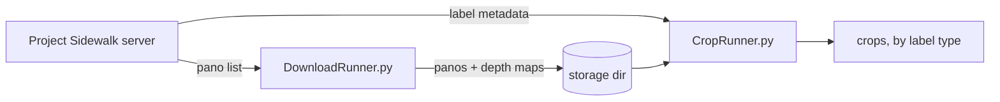

# sidewalk-panorama-tools

[](https://github.com/ProjectSidewalk/sidewalk-panorama-tools/actions/workflows/tests.yml)

Python tools that turn [Project Sidewalk](https://github.com/ProjectSidewalk/SidewalkWebpage)'s
crowdsourced accessibility labels into computer-vision-ready datasets: they download the underlying
street-level panoramas (Google Street View and Mapillary) plus GSV depth maps, then crop out the
labeled features (curb ramps, obstacles, surface problems, …) for ML training.



| Script | Purpose |
|--------|---------|
| [`DownloadRunner.py`](DownloadRunner.py) | Downloads every panorama a Project Sidewalk city has labels on, plus GSV depth maps. Resumable; designed to run nightly. |
| [`CropRunner.py`](CropRunner.py) | Cuts a crop around each label using the label's pixel position on the pano. |
| [`migrate_depth_artifacts.py`](migrate_depth_artifacts.py) | One-time fixer for depth artifacts written before the format-v2 mirror fix (see [Depth maps](#depth-maps)). |

The downloader is actively used in production; the cropper is functional but less exercised
(a new version is in the works), so cropper bugs may go unnoticed longer.

## Contents

- [Requirements](#requirements)
- [Quick start](#quick-start)
- [Downloader](#downloader)
- [Depth maps](#depth-maps)
- [Cropper](#cropper)
- [Running with Docker](#running-with-docker)
- [Data reference](#data-reference)
- [Development](#development)
- [Project history](#project-history)

## Requirements

- **Python 3.10+** and the packages in `requirements.txt`. Everything is pure Python; Linux, macOS,
  and Windows all work. One caveat: [streetlevel](https://github.com/sk-zk/streetlevel) (used for
  depth maps) depends on `pyfrpc`, whose prebuilt wheel coverage is spotty — if pip falls back to
  building it from source you'll need a C compiler.
- **~2 GB RAM.** Stitched panoramas are large (up to 16384×8192), and processing them can crash
  very-low-memory machines.
- Docker is **optional** — it's how we deploy the nightly scraper, not a prerequisite.
  See [Running with Docker](#running-with-docker).

## Quick start

```bash
git clone https://github.com/ProjectSidewalk/sidewalk-panorama-tools.git
cd sidewalk-panorama-tools
pip3 install -r requirements.txt

# Download panos + depth maps for a city
python3 DownloadRunner.py sidewalk-columbus.cs.washington.edu ./panos

# Crop the labeled features out of them
python3 CropRunner.py -d sidewalk-columbus.cs.washington.edu -s ./panos -o ./crops
```

The first argument is a Project Sidewalk server domain. Visit any deployment (e.g.
<https://sidewalk-columbus.cs.washington.edu>) and use the city dropdown to see the public cities
you can pull from.

Heads-up before your first big run: a full city is tens to hundreds of GB, the downloader
[never retries a pano it has logged as failed](#what-gets-written), and the cropper
[draws a dot on every crop by default](#the-mark_label-flag).

## Downloader

```
python3 DownloadRunner.py <sidewalk-server-fqdn> <storage-path> [options]
```

| Argument / flag | Meaning |
|-----------------|---------|
| `<sidewalk-server-fqdn>` | Project Sidewalk server to fetch the pano list from, e.g. `sidewalk-columbus.cs.washington.edu`. |
| `<storage-path>` | Directory to store the panos (created if missing). |
| `-c <csv>` | Read pano metadata from a CSV instead of the server's `/adminapi/panos`. Must contain the same columns (notably `pano_id` and `source`). |
| `--all-panos` | Also download *images* for panos users visited but never labeled. Does not affect depth, which always covers every GSV pano. |
| `--skip-depth` | Skip the [depth-map phase](#depth-maps) (on by default). |
| `--max-runtime MINUTES` | Stop starting new downloads/requests after this much wall time. Exists to keep a run inside its daily cron slot (see [#38](https://github.com/ProjectSidewalk/sidewalk-panorama-tools/issues/38)); the image and depth phases share this one budget. |
| `--min-depth-runtime MINUTES` | Reserve the last MINUTES of `--max-runtime` for the depth phase when there is unresolved depth work, so an image backlog can't starve the depth backfill (see [Sharing the runtime budget](#sharing-the-runtime-budget) for the exact semantics). Default 0 (no reservation); **the recommended production crontab value is `--min-depth-runtime 60`**. Ignored without `--max-runtime` or with `--skip-depth`. Beware: if the reservation meets or exceeds `--max-runtime`, the run downloads **no images** (it prints a loud `WARNING`). |
| `--max-depth-requests N` | Stop the depth phase after N metadata requests (throttle for the initial backfill). |

### Configuration (`config.py`)

| Setting | Meaning |
|---------|---------|
| `thread_count` | Parallel connections for tile downloads. I/O-bound, so higher is generally faster — test what your machine and network tolerate. |
| `proxies` | Proxy for all requests. Leave the placeholder values as-is for no proxy. |
| `headers_list` | Pool of real browser headers; each tile request picks one at random. Edit or extend freely. |
| `depth_min_request_interval` | Floor (seconds) between depth-map requests. See [being a good citizen](#being-a-good-citizen-of-googles-servers). |

### Imagery sources

Each pano is dispatched to a source-specific module in `downloaders/` based on the `source` field
from `/adminapi/panos`. Panos with an unsupported source are skipped with a warning (and not marked
as processed, so a later run with support can pick them up).

- **Google Street View (`gsv`)** — no configuration needed; stitches 512×512 tiles from the
  undocumented CBK endpoint.
- **Mapillary (`mapillary`)** — downloads the original-resolution equirectangular image via the
  [Graph API v4](https://www.mapillary.com/developer/api-documentation). Requires a client token:
  1. Create one at <https://www.mapillary.com/dashboard/developers> (default read scopes suffice).
  2. Export it as `MAPILLARY_ACCESS_TOKEN` before running:
     ```bash
     export MAPILLARY_ACCESS_TOKEN='MLY|...'
     python3 DownloadRunner.py <sidewalk-fqdn> <storage-dir>
     ```

### What gets written

```
<storage-path>/
├── xB/                      # panos sharded by the first 2 chars of pano_id
│   ├── xBcD….jpg            # stitched equirectangular panorama
│   └── xBcD….depth.npz      # GSV depth map, where available
├── pano_id_log.csv          # image ledger: pano_id,downloaded (1|0)
├── depth_log.csv            # depth ledger: pano_id,saved|unavailable
├── log.csv                  # one 18-column row per run (positional; see table below)
└── scrape.log               # debug log for all phases
```

**Resume semantics:** any pano with a row in `pano_id_log.csv` — success *or* failure — is never
re-attempted, which keeps nightly runs fast but means transient network failures stick. To retry
failed panos, delete their `downloaded = 0` rows (or the whole file: panos whose `.jpg` already
exists are re-registered as skipped without re-downloading).

**The `log.csv` columns.** Each run appends one row of 18 positional comma-separated fields (no
header), parsed by our `scraper-log-analyzer` tooling. Durations are whole minutes (rounded).
Fields 2–6 describe the XML metadata phase, a stub since Google killed that endpoint in 2022 —
kept so the column positions never shift:

| # | field | notes |
|---|-------|-------|
| 1 | run start timestamp | `str(datetime.now())`, e.g. `2026-08-06 01:00:00.123456` |
| 2 | metadata successes | always `0` (stub) |
| 3 | metadata failures | always `0` (stub) |
| 4 | metadata skipped | count of image-eligible panos (stub) |
| 5 | metadata total processed | count of image-eligible panos (stub) |
| 6 | metadata phase duration | effectively `0` (stub) |
| 7 | image successes | |
| 8 | image fallback successes | downloaded, but at a fallback resolution |
| 9 | image failures | includes prior runs' failed panos, seeded from `pano_id_log.csv` |
| 10 | image skipped | includes panos already downloaded on previous runs, seeded likewise |
| 11 | image total processed | sum of fields 7–10 |
| 12 | image phase duration | |
| 13 | depth successes | |
| 14 | depth failures | includes permanent `unavailable` outcomes — see [Ops notes](#ops-notes) |
| 15 | depth skipped | panos already resolved in `depth_log.csv` |
| 16 | depth total processed | sum of fields 13–15 |
| 17 | depth phase duration | |
| 18 | total run duration | |

**Blank fields mark a crashed or stopped run.** A run that crashes (or is `docker stop`ped) still
appends a full 18-field row: every phase that completed keeps its real counts, and every field from
the first unfinished phase onward is blank — visibly missing data, never a fabricated `0`. A row
that is only a timestamp means the run died before scraping started (most likely the pano-list
fetch against the webserver failed). Blanks are new as of
[#49](https://github.com/ProjectSidewalk/sidewalk-panorama-tools/issues/49) — historical rows are
all-integer — so readers must treat them as missing data (`pandas.read_csv` surfaces them as `NaN`,
turning those columns `float64`) rather than feeding them to `int()`.

## Depth maps

`DownloadRunner.py` downloads a depth map for every GSV pano by default, using the
[streetlevel](https://github.com/sk-zk/streetlevel) library to fetch and decode Google's photometa
response (pass `--skip-depth` to turn this off). Not every pano has depth data — third-party and
some older panos don't — so the phase saves it where available and records the outcome either way.

### The artifact

The depth map is stored next to the pano's `.jpg` and loads with numpy:

```python
import numpy as np
d = np.load("xB/xBcD….depth.npz")
d["depth"]           # float32 (height, width) array, typically 256x512; distance from camera in meters; -1 = no plane (sky, or unmodeled)
d["heading"]         # camera heading in radians (NaN if Google omitted it); likewise d["pitch"], d["roll"]
d["format_version"]  # 2; absent in artifacts written before the mirror fix below
```

The array shares the JPEG's orientation: column 0 of `d["depth"]` is the leftmost column of the
pano image. (streetlevel's decoder delivers the payload x-mirrored relative to the imagery; we flip
it back on write, and contract tests pin the decoder's end-to-end output orientation — both the
ray-direction formula and the write order — so an upstream change fails CI instead of silently
re-mirroring new artifacts; see
[#58](https://github.com/ProjectSidewalk/sidewalk-panorama-tools/issues/58). **An artifact with no
`format_version` field predates that fix and is horizontally flipped — see
[Migrating a pre-v2 store](#migrating-a-pre-v2-store).**) To sample the depth under a label
position stored in the database:

```python
col = int(pano_x / pano_width * d["depth"].shape[1]) % d["depth"].shape[1]
row = min(int(pano_y / pano_height * d["depth"].shape[0]), d["depth"].shape[0] - 1)
meters = d["depth"][row, col]
```

(Truncation, not `round()`: each depth pixel covers a *range* of pano columns, and flooring picks
the pixel containing the position; rounding would pick the pixel whose edge is nearest — a
systematic half-pixel shift.) The payload is angular (~0.7°/pixel; the horizon at θ = π/2 falls
midway between the two middle rows, not on a single row), so this scaling works for any pano
resolution. Note the frame caveat: `pano_x` and the pano raster are both *heading-centred* (column
0 sits at compass bearing `pano_yaw − 180°`, the vehicle's forward direction at image centre), but
the legacy pre-evolution-179 `sv_image_x` is *north-referenced* (`sv_image_x / 13312 × 360` is a
true compass bearing). Mixing the legacy value with the raster or this array displaces a label by
up to half a panorama — and by nothing at all on a pano that happens to face south, so a
one-example sanity check can pass on the wrong convention.

### The ledger

`depth_log.csv` is an append-only ledger (`pano_id,status`) of resolved outcomes: `saved` (artifact
written) or `unavailable` (pano gone from Google, or no depth payload). Ledgered panos are never
re-requested; transient network failures are *not* ledgered, so they retry on the next run. The
artifacts on disk are the ground truth — deleting the ledger is safe and just makes the next run
re-check everything (existing artifacts are re-registered without re-downloading).

### Migrating a pre-v2 store

Any store scraped before the [#58](https://github.com/ProjectSidewalk/sidewalk-panorama-tools/issues/58)
fix holds x-mirrored artifacts, and the scraper will never correct them on its own — existing
artifacts are never re-fetched or rewritten. `migrate_depth_artifacts.py` detects and fixes them
offline: it scans a storage root, flips every artifact whose `format_version` is missing or below
2, and stamps it, leaving v2 artifacts byte-for-byte untouched (idempotent, so re-running on a
healthy store is a no-op):

```bash
python3 migrate_depth_artifacts.py /path/to/storage --dry-run   # count pre-v2 artifacts, change nothing
python3 migrate_depth_artifacts.py /path/to/storage             # rewrite them in place
```

### Sharing the runtime budget

The depth phase runs after the image phase, and the two share one `--max-runtime` budget — that
flag bounds the whole run to its daily cron slot, and the slot doesn't care which phase spends the
clock. Because images run first, a big image backlog (a mapathon influx — which is also exactly
when many new panos want depth) could starve the backfill night after night. `--min-depth-runtime`
(default 0, i.e. off; the production crontab should pass 60) counters that by reserving the tail of
the budget for depth whenever `depth_log.csv` shows unresolved work: the image phase then stops
*starting* new panos at `max-runtime − min-depth-runtime`. Three consequences worth knowing:

- **It is a reservation, not a hard floor on depth wall time.** A pano already downloading when the
  image share runs out finishes anyway (eating into the reserved slice), and depth still ends at
  `--max-runtime` — on light nights images finish early and depth also gets the slack.
- **It only applies while depth has work.** Once every GSV pano is resolved in `depth_log.csv`, no
  time is reserved and the image phase keeps the whole budget.
- **A reservation at or above `--max-runtime` zeroes the image phase.** The run then downloads
  **no images** and prints `WARNING: --min-depth-runtime (X) >= --max-runtime (Y); NO images will
  be downloaded this run`, so a misconfigured crontab shows up in cron mail instead of looking like
  ordinary budget exhaustion.

Use `--max-depth-requests` to cap the phase's request volume during backfill.

### Being a good citizen of Google's servers

The phase is serial — one metadata request in flight at a time, unlike the image phase's
`thread_count` fan-out — and on top of that:

- **Requests stop when Google pushes back.** The photometa endpoint doesn't answer scraping
  pressure with an HTTP 429; it serves (or redirects to) a captcha/consent interstitial carrying a
  200, which would otherwise look identical to one pano having a bad payload. A response hook spots
  those, and the phase stops for the run rather than spending the rest of its budget on a wall.
  Exhausting the retry policy against 429/5xx is treated the same way.
- **A circuit breaker** stops the phase after 25 consecutive transient failures, with escalating
  back-off (30 s / 2 min / 5 min) before it gives up. Nothing is concluded from a trip — every
  unresolved pano simply retries next run — but the run prints a loud warning breaking the failure
  streak down by cause (e.g. `24 storage, 1 network`) and naming the last error. Storage failures
  (a full or unmounted store) count toward the breaker too but skip the back-off — waiting cannot
  un-fill a disk — so read that breakdown before assuming a Google rate limit:
  `[Errno 28] No space left on device` points at the store, not the network. A run that stops on
  its `--max-runtime` or `--max-depth-requests` budget (or finishes its list) after failures prints
  a warning with the last error too, so a store that fills mid-run can't hide behind a budget stop.
- **`depth_min_request_interval`** in `config.py` sets a floor (with jitter) on the gap between
  depth requests. It defaults to `0.0`. Leave it there unless a canary run shows Google pushing
  back: the backfill is inherently a multi-month job, so pacing costs real weeks. **The throttle is
  per-process** — if several cities scrape concurrently from one box, the rate Google sees is this
  multiplied by however many runs overlap.

### Ops notes

- **Depth ignores `--all-panos`.** The image phase only downloads labeled panos unless you pass
  that flag, but depth always covers every GSV pano the server knows about — including ones nobody
  has labeled, and ones whose image download failed or was never attempted. It costs one metadata
  request per pano either way, and the goal is depth for the whole corpus. As a result the depth
  phase's pano count is normally larger than the image phase's; both are printed at startup.
- Unresolved panos are shuffled each run. Iteration order is otherwise stable, so a cluster of
  panos that fail every time would monopolize `--max-depth-requests` run after run and the backfill
  would never reach anything behind it.
- **The depth failure count in `log.csv` is not an alert signal.** It includes `unavailable` — a
  permanent, expected, non-actionable outcome — so the first backfill runs will show large failure
  numbers that are entirely normal. The success/failure/unavailable split is printed to stdout and
  `scrape.log` (which lives next to `log.csv` under the storage root); `log.csv` keeps its
  18-column positional shape, so there was no room for a separate column.
- Storage or ledger write failures (a full or unmounted store) are treated as transient per-pano
  failures and retried next run — the phase deliberately never lets them escape. Even if a run does
  crash between phases, `log.csv` still gets a single full-width row: fields are accumulated in
  memory and written once in a `finally`, with completed phases' counts kept and never-finished
  phases left blank (not fake zeros).

### What the depth product is (and isn't)

The depth map is Google's plane-based encoding decoded to a per-pixel distance grid — and it is
**not a measurement of the scene**. Analysis of 409 payloads
([label-latlng-estimation#9](https://github.com/ProjectSidewalk/label-latlng-estimation/issues/9))
shows a constructed model of terrain plus extruded building footprints: >99% of pixels lie on
near-flat or near-vertical surfaces, with none of the intermediate slopes (car roofs, tree canopy,
pitched roofs) a real reconstruction would have. Consequences for anything built on it:

- **Vehicles, people, and vegetation are absent.** A ray aimed at a parked car passes through it
  and returns the ground behind — a distance *overestimate* that can't be detected from the depth
  alone, only from imagery.
- **Under a label, depth is close to plain trigonometry** — ~91% of ground pixels fall within 1 m
  of `camera_height / tan(depression)`. The payload's added value is terrain relief and rays that
  hit a facade.
- **Curb ramps sit ~0.15 m above the modeled road surface**, so rays overshoot them by roughly
  0.5 m at typical label distances. That's a bias, not noise.
- **`-1` means "no plane"** — sky *and* anything unmodeled. It is not "very far away".
- **Building geometry drifts between captures** (facades from re-captures of the same street
  differ by a couple of meters), so don't treat facade distances as survey-grade.

## Cropper

`CropRunner.py` cuts a crop around each Project Sidewalk label using the label's pixel position on
the downloaded pano. Crop size is estimated from the label's vertical position (a proxy for
distance from the camera).


```
python3 CropRunner.py (-d <sidewalk-server-fqdn> | -f <metadata-file>) [-s <pano-dir>] [-o <crop-dir>]
```

| Flag | Meaning |
|------|---------|
| `-d <fqdn>` | Fetch label metadata from the server's `/adminapi/labels/cvMetadata`. Mutually exclusive with `-f`; one is required. |
| `-f <file>` | Read label metadata from a local `.csv` or `.json` file instead (see `samples/`). |
| `-s <dir>` | Directory of panos downloaded by `DownloadRunner.py`. Default: `/tmp/download_dest/`. |
| `-o <dir>` | Output directory. Crops are written as `<crop-dir>/<label_type_id>/<label_id>.jpg`. Default: `/crops/`. |

### The `MARK_LABEL` flag

By default `CropRunner.py` **draws a gray dot at the label point on every crop** (`MARK_LABEL = True`
at the top of the script). That's useful for eyeballing label placement, but you almost certainly
want it **off** for ML training data — edit the constant before a real run.

### Filtering low-quality labels

You will likely want to filter out labels where `disagree_count > agree_count` — these counts come
from human validations by other Project Sidewalk users. The code does not do this by default.

A stricter option: query the city's `/v2/access/attributesWithLabels` API endpoint and keep only
labels whose `label_id` appears there too. That filter also removes labels from users we suspect
are providing low-quality data, at the cost of less data — the right trade-off depends on whether
your project needs more data or more accurate data.

### Known limitations

- **Small y-position errors.** We've noticed some error in the y-position of labels on the pano —
  either a bug in the GSV API or metadata Google isn't providing. The errors are relatively small
  and in the y-direction; a cropper that corrects for them is in development, but this version
  works well in the meantime.
- Crops near the pano's left/right edge don't wrap around the 360° seam; the out-of-bounds region
  is padded with black.
- Cropping is single-core; parallelizing it would speed up jobs with tens of thousands of labels.

## Running with Docker

Docker is **not required** to use these tools ([quick start](#quick-start) covers plain-Python
usage). We use it to *deploy* the downloader as a nightly cron job, where it buys three things: a
pinned Ubuntu 22.04 / Python 3.10 baseline, a guaranteed build environment for streetlevel's
`pyfrpc` dependency, and an `sshfs` mount that streams downloads straight to a remote storage
server — that last one is why the container needs FUSE privileges.

Build the image from the repo root:

```bash
docker build -t projectsidewalk/scraper:v6 .
```

**Local storage** — bind-mount a host directory over the container's download path (no special
privileges needed):

```bash
docker run -v "$PWD/panos:/tmp/download_dest" projectsidewalk/scraper:v6 <sidewalk-server-fqdn> [options]
```

(Without the `-v` mount, downloads land inside the container at `/tmp/download_dest` and you'd have
to fish them out with `docker cp`.)

**Remote storage over sshfs** — pass an sshfs remote and port after the server FQDN, and grant the
FUSE-related flags (needed *only* in this mode). This is the production configuration; the nightly
crontab sizes `--max-runtime` to the cron slot and adds the recommended depth reservation:

```bash
docker run --cap-add SYS_ADMIN --device=/dev/fuse --security-opt apparmor:unconfined \
  projectsidewalk/scraper:v6 <sidewalk-server-fqdn> <user@host:/remote/path> <ssh-port> \
  --max-runtime 360 --min-depth-runtime 60
```

The mount authenticates with an SSH private key at `/app/id_rsa` — place it at the repo root as
`id_rsa` (it's `.gitignore`d) before building. Note that this bakes the key into the image, so
don't push such an image to a registry.

To download Mapillary panos, pass the token through: `docker run -e MAPILLARY_ACCESS_TOKEN ...`.

All `DownloadRunner.py` options (`--all-panos`, `--skip-depth`, `--max-runtime`,
`--min-depth-runtime`, `--max-depth-requests`) are accepted after the positional arguments in
either mode. The container's exit code is `DownloadRunner.py`'s own exit code (and a failed sshfs
mount or unmount turns the exit nonzero), so cron-level monitoring can trust it; `docker stop` is
forwarded to the runner, which shuts down cleanly and still writes its `log.csv` evidence row.

## Data reference

Definitions of the fields returned by the two Project Sidewalk API endpoints these tools consume.

### Downloader: `/adminapi/panos`

| Attribute | Definition |
|-----------|------------|
| pano_id | A unique ID, provided by Google, for the panoramic image |
| width | The width of the pano image in pixels |
| height | The height of the pano image in pixels |
| lat | The latitude of the camera when the image was taken |
| lng | The longitude of the camera when the image was taken |
| camera_heading | The heading (in degrees) of the center of the image with respect to true north |
| camera_pitch | The pitch (in degrees) of the camera with respect to horizontal |
| source | The source of the imagery (gsv, mapillary, etc) |

### Cropper: `/adminapi/labels/cvMetadata`

You won't need most of this data in your work, but it's all here for reference. Everything through
`notsure_count` might be useful, then there are a few that are duplicates from the API described
above, then everything starting with `canvas_width` probably won't matter for you.

| Attribute | Definition |
|-----------|------------|
| label_id | A unique ID for each label (within a given city), provided by Project Sidewalk |
| gsv_panorama_id | A unique ID, provided by Google, for the panoramic image [same as /adminapi/panos] |
| source | The source of the imagery (gsv, mapillary, etc) [same as /adminapi/panos] |
| label_type_id | An integer ID denoting the type of label placed, defined in the chart below |
| pano_x | The x-pixel location of the label on the pano, where top-left is (0,0) |
| pano_y | The y-pixel location of the label on the pano, where top-left is (0,0) |
| agree_count | The number of "agree" validations provided by Project Sidewalk users |
| disagree_count | The number of "disagree" validations provided by Project Sidewalk users |
| notsure_count | The number of "not sure" validations provided by Project Sidewalk users |
| pano_width | The width of the pano image in pixels [same as /adminapi/panos] |
| pano_height | The height of the pano image in pixels [same as /adminapi/panos] |
| camera_heading | The heading (in degrees) of the center of the image with respect to true north [same as /adminapi/panos] |
| camera_pitch | The pitch (in degrees) of the camera with respect to horizontal [same as /adminapi/panos] |
| canvas_width | The width of the canvas where the user placed a label in Project Sidewalk |
| canvas_height | The height of the canvas where the user placed a label in Project Sidewalk |
| canvas_x | The x-pixel location where the user clicked on the canvas to place the label, where top-left is (0,0) |
| canvas_y | The y-pixel location where the user clicked on the canvas to place the label, where top-left is (0,0) |
| heading | The heading (in degrees) of the center of the canvas with respect to true north when the label was placed |
| pitch | The pitch (in degrees) of the center of the canvas with respect to _the camera's pitch_ when the label was placed |
| zoom | The zoom level in the GSV interface when the user placed the label |

### Label types

The numbers in the `label_type_id` column correspond to these label types (yes, 8 was skipped! :shrug:):

| label_type_id | label type |
|---------------|------------|
| 1 | Curb Ramp |
| 2 | Missing Curb Ramp |
| 3 | Obstacle in a Path |
| 4 | Surface Problem |
| 5 | Other |
| 6 | Can't see the sidewalk |
| 7 | No Sidewalk |
| 9 | Crosswalk |
| 10 | Pedestrian Signal |

## Development

A `pytest` suite covers the depth phase (ledger semantics, error taxonomy, artifact format and
orientation, budget flags), the positional `log.csv` contract that our log-analyzer tooling parses,
the migration tool, and the Docker entrypoint's flag forwarding and exit codes. The tests are
network-free (streetlevel is mocked) and need only the packages in `requirements.txt` plus
`requirements-dev.txt`:

```bash
pip3 install -r requirements.txt -r requirements-dev.txt
python3 -m pytest tests
```

One module (`test_streetlevel_api.py`) does import the real streetlevel, to pin the handful of API
details `downloaders/gsv.py` depends on — the mocked suite can't catch drift there, since the stub
accepts any arguments. It skips itself if streetlevel isn't installed (its `pyfrpc` dependency
needs a C compiler). Tests that assert POSIX file modes or run the bash entrypoint skip on Windows;
CI runs everything on Ubuntu 22.04.

The `flag_panos/` directory holds a one-time-use internal web tool ([details](flag_panos/README.md))
and isn't part of the pipeline.

## Project history

- **Apr 2023** ([#26](https://github.com/ProjectSidewalk/sidewalk-panorama-tools/pull/26)): removed
  old code related to our 2014 Tohme paper and to depth-map-based cropping, after Google removed
  access to their depth data API.
- **Aug 2026** ([#39](https://github.com/ProjectSidewalk/sidewalk-panorama-tools/issues/39)):
  removed the rest of the legacy depth pipeline — the XML metadata downloader (the `cbk?output=xml`
  endpoint it relied on died in 2022) and the `decode_depthmap` binary. Depth maps now come from
  the streetlevel library instead — see [Depth maps](#depth-maps).
- **Aug 2026** ([#58](https://github.com/ProjectSidewalk/sidewalk-panorama-tools/issues/58)):
  discovered the streetlevel decoder delivers depth x-mirrored; artifacts are now flipped on write
  and stamped `format_version = 2`, with `migrate_depth_artifacts.py` fixing older stores.

If any of this code ever needs to be revived, it exists in the git history via the PRs linked above.
