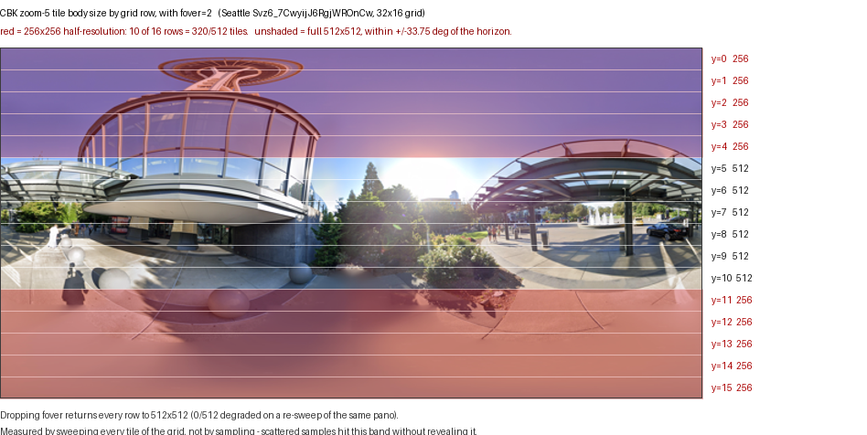
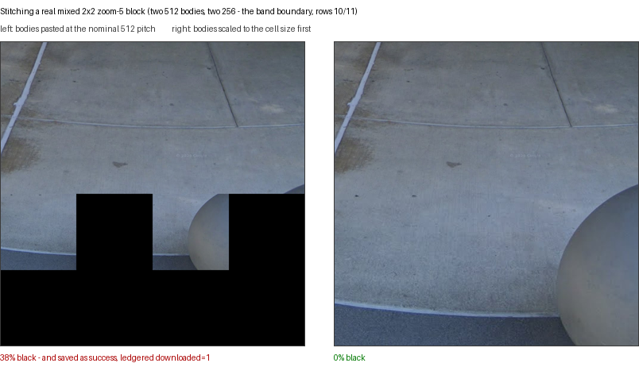
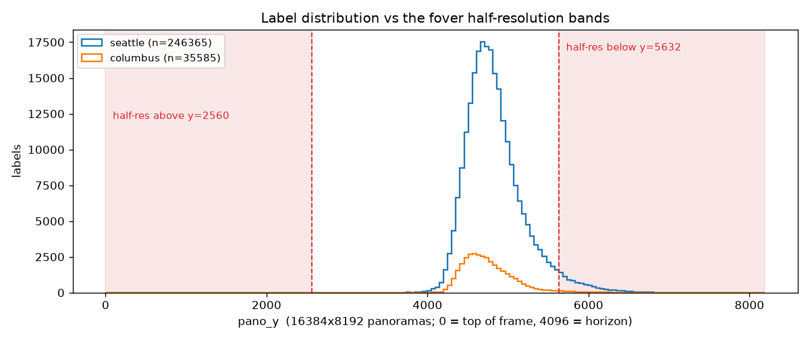

# CBK tile resolution and the `fover` parameter

**2026-08-07** · Issues [#73](https://github.com/ProjectSidewalk/sidewalk-panorama-tools/issues/73),
[#74](https://github.com/ProjectSidewalk/sidewalk-panorama-tools/issues/74) · PR
[#68](https://github.com/ProjectSidewalk/sidewalk-panorama-tools/pull/68) · commits `ef83de3`, `7d9af65`

## Summary

Google's CBK tile endpoint was returning **256×256 tile bodies instead of 512×512 for 320 of the 512 tiles
in every zoom-5 panorama**. The cause was `fover=2` in our own request URL — a Street View viewer bandwidth
optimisation we inherited by copying the viewer's URL wholesale. It halves the resolution of the *polar
rows* of the tile grid, leaving a full-resolution band around the horizon.

The pre-existing stitch loop resized every tile to 512 unconditionally, which absorbed this silently, so the
saved panoramas had correct dimensions and geometry but carried half the intended detail across 62.5% of the
frame. PR #68 removed that resize — believing it vestigial — which turned a silent quality loss into visible
corruption: panoramas roughly 40% black, saved as `success` and ledgered `downloaded=1`.

Both are fixed. `fover` is gone, so full-resolution bodies are returned everywhere; and the stitcher now
scales any undersized body to the cell size as defence in depth, with a guard that refuses to save a
mostly-black frame.

**The credit belongs to @misaugstad**, who isolated the parameter and the band structure on #73 after an
initial diagnosis of mine that was wrong in an instructive way — see [Wrong turns](#wrong-turns).

## The question

PR #68 fixed two stitcher bugs (#44, #45) and, as part of that, deleted an unexplained
`img.resize((512, 512))` from the tile paste loop on the grounds that Google pads edge tiles and the resize
could only distort them. Reviewing it, the question was whether that premise held.

It did not: some tile bodies really do arrive smaller than 512. That opened the real question — **why**, how
often, and what it costs.

## Method

Three rounds, each correcting the previous one's sampling.

1. **Scattered sampling** (wrong, see below): one tile position per zoom level across 12 panoramas.
2. **Spread sampling**: 32 positions spread across the grid, at every zoom level, on five panoramas
   (~900 requests). Established that only zoom 5 is affected and that a panorama whose max zoom is 3 is not
   affected at all.
3. **Full-grid sweeps**: every tile of the zoom-5 grid on four panoramas, with `fover=2` and again without
   it. This is what revealed the structure.

Plus a controlled parameter sweep (varying `fover` and `onerr` against a fixed position), a byte-level
comparison against `streetviewpixels-pa`, and a per-row measurement of what halving actually destroys.

Panoramas were chosen for spread across imagery age and geography: Seattle 2022, NYC 2024, Sydney 2014,
Tokyo 2018, DC 2007, plus SF, London, Paris and historical captures back to 2007 in the earlier rounds.

## Findings

### 1. The degradation is a fixed band, not a random or load-based effect

Full-grid sweeps, with `fover=2` as production sent it. `1` = every tile in that row came back 256×256,
`2` = every tile 512×512:

| pano | grid | row map | degraded |
|---|---|---|---|
| Seattle 2022 | 32×16 | `1111122222211111` | 320/512 |
| NYC 2024 | 32×16 | `1111122222211111` | 320/512 |
| Sydney 2014 | 26×13 | `1111222221111` | 208/338 |
| Tokyo 2018 | 26×13 | `1111222221111` | 208/338 |

The full-resolution band is contiguous, centred on the horizon, and bounded by the poles on both sides. It
spans ±33.75° of elevation in both panorama geometries. Every row is uniform: the tests assert no row is
mixed, and `capture.py` retries dropped responses so a transient fetch failure cannot masquerade as one.

Only zoom 5 is affected. Zooms 0–4 returned 512 in every one of ~900 samples, and DC 2007 (3328×1664, max
zoom 3) showed no degradation at any level — so **the zoom-3 fallback path was never affected**.

### 2. The cause is `fover`, and nothing else moves

Same URL, same host, same panorama, varying one parameter. Rows 2 (polar) and 8 (horizon):

| parameter | row 2 | row 8 |
|---|---|---|
| `fover=2` (what we sent) | 256 | 512 |
| `fover=1` | 256 | 512 |
| `fover=3` | 256 | 512 |
| `fover=0` | 512 | 512 |
| *omitted* | 512 | 512 |
| omitted, `onerr=1` | 512 | 512 |

`onerr` is innocent and must stay: it is what makes an out-of-range tile return a black JPEG rather than an
error, which the zoom probe depends on.

Dropping `fover` changes nothing else. Out-of-range x, out-of-range y, the zoom-3 probe, retired panorama
ids and nonsense panorama ids all behave exactly as before, so the zoom probe and the mostly-black guard are
unaffected. Re-sweeping the same panorama without the parameter: **0/512 degraded**.

### 3. Without `fover`, CBK is byte-identical to the modern endpoint

md5-identical bodies from `maps.google.com/cbk` and `streetviewpixels-pa.googleapis.com/v1/tile` across
several previously-degraded rows. This retired the premise of #74 — there was never anything to recover by
switching endpoints, only a parameter to remove.

### 4. What the deleted resize was actually doing

A real mixed 2×2 neighbourhood straddling the band boundary. Pasting bodies at the nominal 512 pitch leaves
each half-size body in the top-left quarter of its cell. On a full panorama with 320 degraded tiles this
produced roughly 40% black — complete with the sidewalk imagery this project exists to crop.

A half-size body is the *same grid cell at half scale*, not a different crop: each one matches the
corresponding 256×256 quadrant of the zoom-4 tile covering the same region **to the pixel**. That is what
makes scaling to the cell size the correct repair rather than a heuristic.

### 5. The lost detail was worth less than it looks

This is the crux of the re-download question, and the intuitive answer is wrong.

`fover` halved precisely the polar rows — and equirectangular projection oversamples the poles, so those
rows carry the least real detail per pixel in the frame. Measured by halving a full 512 body and
re-expanding it, i.e. exactly the detail a half-size body at that row would have cost:

| pano | polar rows (`fover` halved these) | horizon rows (left alone) | ratio |
|---|---|---|---|
| Seattle 2022 | 0.189 | 1.321 | **7.0×** |
| Sydney 2014 | 0.299 | 0.868 | **2.9×** |

The optimisation is well targeted. This is a measurement of the oversampling argument rather than a
restatement of it, and it bounds what the existing store actually lost.

### 6. There is no reliable retrospective detector

Three metrics tried, for telling an affected panorama from a clean one: Laplacian energy, high-frequency
spectral share, and halve-then-restore loss. All separate a genuine 512 body from an upscaled 256 body by
only **1.0–1.5×**, and LANCZOS ringing on the upscale can make it score *higher* than the genuine tile.

This has the same root cause as finding 5 — there is little real detail in the polar caps to detect the
absence of. So the store cannot be audited by image analysis, but for the same reason it matters less.

### 7. Almost no labels are in the affected band

The open question was whether the panoramas already in the store need re-downloading. It turns out to be
answerable directly and cheaply: `/adminapi/labels/cvMetadata` is public (no auth — it is the endpoint
`CropRunner` already uses for any deployed city), so the label distribution can be measured rather than
sampled or argued about.

Every label from two cities, binned by `pano_y` against the measured band edges — y ∈ [2560, 5632) is the
full-resolution band for 16384×8192, y ∈ [2048, 4608) for 13312×6656:

| city | labels | in a half-res band | panoramas | panoramas to re-fetch |
|---|---|---|---|---|
| Seattle | 259,485 | 9,399 (**3.62%**) | 105,181 | 7,914 (**7.52%**) |
| Columbus | 40,951 | 789 (**1.93%**) | 14,800 | 670 (**4.53%**) |

* **96–98% of labels sit entirely inside the full-resolution band.** Seattle is the worse of the two.
* Of the labels that do fall in the band, **84–88% are within one tile row (512 px) of its edge**, so their
  crops extend up into full-resolution imagery for most of their height.
* The **top** band is empty in practice: two labels across both cities, both with `pano_y = -720`, i.e. bad
  data rather than overhead features. Sidewalk labels are ground features, so only the bottom band matters.
* Note this counts a label as affected when its *centre* falls in a band, which **overstates** the effect —
  a crop is centred on the label and reaches upward into the full-resolution band.

A data-quality note that also resolves the "old `pano_y` convention" caveat raised on #73: 1,756 Seattle
records have negative `pano_y` and no `pano_width`/`pano_height` at all. They are third-party photospheres
(base64-style panorama ids) which never went through the CBK tile path. They are excluded, not misbinned.

**This reframes the decision.** The choice was posed as "accept, or re-download the store". It is really
"accept, or re-fetch ~7.5% of labelled panoramas" — and that work-list needs no detector, because affected
*labels* are identifiable by geometry even though affected *panoramas* are not identifiable by image
analysis (finding 6). For Seattle that is 7,914 panoramas: a bounded, one-time job.

**Recommendation: don't re-download on quality grounds.** The affected labels are few, mostly marginal, and
concentrated in the near field where crops are largest — the degradation is anti-correlated with need. The
one argument that might still carry a targeted pass is imagery retirement rather than quality: Google
retires panoramas (two 2018/2019 Seattle ids in `samples/metadata-seattle.csv` already return blank at every
zoom), so for some of those 7,914 the real choice is half-resolution now or nothing later.

## Wrong turns

Worth recording, because the reasoning is more repeatable than the bug.

**I diagnosed this as per-request load shedding** — "CBK sometimes serves 256, sometimes 512, chosen per
request; sticky per position; drifting over hours". Every observation behind that was the fixed band seen
through scattered sampling:

* "Everything came back 256 for ~30 minutes across 12 panoramas" — every one of those probes was tile
  `(0, 0)` or a `y=15` corner. Both polar.
* "Sticky per position": `(10, 12)` returned 256 through 300 consecutive fetches, `(16, 8)` returned 512.
  Rows 12 and 8 — polar and horizon.
* "A mode flip mid-sequence, at request ~95" — the loop walked rows 8, 9, 10 then 11. Three full rows of 32
  columns is 96 requests. A row boundary, not a mode change.
* "Can't get an all-full-resolution 2×2 block anywhere" — a zoom-4 cell maps to zoom-5 rows `2t, 2t+1`, so
  at the band edge every block straddles it.

Two lessons:

1. **Sampling cannot reveal structure it is not aligned to.** 32 positions spread across a grid sounds
   thorough and was useless here; the full sweep took the same order of requests and settled it immediately.
   Sweep before characterising a spatial effect.
2. **A plausible mechanism stopped the search.** "Google sheds load under scraping pressure" fitted the data
   well enough that I stopped looking for a simpler explanation — a parameter in our own URL.

A third, smaller one: an early version of the fix asserted "the plain body carries visibly more detail than
the upscaled one". The test failed, which is how finding 5 was discovered. The claim was wrong, not the
test.

## What changed

`downloaders/gsv.py`:

* **`fover` removed** from `_CBK_BASE_URL` (`7d9af65`). `onerr=3` retained deliberately.
* **`_stitch_cell_size` / `_stitch_tiles`** bring every body to the cell size before pasting, and scale the
  crop with it (`ef83de3`). Now defence in depth rather than a live requirement.
* **`_reject_mostly_black_stitch`** refuses to save a frame more than 50% black — the check that would have
  caught both this and #44, since an out-of-range tile is answered `200 OK` with a valid all-black JPEG and
  is therefore invisible tile by tile. Calibrated against the real `samples/sample_pano.jpg` at 0.0% black.
* **`_undersized_tile_count`** logs a warning if any body arrives below 512. Expected to be zero forever;
  it is the tripwire for a viewer parameter creeping back in.

Also fixed while in the same lines: `asyncio.TimeoutError` was not in the retry tuple (and is not an
`aiohttp.ClientError`, so timeouts got zero retries); `_partition_tile_results` captured `BaseException`, so
a `CancelledError` would have aborted a whole run rather than one panorama; `_pano_max_zoom(0)` died with a
bare "math domain error" naming no panorama.

## Data and tests

| What | Where |
|---|---|
| Full-grid sweeps, with and without `fover`, plus per-row halving costs | `tests/fixtures/tiles/fover_band_map.json` |
| The same tile captured with and without the parameter | `tests/fixtures/tiles/z5_fover2_4_2.jpg`, `z5_nofover_4_2.jpg` |
| A real mixed 2×2 neighbourhood, and the zoom-4 tile covering the same region | `tests/fixtures/tiles/z5_full_*.jpg`, `z5_degraded_*.jpg`, `z4_cover_4_5.jpg` |
| A real black-padded edge tile and a real out-of-range blank | `tests/fixtures/tiles/z3_edge_bottom.jpg`, `z3_blank_out_of_range.jpg` |
| Provenance for every fixture | `tests/fixtures/tiles/manifest.json` |
| Regenerate all of the above | `python tests/fixtures/tiles/capture.py` |
| Label histogram against the bands (finding 7) | `reports/data/2026-08-07-pano-y-histogram.json` |
| Regenerate that | `python reports/scripts/pano_y_histogram.py` |
| Assertions over the data | `tests/test_gsv_tile_contract.py` |
| Stitcher behaviour | `tests/test_gsv_stitcher.py` |

Fixtures total 78 KB. The suite is network-free; five live re-checks are behind
`SIDEWALK_LIVE_TILE_TESTS=1` and verify the *causation* — that `fover` still does this, that `onerr` still
does not, that CBK is still byte-identical to the modern endpoint, that the side effects are still absent,
and that a full download still reports zero undersized tiles.

Mutation check on the guards: 18/19 killed, including re-adding `fover=2`, re-adding `fover=1`, dropping
`onerr`, and the unscaled paste verbatim. The survivor is LANCZOS versus NEAREST for the per-tile upscale,
which has no correctness consequence.

The grid arithmetic from #44 was verified in passing and is now pinned against Google's own per-zoom
`image_sizes` for 13 live panoramas spanning 2007–2025 — including the 13312, 5376 and 3328-wide ones that
rule out the "zoom *z* is always 512·2^*z* wide" reading, which would have made that fix wrong on old
imagery.

## Open questions

* **Whether to re-download the store** (#73). ~~Open~~ — measured in finding 7 and now a judgement call
  rather than a missing fact. 96–98% of labels are entirely in the full-resolution band, the affected ones
  are mostly within one tile row of its edge, and a targeted re-fetch would be ~7.5% of labelled panoramas
  rather than the whole store. Findings 5, 6 and @misaugstad's crop geometry all point the same way. My
  recommendation is not to re-download on quality grounds; the open part is whether imagery retirement
  justifies a targeted pass anyway. Nothing in the code depends on it either way.

  **Decided 2026-08-19, against that recommendation**, and the reasoning is worth keeping: @misaugstad's
  call on the issue was that since the dimensions do not change, we may as well take the resolution where
  we can get it. So the targeted pass exists —
  [`refetch_panos.py`](../docs/ops.md#repairing-fover-era-panoramas), with the work-list generated by
  `pano_y_histogram.py --write-worklist` and committed per city. A dry run over Seattle's 7,914 against the
  production store says 7,826 would be fetched, 72 stop at a frame disagreement, and 16 have no image at
  all. What findings 5 and 6 change is the *tool*, not the decision: because the recovered detail is small
  and undetectable after the fact, the pass refuses to swap unless the replacement is strictly better, and
  `--measure` records what each swap actually recovered against the horizon band as a control — which is
  the one number this report never had, and the thing a pilot is for.
* **Whether the trigger is "zoom index 5" or "any level wider than ~8192"**. The two make identical
  predictions for every panorama Project Sidewalk holds, and the only live panorama found with a max zoom of
  4 no longer serves through CBK. Unresolved, and operationally irrelevant.
* **Whether to leave CBK at all** (#74). Now a cleanup: the endpoint is undocumented, and photometa's
  `image_sizes` would replace the blank-tile zoom probe with a reported fact and save two requests per
  panorama.
