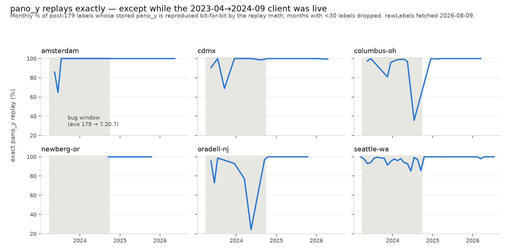

# Era replay: stored pano_x/y is click-time truth — and the post-179 client had an 18-month record bug

**2026-08-09** · Phase 1 desk study for the cropper work package (issues #54, #32) · feeds
[Report 1's](2026-08-09-cropper-consumer-requirements.md) pre-registration

> **Reproduce offline from committed bytes:**
> ```bash
> pytest tests/test_era_replay_study.py                  # machinery + the findings, pinned
> python reports/scripts/era_replay_figure.py            # -> figures/2026-08-09-era-replay-monthly.png
> ```
> **Reproduce from the source** (rawLabels is a moving target; expect drifted decimals):
> ```bash
> python reports/scripts/fetch_rawlabels.py              # -> scripts/.cache/rawlabels/*.csv
> python reports/scripts/era_replay_study.py reports/scripts/.cache/rawlabels \
>     --fetched <today> --write reports/data/<date>-era-replay-summary.json
> ```

## The question

The #54/#32 studies will treat each label's stored `pano_x`/`pano_y` as its location. Before
annotating anything we need to know, per era and per city: does the exact front-end projection
(ported in `scripts/pov_replay.py`, verified bit-for-bit in label-latlng-estimation) reproduce the
stored coordinates from the stored inputs — and where it doesn't, which side is wrong? The answer
decides whether stored coordinates can anchor crops at all, and it hands the studies a free
per-label data-quality covariate.

**Corpus**: `/v3/api/rawLabels?filetype=csv` for six cities, fetched 2026-08-09 — 438,410 labels
(seattle-wa 261,958 · cdmx 74,263 · columbus-oh 41,186 · amsterdam 30,061 · newberg-or 17,351 ·
oradell-nj 13,591). Everything below is computed by `scripts/era_replay_study.py`; the numbers
live in [`data/2026-08-09-era-replay-summary.json`](data/2026-08-09-era-replay-summary.json).

## Headline: the expectation inverted

The sibling repo had established (its 2026-08-06 pov-inversion report, on cvMetadata): `pano_y`
replays exactly everywhere, post-179 `pano_x` replays exactly, pre-179 `pano_x` misses are
camera-metadata drift. On this corpus the **eras ranked backwards** — post-179 was the *worst*
era, including `pano_y` misses that "cannot happen":

| era | exact pano_y | exact pano_x |
|---|---|---|
| legacy (< 2021) | 100.00% every city | 98.76–99.95% |
| mid (2021 → evo 179) | 100.00% every city¹ | 95.67–99.37% |
| post-179 | **94.44–99.75%** | **86.99–99.21%** |

¹ minus exactly 2 corrupt rows corpus-wide (Seattle label_ids 231546, 233419), which carry
**negative stored pano_y** (−720, −355) — impossible values a consumer must bounds-check.

The post-179 misses are not spread over post-179 time. They live in a sharp window:



## The bug window: evolution 179 → SidewalkWebpage 7.20.7

| city | in-window n | exact y | exact x | post-fix n | exact y | exact x |
|---|---|---|---|---|---|---|
| amsterdam | 678 | 94.10 | 73.60 | 1,267 | 100.00 | 94.16 |
| cdmx | 751 | 95.07 | 92.81 | 18,801 | 99.94 | 94.15 |
| columbus-oh | 5,256 | 96.06 | 89.54 | 1,789 | 99.94 | 98.99 |
| newberg-or | 54 | 100.00 | 96.30 | 450 | 100.00 | 99.56 |
| oradell-nj | 862 | 90.95 | 81.90 | 540 | 100.00 | 97.04 |
| seattle-wa | 41,354 | 94.94 | 85.67 | 20,517 | 99.93 | 96.62 |

Seattle's daily series bounds the fix to a day: last bad day **2024-09-25** — the very day of the
`7.20.6 -> 7.20.7` version bump — first clean day 2024-09-28, and ≥ 99.9% every month since.
7.20.7's changeset (2024-09-19/20: `c789837f0`, `59627bbc8`, `610f31dee`, `1c014a77b`) rebuilt the
Explore submission pipeline from **staged batch lists to per-label immediate submission**. The
window opens exactly when evolution 179 turned on live client writing (2023-03-29). So every label
whose record was staged by the 2023-04 → 2024-09 client had a chance of the stored *canvas/POV
tuple* going stale before submission; current clients write a fully self-consistent record.

### What the in-window misses decompose into (Seattle, n = 2,107 y-misses)

* **A devicePixelRatio-2 cohort.** For a few users (3 of the top miss-rate accounts, 19–29%
  per-user miss rates), a single canvas scale factor **s = 0.5** reproduces both stored integers
  exactly, with within-user σ(s) ≈ 0.001 — their stored canvas offsets are doubled (device pixels
  for a CSS-pixel canvas).
* **A zoom-desync slice.** `label_point.zoom` is `Int` in the schema while the client comment
  "*Need to round specifically for Safari*" (Label.js) admits `getPov().zoom` serves fractions;
  refitting zoom repairs ~10% of base-rate misses, with fitted−stored clustering at **+1/+2 whole
  levels** (clicks made at a higher zoom than stored). Genuinely fractional *stored* zooms only
  appear from 2026-07, so fractional zoom wasn't storable in-window.
* **A frame-change slice.** ~3% of y-misses invert to an implied pano height of 6656 while the row
  now serves 8192 — the stored coordinate lives in the *click-time* pano frame and the pano has
  since been re-served at a new resolution. This is the population PR #77's dims preflight exists
  for, now confirmed to exist in production data.
* **A residual majority: per-label canvas jitter**, median ≈ 2 px, p90 ≈ 10 px, isotropic, not
  per-user-constant, not explained by any single-parameter error (see wrong turns). Whatever
  staged variable drifted, it drifted per label, by a few pixels.

`pano_x` additionally misses **outside** the window (94–99% post-fix): the x math consumes
`camera_heading`, which the server's `gsv_data` refresh keeps moving under old labels. The
signature is dispositive and now extends to three cities the sibling repo never measured: among
pre-179 x-miss rows, the implied camera-heading delta has **median within-pano σ ≤ 0.012°**
(rounding noise) against across-pano σ of 0.12–0.73°. Metadata drift, not projection error.

## Which side is the truth?

The operative question for the cropper: when record and replay disagree, is `pano_x/pano_y`
corrupted, or is the canvas/POV record stale? Three independent lines say **trust pano_x/pano_y**:

1. **Code**: the client computes `panoXY` at click time from Google's *live* tile metadata
   (`tiles.worldSize`, `tiles.originHeading` — Label.js `_init`), then stores canvas/POV through
   lossy server casts (`zoom: Int`, `canvasX/Y: Int`) and a staged submission. Every *resolved*
   sub-mechanism above corrupts the record side, not panoXY.
2. **Co-located duplicates**: for in-window miss labels having an independent same-type label
   within 2° by another user, the stored point is the closer one to that independent consensus
   in 61.3% of pairs under selection on either point (n = 173, sign test p = 0.004; the
   discriminator is selection-sensitive — see wrong turns — but the unbiased-union version holds).
3. **Validation outcomes**: in-window miss labels validate *no worse* than hit labels (mean agree
   share 0.863 vs 0.842, ≥ 2 votes) — inconsistent with their pano coordinates being off by the
   observed 0.2–1.3°-scale replay residuals.

## What the cropper studies inherit

* **Stored `pano_x`/`pano_y` anchors crops in every era** — subject to two preflights, both now
  evidence-backed: the #77 dims check (frame-change rows exist in production) and a
  **bounds check** (negative pano_y rows exist in production).
* **Era + window are free covariates.** `rawlabels.add_era()` buckets rows; `BUG_WINDOW_END`
  (2024-09-26) splits post-179. In-window rows carry a ~5% chance of a stale canvas/POV record —
  irrelevant to pano-anchored cropping, but any study that *replays* the POV (e.g. perspective
  re-projection from click parameters) must exclude or flag them.
* **Never re-derive geometry from `camera_heading`** for old labels: it drifts under every era,
  the only per-row quantity whose current value is untrustworthy. `pano_y`-implied depression
  (which consumes no camera metadata) is trustworthy everywhere outside the 2-row corruption.
* **Phase 2 corpus guidance**: post-fix rows (2024-09-26+) are the cleanest stratum; in-window
  rows are usable for pano-anchored work without penalty; the replay-mismatch flag should ride
  along as an annotation-time covariate.

## Wrong turns (the part that will be re-argued)

* **"Post-179 y-misses mean rig tilt leaks into pano_y."** No: regressing miss dy on
  camera_pitch/roll terms at the click bearing gives R² = 0.005.
* **"A 2023–24 client used a different projection formula."** No: free per-zoom fits of implied
  elevation vs canvas offset reproduce the *gnomonic* slopes (0.145/0.076/0.040 °/px), with ~1°
  of per-label noise no deterministic formula explains; and the shipped `UtilitiesPanomarker.js`
  at 7.20.5 is character-identical math to the port.
* **"Stored POV is quantized in-window."** Backwards: rows with integer heading/pitch miss *less*
  (1.7% vs 5.6–5.9%) — integer POVs come from keyboard navigation, which happens to correlate
  with not hitting the bug.
* **"originalPov is a live reference mutated by later panning"** (aliasing). Predicts multi-label
  same-POV groups miss more; they miss *less* (1.18% vs 6.07%). Refuted.
* **The co-location discriminator is selection-biased in whichever direction you select.**
  Selecting partners within 2° of the stored point: stored "wins" 66.7%. Selecting within 2° of
  the replayed point: replay "wins" 67.0%. Only the union-selection version (61.3% stored,
  p = 0.004) is honest, and it is the one reported.
* An earlier fix-candidate — the 2024-10-01 "zoom always integer" commit — post-dates the last bad
  day (09-25) and is cleanup, not the cure. The daily series, not the commit log, dates the fix.

## Open questions

* The residual per-label canvas jitter's precise variable remains unpinned — the staging-window
  rebuild removed it without the diff naming it. Doesn't affect any conclusion above: every
  candidate corrupts the record side, and the co-location + validation evidence caps its possible
  effect on pano coordinates.
* Whether per-city deploy lag shifts `BUG_WINDOW_END` by a day or two outside Seattle: at most a
  handful of rows per city sit that close to the boundary.

## Where everything lives

| Artifact | Path |
|---|---|
| Summary numbers (committed) | `reports/data/2026-08-09-era-replay-summary.json` |
| Analysis + window/era machinery | `reports/scripts/era_replay_study.py`, `reports/scripts/rawlabels.py` |
| Corpus fetcher (cache, gitignored) | `reports/scripts/fetch_rawlabels.py` |
| Figure + its generator | `reports/figures/2026-08-09-era-replay-monthly.png`, `reports/scripts/era_replay_figure.py` |
| Machinery tests + findings pins (6 mutants killed) | `tests/test_era_replay_study.py` |
| Real-data loader fixture | `tests/fixtures/rawlabels_newberg_head.csv` |

---

*Written with [Claude Code](https://claude.com/claude-code) (claude-fable-5). The inversion of the
sibling repo's era ranking — new clients worse than old — was the tell that the stored record, not
the projection, was the thing under test.*
