# Off-target markers: the record is what Validate renders — pricing the bug on screen, and repairing all of it

**2026-08-10** · successor to the [era replay](2026-08-09-era-replay-study.md) · evidence for
[SidewalkWebpage#4842](https://github.com/ProjectSidewalk/SidewalkWebpage/issues/4842) (also
[#2478](https://github.com/ProjectSidewalk/SidewalkWebpage/issues/2478),
[#1529](https://github.com/ProjectSidewalk/SidewalkWebpage/issues/1529)) · hands SidewalkWebpage a
per-label repair

> **Reproduce offline from committed bytes:**
> ```bash
> pytest tests/test_off_target_markers_study.py             # machinery + the findings, pinned
> python reports/scripts/off_target_markers_figures.py      # -> figures/2026-08-10-off-target-markers-*.png
> ```
> **Reproduce from the source** (rawLabels is a moving target; expect drifted decimals):
> ```bash
> python reports/scripts/fetch_rawlabels.py               # -> scripts/.cache/rawlabels/*.csv (the 8 study cities)
> python reports/scripts/off_target_markers_study.py reports/scripts/.cache/rawlabels \
>     --fetched <date> --write reports/data/<date>-off-target-markers-summary.json \
>     --repairs-dir reports/data
> ```

## Summary

The era replay study established that the 2023-03-29 → 2024-09-25 Explore client could submit a
label whose stored viewport record (`heading`/`pitch`/`zoom` + `canvas_x`/`canvas_y`) had gone
stale between the click and the staged batch submission, while the stored `pano_x`/`pano_y` —
computed and frozen at click time — stayed true. It deliberately left three questions unmeasured,
and they are exactly the questions SidewalkWebpage#4842 ("labels do not always look on target")
needs answered, because **Validate, Gallery, and the label-detail views re-derive the label's
position from the record side** (`Label.getOriginalPov` → `PanoManager.renderPanoMarker`, the
stored POV + canvas at 720×480): every stale record is a mis-rendered label on a user's screen.

This study prices that. Over 625,826 labels in eight cities — the era-replay six plus
**teaneck-nj** and **chicago-il**, the homes of #4842's two example labels — **17.40% of the
111,910 in-window labels carry a record that does not reproduce their own pano_x/pano_y**
(1.85–29.46% per city; Teaneck is the worst). Converted to what a validator sees, **4–17% of
in-window labels render ≥ 4 px off in Validate and 2–5% render ≥ 30 px off**, while post-fix
labels are ≤ 0.28% ≥ 4 px in every city. The last record miss in Teaneck, Chicago, and Seattle is
the **same day — 2024-09-25**, the 7.20.7 deploy date, within a one-hour span (19:54–20:50 UTC).

The dominant miss class is the one the era replay left undecomposed: **x_only** (11,313 of 19,472
misses) — `pano_y` replays exactly while `pano_x` misses, i.e. a pure viewport-heading shift.
Its batch fingerprint is direct: among multi-label groups sharing one stored POV tuple at
different canvas positions, **83–93% share a single dx** (up to 172° of it), meaning the staged,
shared POV field drifted after the clicks while each label's frozen pano_x/pano_y kept the truth.

And the truth is enough: re-solving the record from `pano_x`/`pano_y` (rotate heading by the
wrapped x residual, walk pitch down the y residual; halve the doubled canvas offsets for the dpr2
cohort; take the refit zoom for the desynced one) **reproduces the stored coordinate within 1 px
for 100.00% of all 19,472 misses in every city**. The per-label corrected records are committed
as `data/2026-08-10-repairs-*.csv.gz`, ready to become a SidewalkWebpage migration. One negative
result matters as much: **#4842's two example labels (Teaneck 14955, Chicago 30652) are both
`exact`** — their records are self-consistent, so what their screenshots show is where the client
recorded the click, not this bug.

An all-deployment census (§7, added 2026-08-11) extends the pricing everywhere the client ran:
**54 of 55 deployments measured, 261,937 in-window labels, 14.49% stale — and the repair holds at
100.00% in all 23 affected cities**, making the table the staged rollout's "before" baseline.

## The question

1. The era replay decomposed the in-window `pano_y` misses but not the `pano_x` misses — and x is
   where most of the staleness lives (Seattle in-window: 85.67% exact-x vs 94.94% exact-y). What
   are the x misses?
2. What does the bug look like on screen? A residual in pano pixels is not what a #4842 reader
   sees; Validate-canvas pixels at the label's own zoom are.
3. Are #4842's named examples instances of the bug?
4. The era replay proved `pano_x`/`pano_y` is click-time truth. Can the record side be *repaired*
   from it, label by label — and at what success rate?

## Method

**Corpus**: `/v3/api/rawLabels?filetype=csv` for eight cities, fetched 2026-08-10 — 625,826
labels (seattle-wa 261,958 · chicago-il 164,060 · cdmx 74,263 · columbus-oh 41,186 · amsterdam
30,061 · teaneck-nj 23,356 · newberg-or 17,351 · oradell-nj 13,591). `fetch_rawlabels.py` gained
the two new cities; everything downstream is `scripts/off_target_markers_study.py` on top of the
era replay's machinery (`era_replay_study.replay_frame`, the verbatim production projection via
`pov_replay.py`). Numbers live in
[`data/2026-08-10-off-target-markers-summary.json`](data/2026-08-10-off-target-markers-summary.json).

**Classification cascade.** Each in-window label (2023-03-29 ≤ `time_created` < 2024-09-26,
per `rawlabels.EVO179` / `era_replay_study.BUG_WINDOW_END`) takes the first explanation that
reproduces its stored `pano_x`/`pano_y` within 1 px on both axes:

| class | test | reading |
|---|---|---|
| `exact` | stored record replays as-is | the null case |
| `dpr2` | halving the canvas offsets **about the canvas center** reproduces both axes | the era replay's device-pixel cohort (verified center-scaled, not origin-scaled) |
| `frame_change` | the coordinate replays in a previous pano generation (implied height inversion + full replay in that frame) | the *pano* moved, not the record — Validate renders these correctly |
| `zoom_desync` | replaying at a different zoom level (1, 1.999, 2, 2.999, 3) reproduces both axes | #2478's stored-zoom desync |
| `x_only` | `pano_y` exact, `pano_x` off | a pure viewport-heading shift |
| `y_only` | `pano_x` exact, `pano_y` off | a pure viewport-pitch shift — the mirror of `x_only` |
| `xy_small` | both axes off ≤ 10 px | the era replay's residual per-label jitter scale |
| `multi_field` | both axes off, beyond jitter | several record fields stale at once |

**Validate-px conversion.** The angular residual between what the record renders and where the
click-time truth sits, scaled by the record's own zoom: `px = hypot(dx°, dy°) / fov(zoom) × 720`.
Small-angle, center-of-canvas — the gnomonic stretch off-center only makes the on-screen miss
larger, so every share below is a floor.

**Repair.** Hold canvas and zoom; rotate the viewport heading by the wrapped x residual (exact —
azimuths rotate rigidly with the camera), then iterate pitch down the y residual
(d pov_pitch/d pitch ≈ 1 near axis; ≤ 25 vectorized iterations). dpr2 rows first halve their
canvas offsets; zoom_desync rows first take their fitted zoom. Success = the repaired record
reproduces stored `pano_x`/`pano_y` within 1 px. The x correction routes through the row's served
`camera_heading`, so repaired headings inherit its drift — the 0.12–0.73° across-pano σ the era
replay measured — against the 1–170° staleness being repaired.

## Numbers

### 1. The bug window, on screen

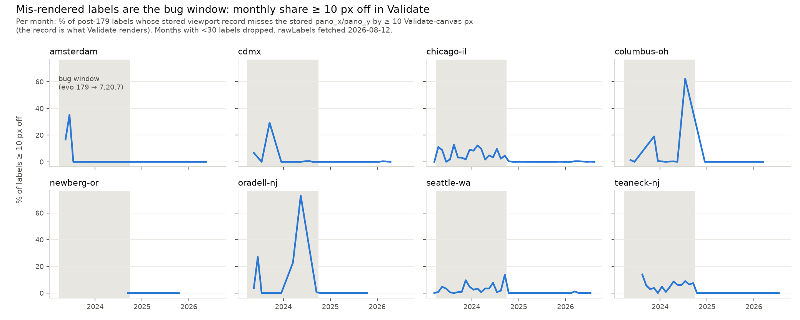

Per month: the share of post-179 labels whose record misses by ≥ 10 Validate px. Every city's
series lives inside the shaded window and drops to ~0 after it — including the two new cities.
The in-window bursts are uneven (Columbus's July 2024 spike is 62.32% of 207 labels; Oradell's
May 2024 peak is 72.97% of 37) because staleness rides individual sessions, not a uniform rate.

| city | in-window n | record misses | ≥ 4 px | ≥ 10 px | ≥ 30 px | post-fix n | post-fix ≥ 4 px |
|---|---|---|---|---|---|---|---|
| teaneck-nj | 19,734 | **29.46%** | **16.98%** | 6.79% | 2.43% | 3,622 | 0.00% |
| chicago-il | 43,221 | 17.27% | 10.10% | 6.51% | 2.06% | 100,548 | 0.28% |
| oradell-nj | 862 | 16.94% | 9.63% | 7.42% | 5.10% | 540 | 0.00% |
| amsterdam | 678 | 21.24% | 7.37% | 5.90% | 3.54% | 1,267 | 0.00% |
| cdmx | 751 | 6.52% | 5.06% | 4.13% | 2.93% | 18,801 | 0.10% |
| seattle-wa | 41,354 | 12.93% | 4.84% | 3.24% | 1.65% | 20,517 | 0.05% |
| columbus-oh | 5,256 | 9.59% | 3.81% | 3.03% | 2.40% | 1,789 | 0.00% |
| newberg-or | 54 | 1.85% | 0.00% | 0.00% | 0.00% | 450 | 0.00% |

Chicago's 0.28% post-fix tail is the era replay's known `camera_heading`-refresh drift (its x
misses continue at drift scale in every era), not a stale record; its `pano_y` post-fix is
≥ 99.9% exact. **The user-error question in #4842 splits by era**: an in-window label that looks
off has a 1-in-6 chance the *record* is what's off; a post-window label that looks off was
recorded exactly where the client computed the click.

The cliff is one deploy: last miss teaneck-nj 2024-09-25 19:54 UTC · seattle-wa 20:01 · chicago-il
20:50 — the 7.20.6 → 7.20.7 version-bump day the era replay dated from Seattle alone, now
confirmed in two more cities at hour resolution.

### 2. What the misses are

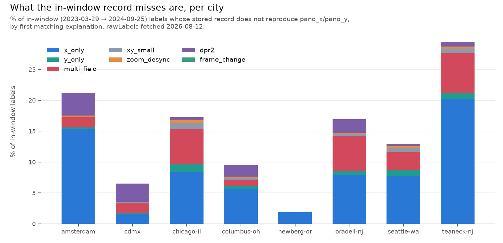

Pooled over the eight cities (19,472 misses of 111,910 in-window labels):

| class | n | share of misses |
|---|---|---|
| `x_only` | 11,313 | 58.10% |
| `multi_field` | 5,053 | 25.95% |
| `y_only` | 1,170 | 6.01% |
| `xy_small` | 900 | 4.62% |
| `dpr2` | 663 | 3.40% |
| `zoom_desync` | 373 | 1.92% |
| `frame_change` | 0 | — (never fires on this corpus; see open questions) |

`y_only` is the mirror of `x_only` and was added in review: without it, a record whose only stale
field is pitch replays with `dx` **exactly** 0 and still landed in `xy_small` or `multi_field` —
classes this report defines as *both* axes being off. Extracting it moved **348 of Seattle's 635**
in-window `xy_small` rows and **24 of Columbus's 38**, so a majority of one published class was
mislabelled. The two axis-pure classes together are **64.11%** of all misses.

Two attribution caveats, stated rather than hidden. First, **dpr2 and zoom_desync are nearly the
same transformation**: halving canvas offsets multiplies the projected offset's tangent by 0.5,
and the fov ladder does almost exactly that per level (2·atan(tan(44.875°)/2) = 52.9° vs
fov(zoom 2) = 53°) — measured, **98–100% of dpr2 rows also replay at zoom + 1**
(`dpr2_zoom_overlap`). The cascade's ordering is therefore a convention; the repair is valid
under either reading. Second, `x_only` at *small* magnitudes overlaps the `camera_heading`-drift
population (43.48% of Teaneck's multi-miss panos have a per-pano-constant dx, the drift
signature); the staleness claim rests on the window boundary — post-fix x misses continue only at
drift scale — and on the batch fingerprint below, not on any per-label attribution.

### 3. The staleness lives on the heading axis, and it moves in batches

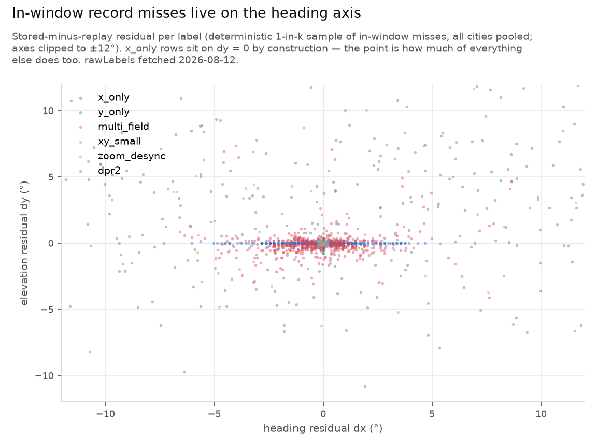

The x_only cohort's implied heading shift: p50 0.11–0.37°, p90 1.16–1.87°, max 167–180° per big
city. The mechanism fingerprint is the **same-POV batch group**: ≥ 2 miss labels sharing one
stored `(heading, pitch, zoom)` tuple at different canvas positions — i.e. labels whose staged
records shared one POV object. If each label's record went stale independently, their residuals
would differ; if the shared field drifted once after the clicks, they move together:

| city | groups | labels | groups sharing one dx | largest shared shift |
|---|---|---|---|---|
| seattle-wa | 407 | 842 | **93.12%** | 171.56° |
| teaneck-nj | 636 | 1,353 | **91.19%** | 103.33° |
| chicago-il | 570 | 1,206 | **83.33%** | 102.24° |

This is the live-mechanism evidence the era replay's group test could not see: it asked whether
same-POV groups miss *more often* (they do not — clean same-POV groups are keyboard-navigation
users), not whether the groups that do miss move *together* (they overwhelmingly do). A Teaneck
specimen: three labels on pano `GaFbtRtSp9Q26YcyU1fafg` at canvas x 425/497/567 share stored POV
(344.75°, −35°, zoom 1) and share a 16.7° error — placed from one viewpoint near 328°, rotated
to 344.75° (the walk-away auto-rotate changes heading only, which is also why pitch survives in
58% of misses), submitted stale.

### 4. Severity, and the repair

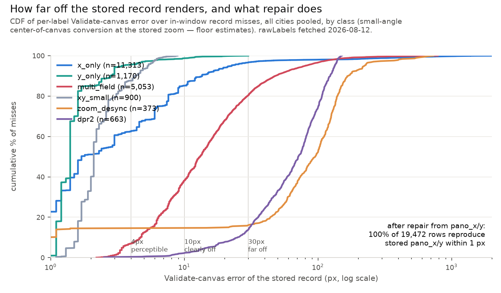

Half the x_only cohort is sub-perceptible (< 2 px); the dpr2 and zoom_desync cohorts are almost
entirely ≥ 30 px (a wrong zoom scales the whole offset by ~1.7×); multi_field spans the middle;
the extreme tail reaches 1,500–4,700 px — labels rendering nowhere near their target, the #2478
"floating label" screenshots.

Repair: **100.00% of all 19,472 misses in every city** re-solve to a record that reproduces the
stored `pano_x`/`pano_y` within 1 px. The committed `2026-08-10-repairs-<city>.csv.gz` files
carry, per label: class, old and new `heading`/`pitch`/`zoom`/`canvas_x`/`canvas_y`, the old
Validate-px error, and the post-repair residual (`new_validate_px` ≤ 1 px throughout). Repaired
headings inherit served-`camera_heading` drift (≤ ~0.7° typical) — two orders of magnitude below
the staleness they remove.

### 5. What it looks like on the imagery

Twenty exemplars (five per miss class, eight cities, chosen deterministically by descending
Validate-px error among panos Google still serves), each rendered on the real panorama with three
markers and **a burned-in legend bar, so every image stays self-explanatory when pasted alone into
an issue or slide**: **blue circle** — the stored `pano_x/pano_y`, the click-time truth;
**red-orange circle** — where the stale record actually renders the label (what a validator is
shown); **yellow square** — where the *repaired* record renders, which must sit inside the blue
circle. The red-to-blue gap IS the detection; the yellow-on-blue coincidence IS the fix.
Coordinates and records for every example:
[`data/2026-08-10-off-target-markers-examples.json`](data/2026-08-10-off-target-markers-examples.json).

**Walkthrough — chicago-il label 65640, a CurbRamp, 736 px off.** The stored record says: viewport
(183.53°, −23.42°) at zoom 3, click at canvas (81, 195). Replaying that record through the
production projection lands at pano (7686, 5063). But the label's own stored `pano_x/pano_y` is
**(6453, 4688)** — the record misses its own coordinate by 1,233 px of heading (−27.1°) and 375 px
of elevation (+8.2°) on the 16384×8192 pano. At zoom 3's 27.7° field of view that is a **736-px
error on the 720-px Validate canvas**: the marker renders in the middle of the street, a full
screen away from the curb ramp. The repair re-solves the viewport as (155.93°, −15.01°) — same
canvas, same zoom — and the record now reproduces (6453, 4688) exactly:

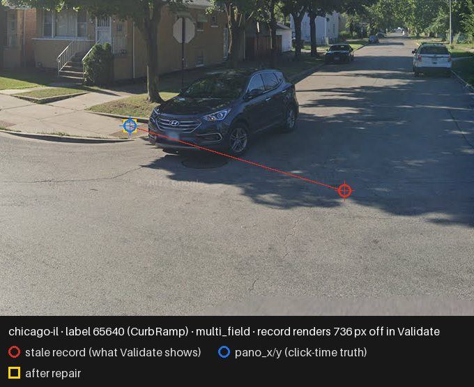

The rest of the gallery, by class:

*Pure heading staleness (`x_only`) — the marker slides along the horizon line:*

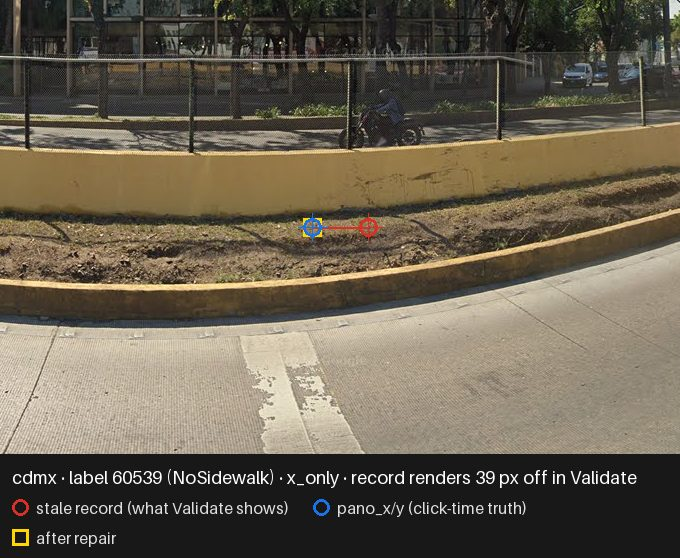
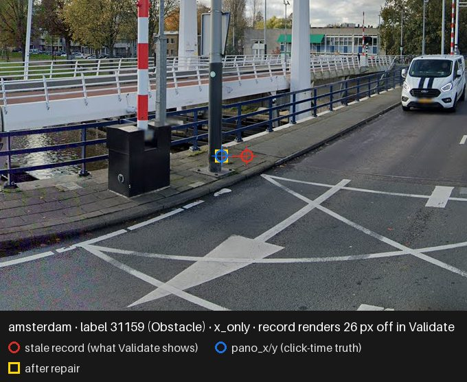
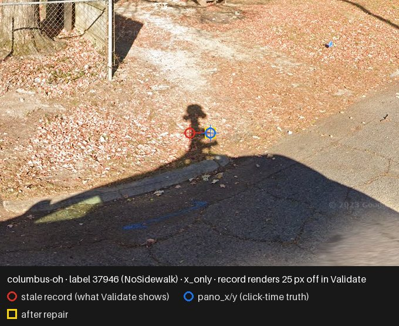
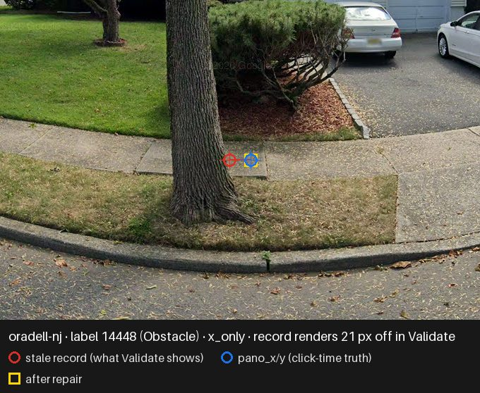
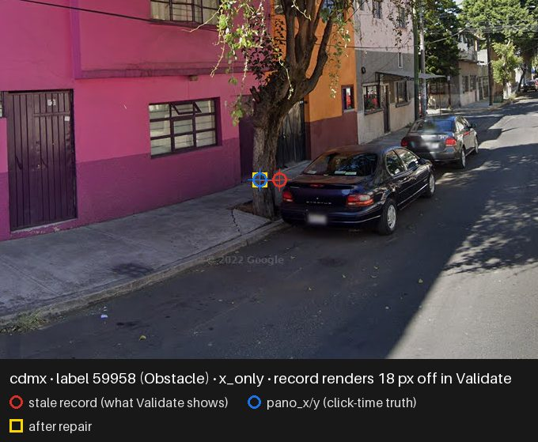

*Several record fields stale at once (`multi_field`) — the largest visual errors in the corpus:*

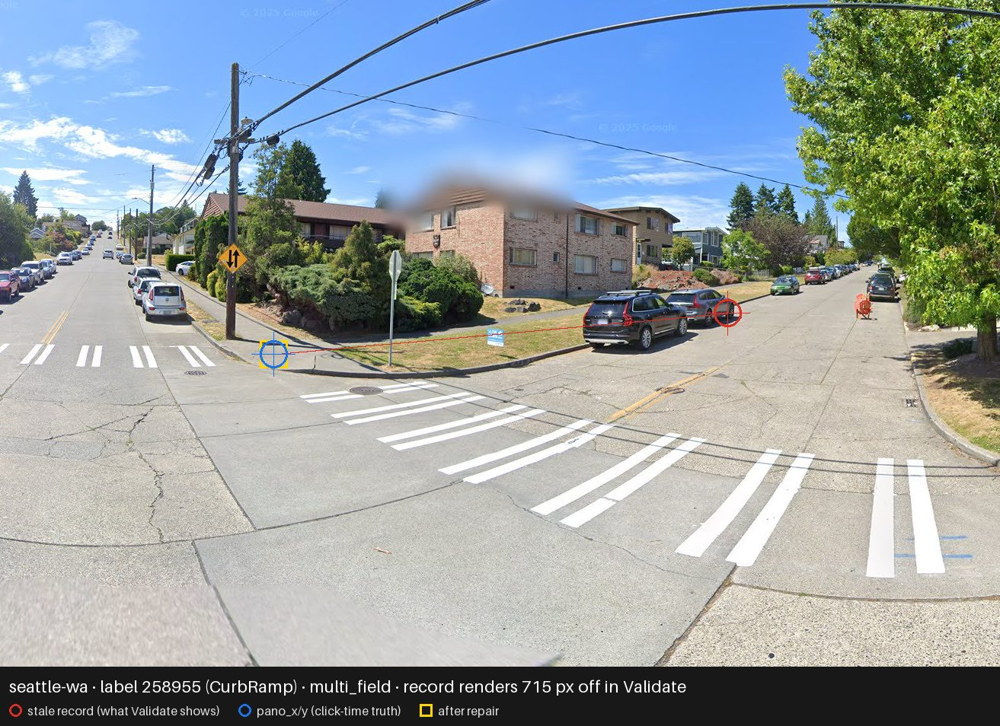
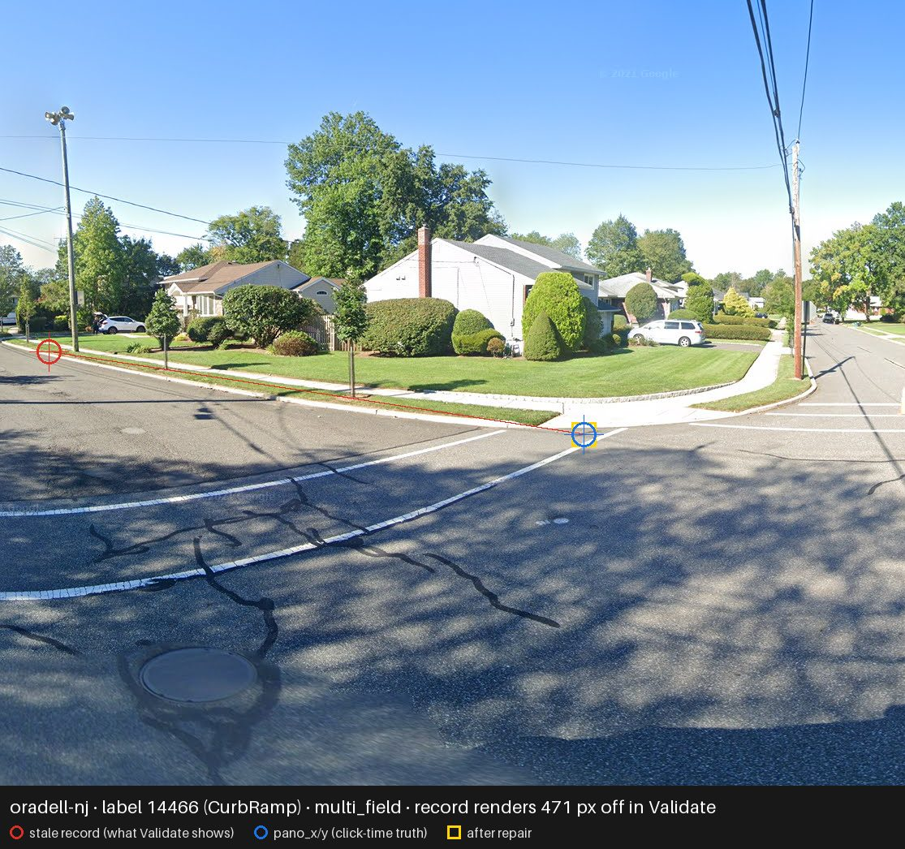
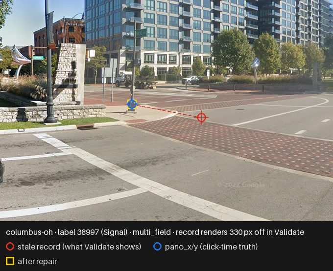
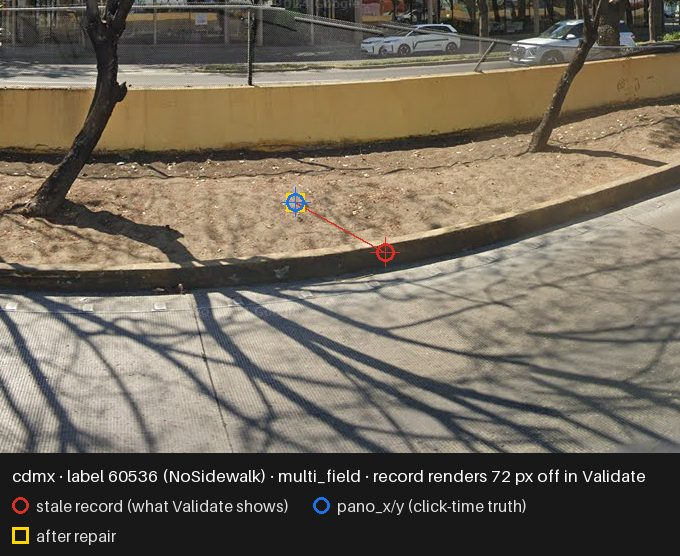

*Doubled canvas offsets (`dpr2`) — the error grows with distance from the canvas center:*

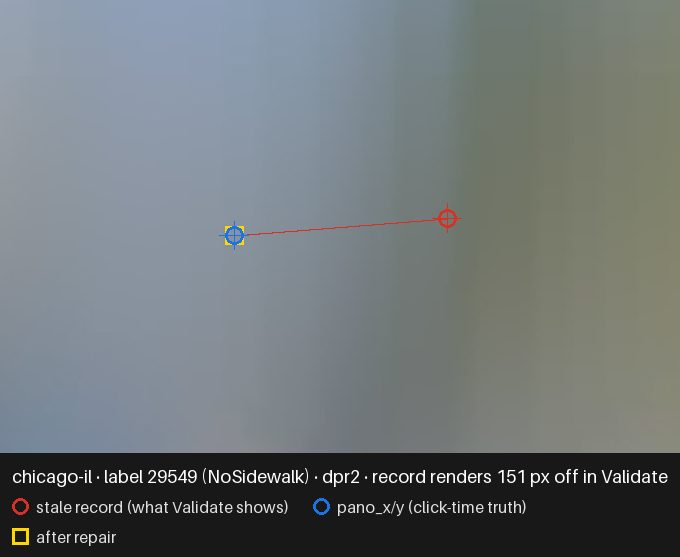
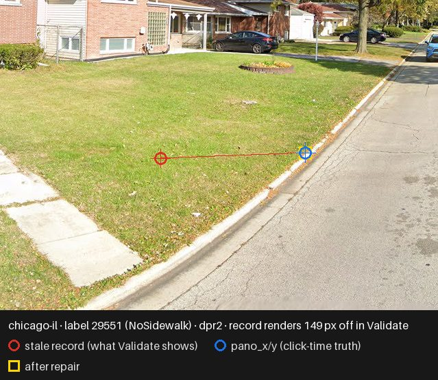
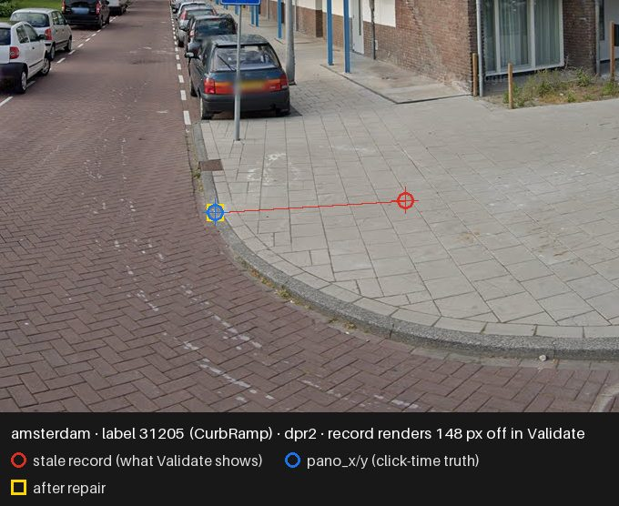
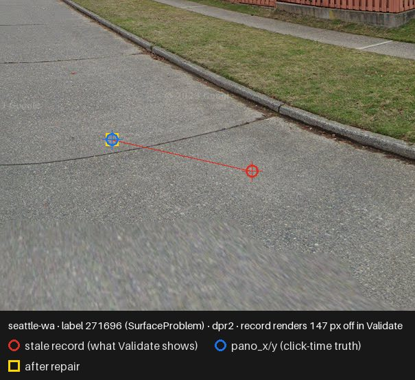
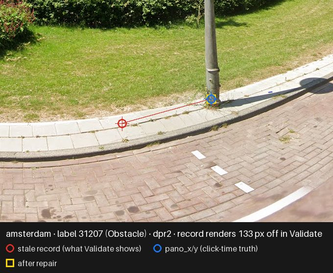

*Stored zoom is not the click's zoom (`zoom_desync`) — the whole offset scales by ~1.7×:*

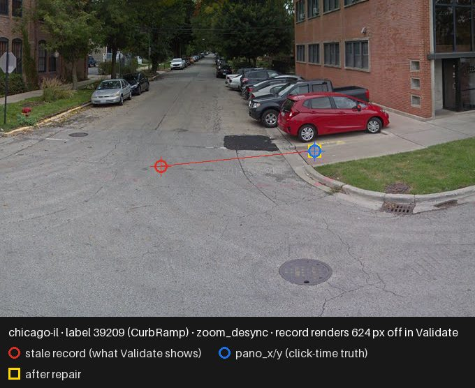
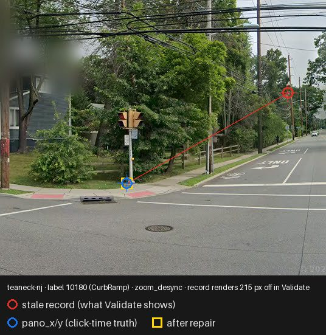
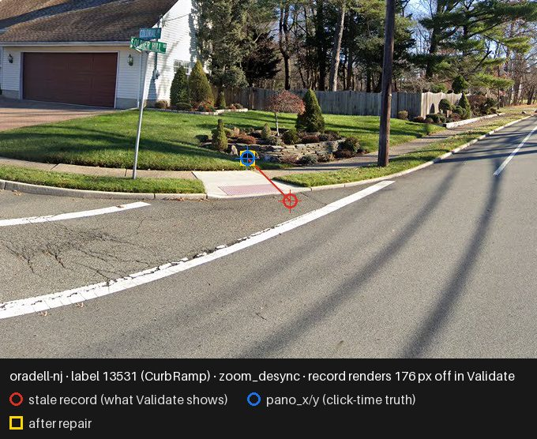
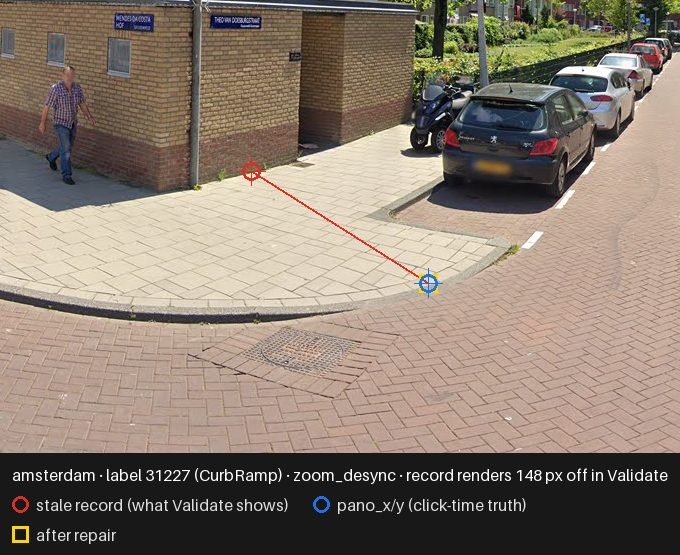
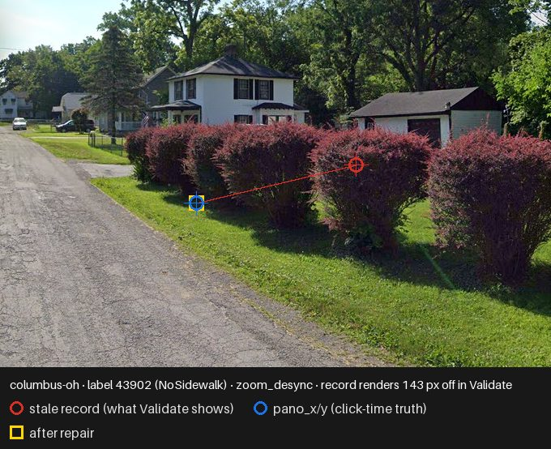

Imagery fetched 2026-08-11 via streetlevel at stitch zoom 3; pano availability decides which
exemplars are showable (~half of labeled panos are no longer served — see the photometa census).
Regenerate with `python reports/scripts/off_target_markers_examples.py` (network stage).

### 6. The #4842 examples are not the bug

| | teaneck-nj 14955 | chicago-il 30652 |
|---|---|---|
| placed | 2024-07-15 (in-window) | 2023-09-21 (in-window) |
| stored record | (298.25°, −35°, zoom 1) @ canvas (451, 142) | (320.5°, −35°, zoom 1) @ canvas (361, 83) |
| replay vs stored pano_x/y | **0 px / 0 px** | **0 px / 0 px** |
| class | `exact` | `exact` |

Both records are bit-perfect. Validate shows these labels exactly where the client computed the
click — so their ~10–20 px visual offsets are placement behaviour or the render-side items listed
below, not data corruption. The issue's *population* is still real: 16.98% of 14955's Teaneck
era-mates and 10.10% of 30652's Chicago era-mates render ≥ 4 px off. Both labels sit at pitch −35
(the Explore pitch floor) at zoom 1 — labels placed far below a shallow viewport are also where
the deployed crop sizing and lat/lng estimates are weakest, a separate thread (#54).

### 7. Every deployment (addendum, 2026-08-11)

The eight-city corpus was a study sample, but the bug lived in the shared Explore client, so the
repair's feasibility has to be priced everywhere the client ran. `fetch_rawlabels.py --all` pulls
the deployment roster from the public cities API and fetches every deployment's rawLabels; the
study then runs unchanged. **54 of 55 deployments responded** (`crowdstudy`, an internal study
instance, did not). **23 have in-window exposure; the other 31 had no labeling activity in the
window** (mostly launched after the 7.20.7 fix). Census totals: **261,937 in-window labels,
37,954 stale records (14.49%)** — nearly double the eight-city corpus's 17.40%-of-111,910 in
absolute terms — and the closed-form repair reproduces the stored `pano_x`/`pano_y` for
**100.00% of misses in every one of the 23 cities**. "Fix it everywhere" is measured-feasible
everywhere.

| city | in-window | stale records | miss % | ≥ 4 px | ≥ 10 px | ≥ 30 px |
|---|---|---|---|---|---|---|
| chicago-il | 43,221 | 7,465 | 17.27% | 10.10% | 6.51% | 2.06% |
| taipei | 46,272 | 6,334 | 13.69% | 4.92% | 2.02% | 0.88% |
| teaneck-nj | 19,734 | 5,814 | **29.46%** | 16.98% | 6.79% | 2.43% |
| seattle-wa | 41,354 | 5,349 | 12.93% | 4.84% | 3.24% | 1.65% |
| new-taipei-tw | 18,164 | 2,498 | 13.75% | 4.25% | 1.61% | 0.59% |
| st-louis-mo | 19,989 | 2,253 | 11.27% | 7.43% | **6.16%** | **4.48%** |
| burnaby | 20,668 | 1,970 | 9.53% | 6.20% | 4.90% | 3.13% |
| validation-study | 7,038 | 1,678 | 23.84% | 12.70% | 8.20% | 4.58% |
| zurich | 8,933 | 1,518 | 16.99% | 3.32% | 2.32% | 1.67% |
| keelung-tw | 7,166 | 837 | 11.68% | 3.81% | 1.73% | 0.75% |
| cuenca | 14,950 | 637 | 4.26% | 2.45% | 1.94% | 1.30% |
| columbus-oh | 5,256 | 504 | 9.59% | 3.81% | 3.03% | 2.40% |
| walla-walla-wa | 2,049 | 305 | 14.89% | 6.10% | 2.20% | 0.73% |
| pittsburgh-pa | 4,002 | 290 | 7.25% | 3.17% | 1.27% | 0.57% |
| oradell-nj | 862 | 146 | 16.94% | 9.63% | 7.42% | 5.10% |
| amsterdam | 678 | 144 | 21.24% | 7.37% | 5.90% | 3.54% |
| la-ca | 283 | 88 | **31.10%** | 16.61% | 8.83% | 5.30% |
| cdmx | 751 | 49 | 6.52% | 5.06% | 4.13% | 2.93% |
| mendota-il | 103 | 39 | **37.86%** | 14.56% | 7.77% | 2.91% |
| spgg | 310 | 26 | 8.39% | 6.77% | 6.13% | 5.16% |
| auckland | 54 | 6 | 11.11% | 7.41% | 5.56% | 0.00% |
| la-piedad-old | 46 | 3 | 6.52% | 6.52% | 6.52% | 6.52% |
| newberg-or | 54 | 1 | 1.85% | 0.00% | 0.00% | 0.00% |

Two rows worth flagging. **st-louis-mo** has the most severe visible tail of any large city
(4.48% of in-window labels ≥ 30 px) — #2478's 2024 St. Louis "floating label" example almost
certainly was this bug. **validation-study** — a research deployment — carries a 23.84% miss
rate, which matters for anything built on that deployment's validation data. The 31
zero-exposure cities: blackhawk-hills-il, chandigarh-india, cliffside-park-nj, clifton-nj,
columbia-sc, danville-il, detroit-mi, fort-wayne-in, gainesville-fl, hackensack-nj, houston-tx,
kaohsiung-tw, knox-oh, la-piedad, madison-wi, maywood-nj, niagara-falls-ny, paterson-nj,
rancagua-chile, santiago-chile, sao-paulo-brazil, taichung-tw, tainan-tw, tucson-az,
vancouver-wa, virden-il, waltham-ma, west-chester-pa, winterthur-infra3d, zurich-infra3d,
richmond-va.

This table is the staged rollout's **"before" baseline**: after the repair evolution reaches
production, the same instrument re-runs against every deployment and the stale-records column
must read ~0. Per-city numbers (classes, visibility tiers, repair-by-class, monthly series):
[`data/2026-08-11-off-target-markers-all-cities.json`](data/2026-08-11-off-target-markers-all-cities.json).
The run also generated per-label repaired-record CSVs for the 15 newly-measured affected cities;
they are not committed (the eight-city `2026-08-10-repairs-*.csv.gz` remain the canonical repair
artifact, and the production repair recomputes server-side anyway) — regenerate with:

```bash
python reports/scripts/fetch_rawlabels.py --all      # -> scripts/.cache/rawlabels-all/*.csv
python reports/scripts/off_target_markers_study.py reports/scripts/.cache/rawlabels-all \
    --fetched <date> --write <out>.json --repairs-dir <dir>
```

`--all` deliberately writes to a *different* directory than the eight-city fetch. Every study in
`reports/scripts/` globs `*.csv` over the directory it is given, so a 54-deployment sweep landing in
`.cache/rawlabels/` would silently redefine the six-city corpus behind every committed artifact —
and the roster includes Mapillary deployments, which the census machinery does not treat as GSV.

`crowdstudy` stays an open row: re-measure it when it responds, before certifying the rollout.

## What this hands SidewalkWebpage

1. **A ready repair migration.** The committed repair CSVs are exactly an
   `UPDATE label_point SET heading = …, pitch = …, zoom = …, canvas_x = …, canvas_y = …` per
   label_id, per city — after which Validate/Gallery/label-detail render every in-window label
   where its click actually was. Alternative implementation: recompute server-side from
   `pano_x`/`pano_y` with the same math (`PanoDataService.calculatePovFromPanoXY` is the existing
   Scala counterpart), which avoids trusting a CSV.
2. **The user-error answer for #4842**: in-window, 1-in-6 labels mis-render from our record —
   post-window, the record is clean and residual off-target labels are placement or render-side.
3. **Render-side follow-ups worth their own issues** (found tracing the render path, not measured
   here): the 5-px vertical fudge Validate's projection lost in the Jan 2026 pano-code
   consolidation (`865b5b8a8`); the dead non-WebGL fallback (`centeredPovToCanvasCoord2d` calls
   the removed `PanoMarker.wrapHeading` — a `TypeError` on any WebGL-less browser); mobile
   Validate's height mismatch between `svv.canvasHeight()` and the marker container; the
   Mapillary viewer's hardcoded 3:2 aspect in fov↔zoom conversion.
4. **A submission-time guard**: the server can recompute `pano_x`/`pano_y` from the submitted
   record and reject/flag on mismatch — any future staleness regression becomes an alert instead
   of eighteen months of silent corruption.

## Wrong turns

* **"The cliff is a Google Maps API rollout."** My working theory before this corpus: the bug
  ended before the 2024-10-01 zoom-rounding commit could deploy, so Google must have changed
  something. No — the era replay had already dated the 7.20.7 *deploy* (2024-09-25, submission
  pipeline rebuilt from staged batches to per-label immediate submission), and this corpus
  confirms the same last-bad-day in three cities within one hour. The deploy is the cure; the
  zoom commit is cleanup.
* **"originalPov is a live GSV object mutated by later panning."** The single-session Teaneck
  version of this study argued aliasing from the shared-error groups. The era replay refuted the
  aliasing *mechanism* (same-POV groups miss less, not more); what survives, measured here, is
  the weaker true claim — staged records shared a POV field that could drift before batch
  submission. The batch fingerprint does not need (and cannot establish) object identity.
* **"The Teaneck dx cohort is camera-heading metadata drift."** First-pass attribution of the
  dx-dominant misses before checking per-pano coherence: labels on one pano did *not* share one
  dx (43% coherent), which kills pure drift for the window population — and the window boundary
  (post-fix x misses continue only at drift scale) is what separates the two populations.
* **"dpr2 rows are origin-scaled device pixels."** `canvas × 0.5` reproduced zero rows; the
  doubling is about the canvas *center* (`360 + (x−360)×0.5` reproduces the cohort). The first
  cascade run shipped the wrong test and found no dpr2 rows at all.
* **An earlier draft treated `x_only` per-label as staleness.** At small dx the class is
  indistinguishable from metadata drift row-by-row; only the window boundary and the batch
  fingerprint license the population-level claim, and the report now says so.

## Open questions

* **`frame_change` never fires on this corpus, and the earlier explanation for that was wrong.**
  This was first written up as a one-fetch anomaly — 0 rows here where the 2026-08-09 fetch had
  reported ~3% of Seattle y-misses — with a `gsv_data`-refresh theory attached. Re-checked in
  review against Seattle's full 261,958 rows: `frame_change` is 0 in **every** era, and of the
  2,104 rows carrying a y miss, **not one** has an implied height within even 50 px of a
  *different* generation (tested at tolerances 2, 10 and 50 against all four
  `GENERATION_HEIGHTS`). So it is not a fetch-to-fetch difference and the refresh theory is not
  supported by the corpus; the branch simply does not match real input here. The machinery itself
  is sound — implied height recovers served height to ≤ 1.0 px on 40,098 exact Columbus rows —
  and it is retained because it is the only thing separating a *pano* that moved from a *record*
  that went stale, which would otherwise be silently repaired. But it is **validated only by a
  synthetic test**, and the row this report publishes for it is a structural zero, not a
  measurement of something rare. Do not read it as "frame changes are rare in Project Sidewalk".
* The `multi_field` cohort (26% of misses) is repaired but not mechanistically decomposed —
  pan-between-click-and-submit moves both axes, as does the dpr2/zoom family at fractional
  scales; nothing in the record distinguishes them, and repair does not need to. Note this cohort
  is now genuinely two-axis: the pitch-pure rows that used to sit in it are the `y_only` class.
* Per-city deploy lag on the window edge: Chicago's last miss is 56 minutes after Teaneck's;
  nothing in this corpus resolves sub-day ordering beyond that.
* The separate click-*capture* question (the CSS-`zoom` scaling era, Dec 2023 – Jun 2026,
  interacting with Chrome 128's semantics change) is invisible to replay consistency by
  construction — a self-consistently wrong record replays exactly. It needs
  `audit_task_environment.css_zoom` (not in rawLabels) plus a browser harness, and is deferred.

## Where everything lives

| Artifact | Path |
|---|---|
| Summary numbers (committed) | `reports/data/2026-08-10-off-target-markers-summary.json` |
| All-deployment census (committed) | `reports/data/2026-08-11-off-target-markers-all-cities.json` (54 cities) |
| Per-label repaired records (committed) | `reports/data/2026-08-10-repairs-<city>.csv.gz` (8 files, 19,472 rows) |
| Analysis + cascade + repair solver | `reports/scripts/off_target_markers_study.py` |
| Corpus fetcher (now 8 cities; cache gitignored) | `reports/scripts/fetch_rawlabels.py` |
| Figures + their generator | `reports/figures/2026-08-10-off-target-markers-*.png`, `reports/scripts/off_target_markers_figures.py` |
| Imagery examples (committed crops + metadata + generator) | `reports/figures/2026-08-10-example-*.jpg`, `reports/data/2026-08-10-off-target-markers-examples.json`, `reports/scripts/off_target_markers_examples.py` |
| Machinery tests + findings pins | `tests/test_off_target_markers_study.py` |
| Inherited machinery | `reports/scripts/era_replay_study.py`, `reports/scripts/pov_replay.py`, `reports/scripts/rawlabels.py` |

---

*Written with [Claude Code](https://claude.com/claude-code) (claude-fable-5). The decisive move
was pricing the residuals in the pixels a validator actually sees: the same numbers that read as
a data-quality footnote in pano coordinates are one in six labels visibly off target on screen.*
