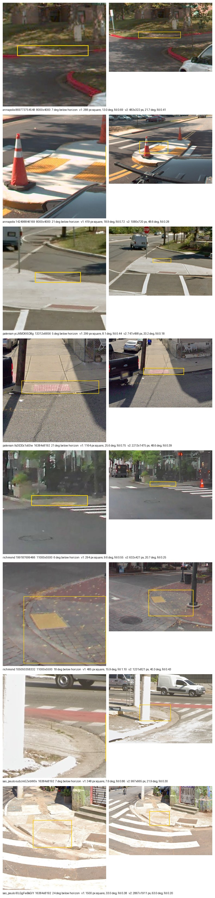

# The crop window was never an angle — sizing rule v2

**2026-08-19** · Replaces the sizing half of `CropRunner.predict_crop_size` · scored against 658
hand-drawn curb-ramp extents in four cities

> **Reproduce:** `pytest tests/test_crop_sizing_v2.py` pins every number below against the committed
> summary, offline. **From source** — needs the RampNet benchmark bundles, whose panoramas are
> archive-anchored:
> ```bash
> python3 reports/scripts/crop_sizing_v2.py \
>     --bundle richmond=<RampNet>/benchmark/richmond \
>     --bundle sao_paulo=<RampNet>/benchmark/sao_paulo \
>     --bundle paterson=<RampNet>/benchmark/paterson \
>     --bundle annapolis=<RampNet>/benchmark/annapolis \
>     --write reports/data/2026-08-19-crop-sizing-v2.json \
>     --figure reports/figures/2026-08-19-crop-sizing-examples.jpg
> ```
> Paterson's and Annapolis' boxes live on the RampNet branches `data/paterson-extent-gold` and
> `data/annapolis-extent-gold`; Richmond's and São Paulo's on `data/sao_paulo-extent-gold` and `main`.

## The question

`predict_crop_size` maps a label's height in the panorama to a crop size, through a distance
estimate fit around 2013. Its own docstring has flagged it as due for replacement for years, but
"replace it" was never actionable, because nothing measured what a crop is *supposed* to contain.
That gap is now closed: the RampNet benchmark carries whole-apron boxes drawn by hand around
adjudicated curb ramps (#114/#116), which is the first extent gold this ecosystem has had. It makes
"is this crop the right size" a measurement.

The corpus is 658 boxed ramps, two imagery providers, and pano heights from 1664 to 8192 px:

| city | provider | pano heights | boxed ramps | median ramp width |
|---|---|---|---:|---:|
| richmond | Mapillary | 2048–6144 | 299 | 9.97° |
| sao_paulo | GSV | 6656–8192 | 119 | 9.67° |
| annapolis | Mapillary | 4000 | 131 | 14.93° |
| paterson | GSV | 1664–8192 | 109 | 8.74° |

## Finding 1: the old rule's window is not an angle, and it leans the wrong way

This is the defect, and it is not a matter of taste. The regression's constants were fit on GSV
panoramas 6656 px high, and the function fed it **native** pixels from panoramas of any size. A
panorama is an equirectangular projection, so a window's angular size is `width / pano_height × 180°`
— which means feeding native pixels into height-calibrated constants makes the window's *angle*
depend on the panorama's pixel count.

Holding the ramp's real geometry fixed and varying only the panorama's height, across the eight
heights present in the corpus:

| depression below horizon | v1 window, spread across heights | v2 |
|---|---|---|
| 5° | **4.09×** | 1.00× |
| 10° | **3.22×** | 1.00× |
| 20° | **1.86×** | 1.00× |

And the direction is backwards: the *larger* the panorama, the *tighter* the crop. At 5° below the
horizon the smallest panorama in the corpus (1664 px high) gets a **28.05°** window and the largest
(8192 px) gets **6.86°** — that ratio is the 4.09× above. Better imagery has been producing worse
crops for a decade, which is also why the defect never announced itself: the cities with the worst
crops were the ones with the best source pixels.

The fix is the one the upstream docstring already describes: step 1 is documented as converting
`pano_y` "to the old version of `pano_y` that we had when this alg was written", and that conversion
was simply missing. Rule v2 does it — normalise into the 6656-px reference frame, evaluate the
formula and its clamps there, scale back — which is bit-identical to the old function at
`pano_height == 6656` and correct everywhere else.

*(A consequence worth knowing: normalising bounds the reference y-offset at ±3328 for every
panorama, so the regression's own 50 px floor becomes unreachable. What bounds a far-field window
now is the 8° angular floor, one level up.)*

## Finding 2: v1's crops are too tight, in 89% of cases

"Too tight" is not an aesthetic judgement here. A blind absolute-judgement round (144 crops, fills
sampled log-uniformly 0.12–1.79) put the boundary at **fill 0.49** — the ramp occupying more than
about half the window's width reads as too tight — with 92% agreement on hidden repeats and, notably,
**zero "too wide" verdicts anywhere in the range tested**. Scoring the gold against that threshold:

| | v1 | v2 |
|---|---:|---:|
| median fill (ramp width ÷ window width) | 0.84 | 0.37 |
| share clearing the "too tight" threshold | **10.9%** | **74.8%** |
| whole-apron containment | **0.471** | **0.944** |
| median window | 12.9° | 24.9° |

v1's median crop is at fill 0.84 and **more than half of aprons are not inside their own crop at
all**. Per city, the share clearing the threshold goes 0.06 → 0.93 (paterson), 0.03 → 0.95
(sao_paulo), 0.16 → 0.74 (richmond), 0.11 → 0.43 (annapolis); containment goes 0.48 → 0.98, 0.53 →
0.95, 0.33 → 0.86 on the same cities.

**Containment is positional, not a size comparison** — the check is whether the apron lies inside the
window that was cut, with x taken through the seam exactly as the window was cut. That distinction is
worth stating because the first version of this study got it wrong: it compared the apron's *width and
height* against the window's and called the result containment, which passes for an apron the right
size sitting entirely outside its crop. The window is centred on the label's stored point (a click at
ground contact) and the box on the apron's extent, so those are different places and the offset is
real. Under the size-only reading the same corpus scores **0.684 → 0.979**; both figures are in the
summary (`containment` and `fits_by_size`), and the gap between them — much wider for v1 than for v2 —
is the placement error Study 1 exists to measure, showing up here as a by-product.

**Annapolis is the honest exception**: at 0.43 it misses the ≥45% per-city floor this rule was
supposed to hold, and it does so for a known reason — Annapolis' ramps genuinely subtend the largest
angle of the four cities (median apparent width **14.93°** against São Paulo's **9.67°**), so a single
global scale constant under-sizes there. Fixing that needs either per-city calibration (~100 boxes,
about a day) or extent-aware sizing; it is not reachable by changing one constant without giving up
the other three cities.

## Finding 3: the stored file, on two different write paths

There are two questions here and the first draft of this section ran them together. Keeping them
apart matters, because only one of them is about code in this repository.

**What `CropRunner` writes.** It has never resized: under v1 it saved the cut window at its own size,
and under v2 it saves `min(window, 1440)`. So the change here is that the window got wider and the
file follows it up to a ceiling — stored width p50 **348 px → 873 px**, p90 **807 px → 1440 px**. The
cap only ever binds against v1 at the extreme near field, where v1's window hit its own 1500 px clamp
and v2 stores 1440 of a much wider view; that is more world at slightly lower magnification, and it is
the trade the figure below is for. 1440 is a ceiling and not a target: a narrower window is written at
its own size rather than upscaled, because the ramp carries a fixed number of source pixels and
stretching them adds bytes and blur, not detail.

**What the webpage's write path does.** `ImageController.resize` is a plain `getScaledInstance` to
1440×960, unconditional and without aspect preservation, so a window narrower than 1440 gets
*upsampled* into the stored file. No code in this repo takes that path today — production's
human-facing crops are browser canvas captures, not this tool's output — but the server-side
`CropService` in [ProjectSidewalk/SidewalkWebpage#4865](https://github.com/ProjectSidewalk/SidewalkWebpage/issues/4865)
will hand it a formula cut for AI-submitted labels, which is what makes 1440 the right ceiling rather
than an arbitrary one. Modelled over the gold, v1's window sizes would arrive there at a median
**4.14×** upsample with **89.5%** above 2×, worst where imagery is weakest (98.5% of Annapolis, 97.0%
of Richmond, against 78.9% and 70.6% for the two GSV cities). v2's windows reduce that to **1.65×**
and **35.3%** — it does not eliminate the upsample, and claiming it did was the other half of running
the two paths together.

## Finding 4: the window should be 3:2

Three reasons, in decreasing order of how much weight they carry.

Curb-ramp aprons are ≈3:1 in equirectangular pixels, so a square window spends its extra height on
sky and road. Measured, the shape costs nothing on framing quality — crops read equally well at 1:1,
3:2 and 2:1, because it is the ramp against the window's *width* that binds — so the height is free to
be chosen on content. And 3:2 is what the rest of the stack already assumes: share images are
1440×960, the label canvas is 720×480, and AI ingest writes `canvas_x/y = (360, 240)`, its exact
centre.

The fourth reason, which the first draft led with, is that `ImageController.resize` would stretch a
square window 1.5× horizontally on write. That is true of that write path and it reinforces the
choice, but per Finding 3 it is not the path this tool's output takes, so it is not what the decision
rests on.

## The rule

```
window_width_px = clamp(predict_crop_size(pano_y, pano_height) × 2.5,  8°, 90°)
window_height_px = window_width_px / 1.5
stored width     = min(window_width_px, 1440)
```

with `predict_crop_size` normalised into the 6656-px reference frame. The scale constant is where
two independent instruments overlap: the absolute round's threshold requires at least ×1.95 for the
median crop to clear "too tight", and two forced-choice rounds peak at fill 0.28–0.44, i.e. ×2–×3.

**Method lesson, earned three times.** Two earlier drafts of the scale constant were wrong, at ×4.5
and ×1.25, and both failed the same way: they were chosen with a criterion that improves without bound
as the crop grows, or against an acceptance band that was assumed rather than elicited. Never rank
crop sizes on a metric monotone in crop size, and never assume the band — ask.

The third time was this report's own headline table, and it is worth naming because the lesson did not
catch it. `frac_clearing_too_tight` counts fills at or under 0.49 with no lower bound, and containment
only improves as the window grows: **both** are monotone in crop size, so a rule returning a constant
90° window scores 1.00 on each. They are reported anyway because they answer "did the too-tight
problem go away", which is a real question — but what actually *selects* ×2.5 is the two-sided
forced-choice peak, and what bounds the window from above is the 90° clamp. A metric that cannot be
made worse by growing the crop is a check, not a criterion.

## Examples



Eight gold ramps, two per city, v1 left and v2 right, each drawn at the same display width because a
Gallery card is a fixed box — a wider window is not a bigger picture, it is more context at lower
magnification. The gold outline is the hand-drawn apron, clamped to the panel where it runs off.

Row 7 is the case that makes the argument: a São Paulo ramp 7° below the horizon on a 16384×8192
panorama gets a **348 px** window from v1 — 7.6°, fill 0.86, an unreadable blur of kerb with no
indication of what is being looked at. v2 cuts 997×665 at 21.9°, fill 0.30, and the ramp, the crossing
and the pole are all in frame. Row 6 shows v1 at **fill 1.10**: the apron does not fit inside its own
crop and its outline runs off two edges. Row 8 is the wide end of v2's range — 63°, fill 0.20 — where
the extra context is arguably more than needed; that is the price of one global constant, and it is
paid in context rather than in broken crops. Rows 1 and 2 are Annapolis, the city the constant
under-sizes: even v2's windows sit at fill 0.41 and 0.28 against a corpus median of 0.37.

## What this does not fix

The rule is still **y-only**: it infers a window from the label's height in the image and nothing
else. Measured against an oracle that knows each ramp's true cross-range extent, any y-only rule tops
out at R² ≈ 0.43–0.74 where the oracle reaches 0.72–0.95. The residual is genuine variation in how
large ramps actually are, and it is not recoverable by a better closed form — the direction that
would fix it is extent-aware sizing (segment or detect the apron, size to what is found), tracked in
RampNet #83.

Orientation was tested as the cheap version of that idea and does not work: a full angular basis on
top of the depression-only fit moves R² by 0.014–0.095 across the four cities, and the sign of the
effect **disagrees between cities**, so it is city-specific population structure rather than a law.

## Consequences for the older reports

Findings in [the crop-geometry review](2026-08-10-crop-geometry-review.md) and
[the clamp census](2026-08-09-clamp-census.md) that depend on the window's *size* describe rule v1
and do not carry over — the seam-crossing rate especially, since it is a function of window width and
v2's windows are ~2.5× wider. Their replica-fidelity tests, which previously pinned against the
deployed function, now pin against `reports/scripts/crop_rule_v1.py`, a single frozen copy of v1 that
this study also uses; that guard is what caught this in the first place, failing the moment the rule
changed rather than letting the census quietly describe geometry nobody cuts any more.

## Provenance, because a crop store has none of its own

A crop directory is derived data and a JPEG does not say what geometry produced it. Existing crops are
the resume marker and are never re-cut, so running v2 against a store cut under v1 leaves a directory
holding both shapes and looking entirely consistent to a consumer that trains on all of it. `CropRunner`
therefore writes `<crop-dir>/crop_rule.json` — the rule version and every constant — before cutting
anything, and warns when it disagrees with what is already there. Warns rather than refuses: a
deliberately topped-up store is a real thing, and stranding it would be worse than recording it.

## Mechanics are untouched

The seam wrap, the vertical shift, the integer rounding and the "no crop ever contains synthetic
black" property are the same code and the same guarantees as before #47/#77.
