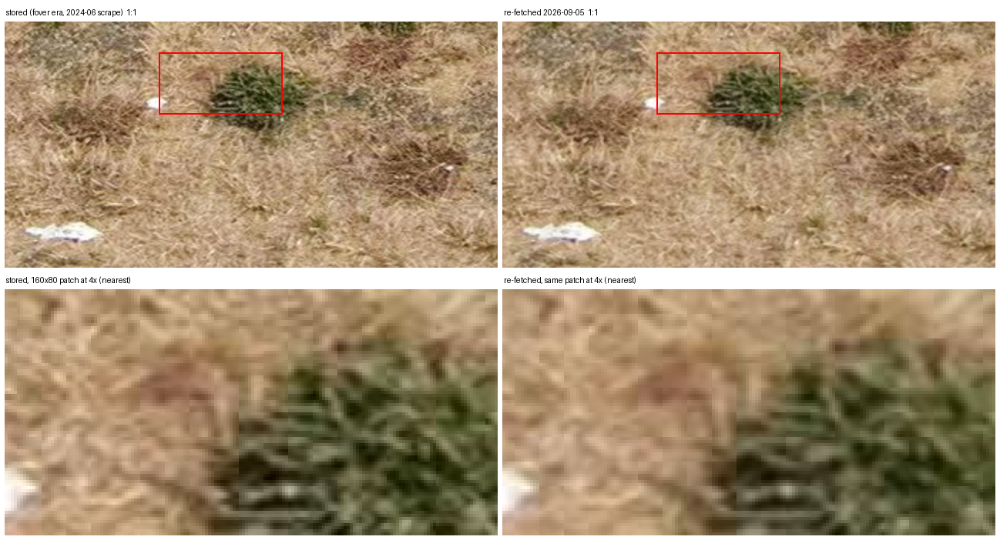

# The `fover` re-fetch pilot: nothing to recover, because the 512-px polar bodies are upscales

**2026-09-05** · prompted by the open action on #73 after PR #94 merged the repair pass · answers the
question the [2026-08-07 report](2026-08-07-cbk-tile-resolution.md) left open and the 2026-08-19 decision
reversed: is re-fetching the `fover`-era panoramas worth doing?

> **Reproduce offline from committed bytes:**
> ```bash
> pytest tests/test_refetch_pilot_report.py tests/test_refetch_pilot.py tests/test_refetch_pilot_sample.py \
>     tests/test_refetch_pilot_sharpness.py
> ```
> **Reproduce from the source** (needs a copy of the sampled panoramas and a route to Google; the run below
> is the 2026-09-05 one, against a copy of the Seattle store on makelab2):
> ```bash
> python reports/scripts/refetch_pilot_sample.py reports/data/2026-08-19-fover-refetch-worklist-seattle.csv.gz \
>     --n 200 --seed 20260905 --write reports/data/2026-09-05-fover-refetch-pilot-worklist-seattle.csv.gz
> # copy those 200 panoramas out of the store with mtimes preserved (tar, rsync -a, cp -p), then:
> python refetch_panos.py <copy> --worklist reports/data/2026-09-05-fover-refetch-pilot-worklist-seattle.csv.gz \
>     --measure --min-pano-interval 2 --fixed-after 2026-09-01
> python reports/scripts/refetch_pilot.py <copy>/refetch_log.csv <copy>/refetch_measurements.jsonl \
>     --probed 2026-09-05 --write reports/data/2026-09-05-fover-refetch-pilot.json
> python reports/scripts/refetch_pilot_sharpness.py --old-store <production city dir> --new-store <copy> \
>     --ledger <copy>/refetch_log.csv --write reports/data/2026-09-05-fover-refetch-pilot-sharpness.json
> # the figure. Its window origin was chosen by eye during the run and never recorded, so this reproduces
> # the recipe, not the committed bytes:
> python reports/scripts/refetch_pilot_figure.py --old-store <production city dir> --new-store <copy> \
>     --pano-id CkUrdiulTbw482CMAkrKyg --x <col> --y <row> --probed 2026-09-05 \
>     --write reports/figures/2026-09-05-fover-refetch-pilot-CkUrdiulTbw482CMAkrKyg.png
> ```

## Summary

**Do not run the full pass. There is no resolution to recover.** The polar tiles CBK serves at 512 px
without `fover` are upscales of the same data it served at 256 px with it. Dropping the parameter (#68)
changed the tile *size*, not the information in it, so every `fover`-era panorama in the store already holds
everything Google has for those rows, one resampling filter apart.

Three measurements say so, on 78 re-fetched panoramas and on the committed tile pair:

* **The pre-specified metric found nothing.** Mean absolute difference between the stored bottom band and the
  fresh one is **1.146** luma at the median, *below* the **1.466** measured at the horizon band, which was
  served at full size in both eras and was meant to be the noise floor. Recovered-above-noise is **-0.279** at
  the median, positive for **25** of **78**. On the like-for-like core (below) it is **-0.250**.
* **Measured directly, the re-fetched band is less sharp, not more.** Laplacian variance of the bottom band
  falls to **0.591** of the stored value at the median; **0** of **78** panoramas got sharper; the horizon
  control sits at **1.000**. The stored band's extra high-frequency energy is the stitcher's per-tile Lanczos
  upscale of JPEG bodies - ringing, upscaled blocking, tile seams - not detail.
* **The committed tile pair explains why.** The 512-px body served without `fover` is within **0.232** luma
  (MAE) of a *bilinear* upscale of the 256-px body served with it, loses only **0.027** luma when halved and
  restored (a horizon tile loses **0.670**), and carries less high-frequency energy (**1.2**) than the
  stitcher's Lanczos upscale of the 256 (**1.5**). It is an upscale.

Two things the pilot found on the way matter beyond #73. **Google still serves 39.8%** of this population,
lower than the [photometa census](2026-08-09-photometa-census.md)'s 47.9% for labelled panoramas a month
earlier. And **Google has re-rendered a quarter of the survivors** - 19 of 78 differ from the stored file by
3.6 to 24 luma levels at the horizon, where two encodes of the same picture differ by 0.5 to 1.9 - so a bulk
re-fetch would have replaced a quarter of what it touched with a different picture, not a sharper one.

The tool itself behaved: 196 panoramas probed, 78 swapped, zero `undersized`, zero `frame_grew`, zero
`too_black`, zero transient failures, about 40,500 tile requests, and the production store untouched
throughout because the pass ran against a copy.

## 1. What ran

The pilot ran against a **copy**, not the store. `refetch_panos.py` swaps a panorama only when the
replacement passes four gates, but a swap is final, and for a retired panorama the stored file is the only
copy there will ever be. A pilot whose purpose is to learn whether swapping is worthwhile should not find out
on the originals. So the draw happened up front rather than inside the run:

1. `refetch_pilot_sample.py` drew **200** of the committed Seattle work-list's 7,914 rows with seed
   **20260905** - **188** at 16384×8192 and **12** at 13312×6656, the corpus's own mix. The draw is committed
   and a test redraws it from the full list.
2. Those 200 were copied out of `Panoramas/seattle-wa` on makelab2 into a scratch store with mtimes intact
   (tar preserves them; the `already_clean` gate reads them). One was not on the store at all.
3. The pass ran there with `--measure --min-pano-interval 2 --fixed-after 2026-09-01`. The date is the day
   production moved to the fixed code ([history](../docs/history.md)); the tool's default of 2026-08-07 is the
   merge date, and the box ran a checkout 183 commits behind until 09-01, so files scraped in between are
   `fover`-era and the default would have skipped them. None of the 200 was scraped in that window anyway -
   the newest mtime in the copy is 2026-04-25 - but the flag is the one an operator has to get right.

The dry run, at zero requests, reported the shape: **1** `absent`, **3** `dims_changed`, **196** to fetch.
The real run confirmed it, and every one of the 196 resolved at Google: **118** `gone`, **78** `replaced`,
nothing else. The zero-request outcomes are not ledgered (that is deliberate, since #94's review), so they
come from the run's own summary, committed beside the ledger.

| | |
|---|---|
| drawn | 200 |
| `absent` (in the label DB, not on the store) | 1 |
| `dims_changed` (label DB frame ≠ stored frame) | 3 |
| probed at Google | 196 |
| `gone` | 118 |
| `replaced` | 78 |
| `frame_grew` / `upscaled` / `undersized` / `too_black` | 0 / 0 / 0 / 0 |
| transient failures | 0 |
| measured (`--measure` records) | 78 |

At the tool's per-outcome costs that is 118 × 2 + 78 × 516 = **40,484** tile requests, at a two-second pano
interval. Scaled to the full work-list ([7,826 would fetch](../docs/ops.md#sizing-a-pass)) the pass
would be roughly 1.6 M requests for about 3,100 swaps, not the 4.0 M / 7,826 that note assumed, because
survival is lower than it planned for.

## 2. Survival, and what "served" turned out to include

**39.8%** of the probed panoramas are still served (78 of 196). The photometa census measured **47.9%**
survival for labelled panoramas on 2026-08-09. The two populations differ - the census sampled all labelled
panoramas, this is the subset with a label in the polar band, which skews toward older imagery - and a month
passed, so the gap is not a contradiction, but it moves the sizing: a full pass buys about 40% swaps, not 48%.

The re-fetch was clean in the sense #73 cares about: **0** of 78 fan-outs returned an undersized body, so the
parameter really is gone from the request and stayed gone across 40 thousand tiles. No frame had grown at
Google (`frame_grew` **0**), which the [store-coverage report](2026-08-10-store-coverage.md)'s 4.6% would
have predicted a handful of; the three `dims_changed` stops are that population, caught by the work-list's
frame before any request was spent.

What "served" hid is the second finding. The `--measure` record's horizon band is a control: CBK served rows
5-10 at full size in both eras, so the stored and fresh frames should differ there only by our own JPEG
round-trip, and for most panoramas they do - by **1.358** luma at the median. But the distribution has two
populations and a gap between them. Sorted, the horizon MAEs run 0.5 to 1.9 for three quarters of the
panoramas, then jump: the next value is 3.6, and the rest run from 7 up to 24. **19 of 78 (24.4%)** are above
the **3.0** threshold the reducer now records, which sits in that gap. Those are panoramas Google has re-rendered since we scraped them:
same id, same 16384×8192 frame, different pixels - re-stitched, re-blurred or re-graded. A bulk pass would
have swapped every one of them, replacing the picture the labels were placed on with a different one, and
the gates could not have seen it because none of the four measures that.

## 3. The pre-specified metric: below the noise floor, and why

`--measure` records, per swapped panorama, the mean absolute luma difference between the stored frame and the
fresh one in the bottom band (the half-resolution rows) and in the horizon band (the control), plus each
band's own halve-and-restore cost as the ceiling on what halving could have taken from it. The headline is
bottom minus horizon.

| | median |
|---|---|
| bottom band MAE, stored vs fresh | 1.146 |
| horizon band MAE, stored vs fresh | 1.466 |
| recovered above noise (bottom − horizon) | -0.279 |
| positive | 25 of 78 |
| bottom band halving cost (fresh frame) | 0.441 |
| horizon band halving cost (fresh frame) | 2.572 |

Restricted to the **59** panoramas Google has not re-rendered, the like-for-like core: bottom **0.995**,
horizon **1.358**, recovered **-0.250**, positive **18** of 59. Per frame: the 71 at 16384×8192 read
**-0.298**, the **7** at 13312×6656 read **0.031** with 4 positive - an n too small to say anything, listed so
that nobody reads it as a difference.

Two things about this metric are worth recording, because the pilot is the first time it was run on real
frames.

The control over-corrects. JPEG re-encode error scales with texture, and the horizon band carries an order of
magnitude more of it than the road-surface bottom band: Laplacian variance **382.9** against **35.2** on the
stored frames (§4), about 11×. So the "noise" read at the horizon is larger than the noise actually present
in the band being measured, and subtracting it pushes the headline negative even where the bands are
otherwise identical. The control is like-for-like for the *encoder* but not for the *content*. That is why
the direct measurement in §4 uses a within-band ratio instead.

The two halving costs in the table say the same thing, but they cannot be read as a texture measure on their
own: halve-and-restore cost is exactly the statistic §5 uses to identify an upscale, and the fresh bottom
band *is* built from upscaled bodies, so its **0.441** is partly smooth asphalt and partly the upscale. The
Laplacian variances carry no such confound, which is why the ratio quoted above is theirs.

And whole-band MAE cannot see a resolution change well in the first place. A 2× upscale changes pixels only
near edges; averaged over a smooth road surface, the ceiling on the whole effect is the halving cost - 0.441
luma - which is itself below the round-trip noise. The metric was always going to answer "small", whichever
way the truth lay. It was the right thing to pre-specify, and the wrong thing to stop at.

## 4. Measured directly: the re-fetched band has less high-frequency energy

Resolution is high-frequency content, so `refetch_pilot_sharpness.py` measures that: the variance of a
4-neighbour Laplacian over each band, in the stored file and in the re-fetched one, as a fresh-over-stored
ratio. A band that was upscaled from 256-px bodies has had its top octave removed, so if the fresh 512-px
bodies carried it, the ratio would exceed 1. The horizon band is the control again, and this time it is
like-for-like: a ratio within a band does not depend on the band's texture level.

| Laplacian variance, fresh / stored | p10 | median | p90 | sharper (ratio > 1) |
|---|---|---|---|---|
| bottom band | 0.159 | **0.591** | 0.723 | **0 of 78** |
| horizon band | 1.000 | **1.000** | 1.679 | 44 of 78 |

Every one of the 78 bottom bands lost high-frequency energy on re-fetch, and none of them gained more than
its own horizon band did (**0** of 78). The horizon's median is 1.000 to three places, and for **25** of the
78 it is 1 exactly — those two frames give the *same float32 variance to the last bit*, over a band of forty
million pixels, which means the band came back pixel-identical: Google returned the same tile bodies, the
stitch is a paste, and our JPEG encode is deterministic. In the bottom band that happens **0** times.

Read the control for what that makes it. Where it is an identity it is the strongest available statement
about the *other* band — no encoder difference can be hiding in a bottom-band ratio measured on the same
pair of files, so 0.591 is the tile bodies and nothing else. It is not, however, a measurement of what a
JPEG re-encode alone would do to a low-texture band, and it cannot be, because for a third of the sample no
re-encode took place. §5 is what settles that; §4 on its own does not. (This is also why §3 and §4 can
report the same band of the same panorama as differing by 1.358 luma and as bit-identical: `--measure`
compares the stored file against the fresh stitch **before** it is saved, while §4 compares it against the
**saved** file. One JPEG encode apart.)

The horizon's p90 of 1.679 is the re-rendered quarter, whose horizon ratio is **1.633** at the median against
**1.000** for the rest; their bottom bands read **0.583** and **0.595**, the same as everyone else's. In
absolute terms the bottom band's Laplacian variance falls from **35.2** to **15.1** at the median while the
horizon's goes from **382.9** to **400.1**; per frame, 0.544 for the 71 at 16384×8192 and 0.693 for the 7 at
13312×6656.

So the fresh polar band is *smoother* than the stored one. That is the opposite of the premise, and it needed
an explanation before it could be a finding.

## 5. The tile pair explains it: the 512-px body is an upscale

`tests/fixtures/tiles/` holds the pair that isolated the parameter in August: `z5_fover2_4_2.jpg`, the
256×256 body CBK served for cell (4, 2) of a Seattle panorama with `fover=2`, and `z5_nofover_4_2.jpg`, the
512×512 body it served for the same cell without it. The 2026-08-07 report measured their MAE as small
(finding 5). Measured the way §4 measures, on those committed bytes:

| | Laplacian variance |
|---|---|
| 512-px body, as served without `fover` | **1.2** |
| 256-px body, upscaled 2× with Lanczos (what the stitcher did) | **1.5** |
| 256-px body, upscaled 2× bicubic | 1.3 |
| 256-px body, upscaled 2× bilinear | **0.9** |
| a horizon tile at 512 (`z5_full_8_10.jpg`), for scale | **19.9** |

The served 512 body sits between the bicubic and bilinear upscales of the 256 body in high-frequency energy,
and differs from the bilinear one by **0.232** luma MAE (from the Lanczos one by **0.256**). Halved and
restored, it loses **0.027** luma; the horizon tile loses **0.670**. Downsampled 2×, its Laplacian variance
is **7.1** against **14.5** for the raw 256 body - it is smoother than the low-resolution body it would have
to contain if it carried anything more. Every one of those is what an upscale looks like and none is what
native detail looks like.

So the two bodies are the same information, resampled twice by different filters: Google's, smooth; and the
stitcher's Lanczos, which adds ringing and sharpens the 256 body's own JPEG blocking, plus a seam wherever
two independently upscaled tiles meet. That is the high-frequency energy the stored bands have and the fresh
ones lack, and it is why §4 reads the way it does: the re-fetch did not add detail, it removed artifacts.



*`CkUrdiulTbw482CMAkrKyg`, the median of the 71 same-rendering 16384x8192 panoramas by bottom-band ratio
(0.591; the same-rendering median over both frames is 0.595). Top: the same
640×320 window of the bottom band, stored (left) and re-fetched (right), at 1:1. Bottom: the red 160×80 patch
at 4× with nearest-neighbour scaling so pixel structure is visible. The stored patch shows the blockier texture
of an upscaled JPEG; the re-fetched one is smoother. Neither has detail the other lacks.*

`fover`, then, was not costing resolution. It was a viewer optimisation that skipped a server-side upscale
for rows where the equirectangular projection has stretched a few source pixels across many tile pixels. The
August report's title finding - "recovered full zoom-5 resolution" - should be read as "recovered full-size
zoom-5 *bodies*"; its findings 5 and 6, that the difference is small and undetectable after the fact, were
the ones that had it right, and they had it right because there was no difference to detect. The report's
own recommendation, not to re-download on quality grounds, stands, now with the measurement it lacked.

## 6. Decision, and what changes

* **The full pass does not run.** #73's open action closes as *nothing to recover, measured*. The work-lists
  stay committed as the record of what would have been fetched.
* **`refetch_panos.py` stays.** It is a correct, tested, non-destructive repair tool with a ledger, a
  breaker and a frame probe, and the one measured fact about it is that it does what it says. It has no
  `fover` job to do; `docs/ops.md` says so at the top of its section.
* **A quarter of surviving panoramas have been re-rendered by Google.** Nothing in the tools measures this
  today, and anything that re-fetches imagery by id - a future repair pass, a backfill that revisits an
  existing file - should know that "same id, same frame" no longer implies "same picture". It is also a
  sampling fact for the ground-truth studies: for those panoramas, the store holds the picture the labels
  were placed on and Google does not.
* **Survival on band-label panoramas is 39.8%**, and the sizing note's "about half will return `gone`"
  is nearer 60% here.

## 7. Wrong turns and limits

* **The MAE control was content-mismatched**, §3. Recorded rather than fixed: the metric is now superseded by
  the within-band ratio, and re-specifying it after seeing the data would be worse than leaving it.
* **"Sharper" in §4 first read as "worse".** A bottom band with *less* high-frequency energy after re-fetch
  looked like the fresh tiles were blurrier than the old ones, which would have been a finding against the
  fix. The fixture pair (§5) was the check that turned it into the right finding, and it was available all
  along - the August report measured the pair by MAE and stopped.
* **The §4 control is an identity for a third of the sample**, not a measurement: 25 of 78 horizon bands came
  back bit-identical, so nothing there bounds what our own JPEG encode does to a low-texture band's Laplacian
  variance. §5's tile pair is the evidence that carries that weight, and it is one cell of one panorama — the
  agreement of 78 band-level measurements with it is what generalises it.
* **n = 7 at 13312×6656.** The corpus's own mix gives few of the smaller frame; nothing here distinguishes the
  two geometries, and nothing needs to, since the mechanism in §5 is not geometry-specific.
* **One city.** Seattle's store, Seattle's survival. The mechanism is Google's tile service, not Seattle's,
  but the survival and re-render rates are one city's.
* **The empty `refetch.log` from the August dry run was still on the production store**, the nit #94's
  review caught, sitting where it was predicted. Dry runs no longer create one.
