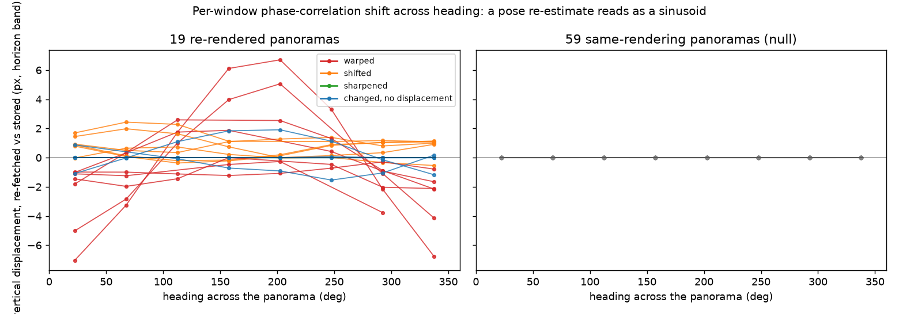

# What did Google's re-render actually change? Geometry, tone and sharpness on all 19 pairs

**2026-09-06** · Follow-up measurement for
([#114](https://github.com/ProjectSidewalk/sidewalk-panorama-tools/issues/114)), from the
[`fover` pilot](2026-09-05-fover-refetch-pilot.md)
([#73](https://github.com/ProjectSidewalk/sidewalk-panorama-tools/issues/73))

> **Reproduce:** `pytest tests/test_rerender_probe.py tests/test_rerender_probe_report.py` offline. The
> table below regenerates from the committed artifacts with
> ```bash
> python reports/scripts/rerender_reduce.py \
>     --probe reports/data/2026-09-06-rerender-probe.json \
>     --photometa reports/data/2026-09-06-rerender-photometa.json
> ```
> The measurement itself needs both copies of each panorama and was run on makelab2, where the pilot
> store sits beside the production Seattle store:
> ```bash
> python reports/scripts/rerender_probe.py --old-store <production seattle dir> \
>     --new-store <pilot copy> --ledger <pilot copy>/refetch_log.csv \
>     --pilot-json reports/data/2026-09-05-fover-refetch-pilot.json \
>     --write reports/data/2026-09-06-rerender-probe.json
> ```

## The question, and why it mattered

The `fover` pilot re-fetched 200 Seattle panoramas against a copy of the store and found that of the 78
Google still served, **19 (24.4%) came back as a different picture**: same pano id, same 16384×8192 frame,
pixels differing from the stored file at the horizon band by far more than two encodes of one picture
differ. That was a by-product of the pilot, not its question, so nothing was known about *what* had
changed — and one thing about it mattered a great deal.

**If a re-render moves features, every stored `pano_x`/`pano_y` on those panoramas is wrong for the live
imagery.** Labels were placed on the rendering we scraped. A re-stitch with a re-estimated camera pose
would shift the referent under the coordinate. That is a different problem from a re-grade, which changes
pixels a model sees and leaves every coordinate correct.

Both versions of all 78 panoramas were on makelab2 — the stored frame in the production Seattle store, the
re-fetched one in the pilot copy — so this was measured rather than argued.

## Method

Per panorama, per band. The **horizon band** is the control: CBK served those tile rows at full size in
both eras, so it isolates a change in the picture from the polar-resolution question #73 was about. The
**bottom band** is the polar rows below it.

* **Displacement** — phase correlation on 16 windows of 1024×1024 px spread across each band (8 headings ×
  2 rows), with parabolic sub-pixel refinement. A yaw change reads as a constant horizontal shift; a
  pitch/roll re-estimate cannot translate an equirectangular frame, so it reads as a vertical shift running
  as one sinusoid across heading. Every window also records its MAE **before and after** applying the
  estimated shift, so a spurious correlation peak cannot pass as a displacement.
* **Tone** — least squares `new ≈ gain × old + offset` on luma, plus the residual after it. A re-grade is a
  change the fit removes; a re-render is one it does not.
* **Sharpness** — Laplacian variance, re-fetched over stored, **divided by gain²**. A pure contrast gain
  scales that ratio with no change in detail; the synthetic battery caught that confound before the run.
* **Photometa** — capture date, served size and current pose for all 78.

The 59 panoramas the pilot classed as same-rendering run through identical code and are the null.

## What came out

**The null is clean, which is what licenses everything below.** Across all 59 same-rendering panoramas the
horizon band differs by at most **0.0742** luma, every one of the 16 windows locks, the largest measured
shift is **0 px**, and the tone fit is the identity. The 19 start at **3.3823** — a **45.6× gap** with
nothing in between. Whatever the instrument says about the 19, it is not the instrument.

| pano | captured | what changed | horizon MAE | heading offset px | tilt amplitude px | tone gain / offset | sharpness × | bottom-band MAE |
|---|---|---|---|---|---|---|---|---|
| `sJUrMnpJlG-xe1F4C4UPcQ` | 2018-10 | re-posed (heading) | 24.4 | -2.4 (-0.053°) | 0.4 (0.008°) | 1.08 / +1 | 1.6 | 38.6 |
| `F3xUV6btmwM9LnPtPaYogA` | 2019-07 | re-posed (heading + tilt) | 18.4 | +3.0 (+0.067°) | 7.2 (0.158°) | 0.92 / +8 | 1.8 | 9.7 |
| `5LKY_y72gH6MFAsG_xdglg` | 2019-06 | re-posed (heading + tilt) | 18.1 | +3.8 (+0.083°) | 5.2 (0.115°) | 0.88 / +18 | 2.2 | 15.1 |
| `vqBgfAg5m8d4prZhuClfLA` | 2018-09 | re-posed (heading) | 16.5 | +1.2 (+0.025°) | 0.5 (0.011°) | 1.03 / +4 | 1.6 | 12.9 |
| `st1BSHwdSV1XF1QiISncQA` | 2019-06 | re-posed (heading + tilt) | 15.2 | +2.0 (+0.045°) | 1.7 (0.038°) | 0.91 / +11 | 2.0 | 8.8 |
| `QF6akwbkzbXmp-YX2OIVlQ` | 2022-09 | re-posed (heading) | 12.3 | +1.3 (+0.029°) | 0.8 (0.017°) | 0.93 / +7 | 2.0 | 5.4 |
| `s9WoG61hak-5LI8FWmVq4w` | 2019-06 | re-posed (heading + tilt) | 11.6 | +1.6 (+0.036°) | 2.8 (0.062°) | 0.95 / +6 | 1.9 | 6.4 |
| `koyB692YVKl5MYVMrRKqlQ` | 2023-01 | re-posed (heading) | 11.2 | +1.9 (+0.042°) | 0.9 (0.019°) | 0.94 / +9 | 1.9 | 6.7 |
| `b17px-qNlqgD1nN3Kcx6HQ` | 2023-01 | re-posed (heading) | 9.9 | +1.5 (+0.033°) | 0.6 (0.014°) | 0.96 / +6 | 1.7 | 8.4 |
| `HWvXpp4MJSQsOKUpEUhhFA` | 2022-09 | sharpened, no displacement | 9.2 | 0 | 0 | 0.90 / +15 | 2.2 | 7.6 |
| `J1GLvc1i62EnweUZVJaQbA` | 2022-09 | re-posed (heading) | 8.6 | +1.4 (+0.030°) | 0.7 (0.016°) | 0.97 / +5 | 1.8 | 6.4 |
| `1hmsxmHRB-ieRY2WNN1n1g` | 2015-08 | re-posed (heading + tilt) | 8.3 | -0.2 (-0.006°) | 0.7 (0.018°) | 0.95 / +5 | 1.0 | 6.2 |
| `G8HiMBy3EqB3yAxR2Tgyzw` | 2019-04 | re-posed (heading + tilt) | 8.1 | +1.1 (+0.025°) | 0.3 (0.007°) | 0.97 / +4 | 1.7 | 6.9 |
| `TQEXMTPPTyPaAQkWyRm1-w` | 2019-05 | no displacement | 7.9 | 0 | 0 | 0.97 / +5 | 1.0 | 10.9 |
| `WfLuTvukUoZGf-ldOjry-Q` | 2011-07 | re-posed (heading + tilt) | 7.8 | +0.4 (+0.010°) | 0.7 (0.019°) | 0.95 / +6 | 1.6 | 14.3 |
| `Qd6QYq567lGBJmPHsi5yVA` | 2011-09 | no displacement | 7.3 | 0 | 0 | 0.95 / +7 | 1.1 | 10.8 |
| `Mb9A91CdjWBbez-kweqpxQ` | 2025-09 | no displacement | 5.5 | 0 | 0 | 0.97 / +3 | 1.1 | 48.9 |
| `CpwhhT8VYk-RCGpSqa6s3w` | 2025-09 | no displacement | 4.5 | 0 | 0 | 0.99 / +1 | 1.0 | 29.1 |
| `2MtE0TuWnZWqVJk7mIzwEg` | 2025-09 | no displacement | 3.4 | 0 | 0 | 0.99 / +1 | 1.0 | 12.6 |

"Heading offset" is the mean horizontal shift over locked windows; "tilt amplitude" is the amplitude of a
sinusoid fitted to vertical shift against heading, in px and in degrees at that frame's scale; "sharpness ×"
is the Laplacian-variance ratio net of gain, horizon band.



### Reading it

1. **13 of 19 were re-stitched with a re-estimated camera orientation.** Heading moved by up to **3.8 px
   (0.083°)**; in **four** of them the vertical shift runs as a clean sinusoid across heading with amplitude
   **1.7 to 7.2 px (0.038° to 0.158°)**, which is what a corrected pitch/roll does to an equirectangular
   frame. Removing the fitted shift roughly halves the per-window MAE — median **12.1 → 6.7** luma — so the
   displacement is real, and what remains is the next item.
2. **13 were sharpened and re-graded** (Laplacian ratio ≥ 1.2× net of gain): high-frequency energy up **1.6
   to 2.2×**, contrast gain **0.88 to 1.08**, offset **+1 to +18** luma. Flatter and brighter with more edge
   energy. That is the opposite of denoising, and it is global, so it is not localised glare repair either.
3. **Six show no displacement at all.** Three are **2025-09** captures whose horizon barely moved (MAE 3.4
   to 5.5) but whose bottom band changed enormously — MAE 12.6 to 48.9, with mean signed differences of
   **-28.5** and **+20.4** luma on two of them. That is the nadir patch over the car being replaced, on
   imagery published within the last year. The other two (2011 and 2019 captures) have patchy per-window
   MAEs at unchanged sharpness: localised edits, not a re-render of the whole frame.
4. **Not an age effect.** Capture years run **2011 to 2025 in both groups**. Every one of the 78 is still
   served at its stored frame size.

So: a reprocessing pass whose components are a pose refinement, a sharpen-and-tone step, and a nadir-patch
update, applied to different subsets. "Quality improvement" is a fair description of the motive.

## What this changes

* **Label geometry survives a swap.** The largest displacement here is **0.158°** of tilt and **0.083°** of
  heading. The [click-noise study](2026-08-09-click-noise.md) puts label placement sigma at **0.57°**
  azimuth and **0.51°** elevation, so a re-render moves a feature by at most **a third of one sigma** of the
  noise already on every label. Nothing in this sample would move a label off its referent.
* **But it is a different rendering.** Sharpness up 2× and contrast re-graded is a distribution shift for
  any crop consumer trained on the stored pixels — and the pilot's per-tile finding still stands: nothing
  Google now serves has detail the stored file lacks. So "harmless" for coordinates, **not "same" for
  pixels**. The store keeps the picture the labels were placed on; a swap trades that for a sharper one.
* **The store is an archive, and that is now written down.** See
  [ops → The store is an archive, not a cache](../docs/ops.md#the-store-is-an-archive-not-a-cache). A
  re-render at *identical dimensions* passes all four of `refetch_panos.py`'s swap gates — `dims_changed`
  catches only the ones that changed frame — so the repair path could today overwrite without proof the
  replacement is better. The gate that would close it is a horizon-band MAE against the stored file, which
  costs **no extra requests** (the fresh frame is already decoded at the point of the swap) and separates
  these two populations by 45.6×. It is not being built, because no writer runs; the rule is what stops the
  next one shipping without it.
* **For the [#43](https://github.com/ProjectSidewalk/sidewalk-panorama-tools/issues/43) decay
  measurement:** "alive" means the id is served, and here a quarter of alive ids serve a rendering that has
  been re-posed by a few pixels and re-graded. The stored rendering for those is ours alone.

## What it does not say

* **One city, n = 19 re-rendered**, drawn from panoramas with a label in the polar band. Whether 24.4% is
  Seattle-specific or age-specific is unanswered here — but see below, because it need not stay that way.
* **Displacement is measured on the horizon band only.** The bottom band is too smooth for phase
  correlation to lock reliably (**0 to 4 of 16 windows**), so the nadir finding rests on MAE and signed
  difference, not on shift.
* **The re-pose model is a heading offset plus a single sinusoid.** Residual RMS after the fit is small, so
  nothing larger is hiding in it — but a more complex warp would not be distinguished from noise.
* Thresholds (lock peak ≥ 0.10, "shifted" at ≥ 1 px sub-pixel median, "sharpened" at ≥ 1.2× net of gain)
  were **fixed before the run** against a synthetic battery of known shifts, re-grades and sharpening.

## How we would ever notice this again

Detecting a re-render in **pixels** requires the pixels, which is a full tile fan-out per panorama, and the
download path deliberately never re-fetches a panorama it already has. So there is no cheap image-side
tripwire and there should not be one.

There is a cheaper channel. **Photometa carries `heading`/`pitch`/`roll`, and 13 of these 19 were re-posed**
— so pose drift is a re-render proxy at one metadata request rather than 512 tile requests.
`photometa_census.py --refetch` already re-asks a fixed 1,360-panorama manifest, already records pose on both
sides, and already joins them one-to-one; it simply never compared the pose. It does now (`pose_drift`),
which makes the standing decay census a re-render tracker for free, across every city in the sample rather
than Seattle alone.

**Run against the two existing censuses, it immediately finds the effect.** Of the **649** panoramas alive in
both, **21 (3.24%)** had their reported pose move by at least 0.05° on some axis in the 28 days between them,
and **95** moved by any amount at all. Maximum movement was **0.1065°** of pitch and **0.2918°** of roll —
which is squarely the "`camera_pitch` changing by .1 degrees or something" raised on
[#114](https://github.com/ProjectSidewalk/sidewalk-panorama-tools/issues/114), now measured rather than
recalled.

The structural detail is what makes it a signal rather than noise: **the 95 panoramas that moved on pitch and
the 95 that moved on roll are the same 95.** Serialisation jitter would be independent per axis. A pose
re-estimation is one operation touching both, which is exactly what a re-stitch does. No panorama alive in
both changed its served dimensions, so none of this is visible to any existing check.

Its limits are worth stating plainly:

* **It catches roughly 13 of 19.** The six no-displacement panoramas — the pure re-grades and the 2025 nadir
  patches — are invisible to pose and stay undetectable by anything short of the pixels. It is a lower bound
  on re-rendering, never a count of it.
* **The 0.05° threshold is a reporting choice, not a validated detector**, and it cannot be validated: that
  would need each panorama's pose as of the night we scraped it, and nothing recorded it. The count of
  panoramas whose pose moved *at all* is reported beside it for that reason.
* **Pose drift is not the same measurement as the pixel displacement above.** These are Google's reported
  camera angles between two censuses; the table measures where the pixels actually went between scrape and
  now. They should agree in magnitude and here they do, but nothing forces them to.
* **Heading joins the census only from now on.** `extract_record` did not carry it before this change, so the
  two existing censuses can only be compared on pitch and roll — the axis a pure yaw re-estimate moves is the
  one the existing baseline is blind to.

## Where the data lives

* `reports/data/2026-09-06-rerender-probe.json` — thresholds, the two group summaries, and all 78 per-pano
  records including every window's shift, peak and before/after MAE.
* `reports/data/2026-09-06-rerender-photometa.json` — capture date, served size and current pose for all 78.
* `reports/data/2026-09-05-fover-refetch-pilot.json` — the pilot that produced the pairs and the
  `RERENDERED_HORIZON_MAE = 3.0` split.
* `reports/scripts/rerender_probe.py` — the instrument, with its synthetic self-tests;
  `rerender_photometa.py`; `rerender_reduce.py` — the table above.

## The tests that pin it

`tests/test_rerender_probe.py` drives the measurement functions on **synthetic** pairs with known answers —
a known shift, a known re-grade, a known sharpening, and the gain²-confound case that a naive sharpness
ratio gets wrong. `tests/test_rerender_probe_report.py` re-derives every cell of the table above from the
committed artifacts and asserts it appears in this markdown, per the repo's rule that a report table is the
one place a plausible number has no compiler.
