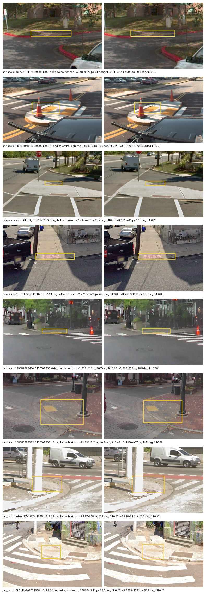

# Swapping the distance estimator: sizing rule v3, opt-in

**2026-09-26** · The distance half of [#32](https://github.com/ProjectSidewalk/sidewalk-panorama-tools/issues/32) ·
scored against the same 658 hand-drawn curb-ramp extents as [rule v2](2026-08-19-crop-sizing-v2.md)

> **Reproduce:** `pytest tests/test_crop_sizing_v3.py` pins every number below against the committed
> summary, `reports/data/2026-09-26-crop-sizing-v3.json`, offline. **From source** — needs a RampNet
> clone; the four bundles' `boxes.json` and `records.jsonl` are all tracked on RampNet `main` (this run:
> `780f25f95cb66ca8fab9039df762e76598966e4b`, recorded in the artifact's `meta`):
> ```bash
> python reports/scripts/crop_sizing_v3.py \
>     --bundle richmond=<RampNet>/benchmark/richmond \
>     --bundle sao_paulo=<RampNet>/benchmark/sao_paulo \
>     --bundle paterson=<RampNet>/benchmark/paterson \
>     --bundle annapolis=<RampNet>/benchmark/annapolis \
>     --write reports/data/2026-09-26-crop-sizing-v3.json \
>     --figure reports/figures/2026-09-26-crop-sizing-v3-examples.jpg
> ```
> `meta.bundles` records each bundle relative to the RampNet checkout and `generated_by` writes
> `<RampNet>/` in its place, so run from this repo's root against any checkout at that commit, the JSON
> is byte-identical to the committed file. `RAMPNET_ROOT=<RampNet> pytest tests/test_crop_sizing_v3.py`
> re-runs it and compares everything but `generated_by`. This corrects the v2 report's reproduce note:
> Paterson's and Annapolis' boxes are no longer only on data branches; all four are on `main`.

## 1. The question

Rule v2 fixed the half of #32 that was a units bug (the window is now an angle, clamped as an angle) and
left the other half alone: the distance a label is from the camera still comes from the 2013 linear line,
`distance = 19.81 + 0.01524 · ref_offset`, fed through the power law `8725.6 · distance^−1.192`. The lle #3
work has since produced a calibrated distance — a cotangent of the exact depression angle, blended into a
matched straight line near the horizon — and the thread's own prediction was that with a distance shaped
like geometry, the size law should become geometry too.

What a swap can and cannot buy has to be said first. v2 and v3 are both functions of the label's
depression angle **and nothing else**, so neither can know how large a particular ramp is. The most any
depression-only rule could explain on this gold is bounded, and this study computes that bound rather than
quoting RampNet's (§2). A better estimator can only move a rule towards it.

## 2. Method

Same gold, same instruments as the v2 study: 658 boxed aprons in four cities, windows cut through
`CropRunner.compute_crop_box` exactly as the cropper cuts them, and the v2 rows recomputed live (they
match the v2 artifact to the bit on every key the two artifacts share, which a test asserts; the window
angles agree only because every gold pano is 2:1, since the v2 study took them on the elevation axis).

**Rule v3** is three named steps. `label_depression_deg` turns `pano_y` into an angle;
`blend_distance_m` is the lle #3 distance (camera height 2.3412 m, blend at 11.25°, capped at 50 m); and
`geometric_window_fov_deg` returns the angle a fixed frontal span of world, `V3_CONTEXT_WIDTH_M`, subtends
at that distance: `2·atan(W / 2d)`, clamped to v2's 8°–90°. Everything downstream — the 3:2 shape, the
seam, the storage cap — is v2's.

**One constant is fitted, and how it is chosen is the method.** `V3_CONTEXT_WIDTH_M` is the value on a
0.1 m grid from 4.0 to 8.0 m whose pooled fill p50 is nearest rule v2's (0.371). That anchors v3 to the
forced-choice band that selected v2 and makes every other column a comparison **at the same median crop**.
The answer is **5.8 m**. The band-centre criterion (fill p50 nearest 0.36) gives **6.0 m**, two grid steps
away; the matched value ships because it is the like-for-like one: at 6.0 m v3 would read better on
clearing and containment purely because its windows are wider, which is the v2 report's method lesson.

**What discriminates.** `frac_clearing_too_tight` and `containment` are monotone in window size — a
constant 90° window maximises both — so they ride along as checks. The metrics a rule cannot improve by
growing are the fill dispersion (`fill_log_sd`, `p90/p10`) and the R² of log(window) against log(apron
width), both in degrees so resolution cannot enter.

**The ceiling is an isotonic fit**: the best non-decreasing function of depression, fitted to log(apron
width). Both rules are monotone in depression and an R² is the best affine map of the log window, which
is itself monotone, so this bounds both, in-sample — given a positive slope, and up to integer-pixel
rounding of the cut widths (about 0.1%). Being in-sample, it is also optimistic, so the share of the gap
a rule closes against it is a lower bound. The plan proposed a three-parameter smooth fit
(`log dep`, `dep`, intercept); it is reported too, and it is *not* a bound — v3 beats it pooled.

## 3. Finding 1 — the 2013 line is not distance-shaped

| depression | 2013 line | lle #3 blend | v2 window | v3 window |
|---:|---:|---:|---:|---:|
| 0.5° | 19.52 m | 23.31 m | 17.1° | 14.2° |
| 5° | 16.99 m | 18.48 m | 20.2° | 17.8° |
| 10° | 14.17 m | 13.11 m | 25.0° | 24.9° |
| 15° | 11.35 m | 8.74 m | 32.6° | 36.7° |
| 20° | 8.53 m | 6.43 m | 45.8° | 48.5° |
| 30° | 2.90 m | 4.06 m | 90.0° | 71.1° |
| 35° | 0.08 m | 3.34 m | 90.0° | 81.9° |
| 45° | 0.00 m | 2.34 m | 90.0° | 90.0° |

The linear line reaches **0 m at 35.15°** of depression and stays there. Under v1 the 1500-px clamp then
sized every crop; under v2 this is moot, because the 90° cap already binds from **26.55°**, so past that
depression no v2 window depends on the distance at all. The blend lands at the camera height at 45°, as a
45° ray must.

Against the aprons themselves, the log-log slope of angular width on distance (geometry says −1) and
the share of variance each distance explains:

| city | 2013 line: slope | R² | n | blend: slope | R² | n |
|---|---:|---:|---:|---:|---:|---:|
| richmond | −1.36 | 0.509 | 296 | −1.10 | 0.598 | 299 |
| sao_paulo | −1.17 | 0.657 | 117 | −1.14 | 0.789 | 119 |
| annapolis | −1.48 | 0.452 | 129 | −1.05 | 0.531 | 131 |
| paterson | −1.31 | 0.695 | 108 | −1.16 | 0.798 | 109 |
| **pooled** | **−1.28** | **0.502** | **650** | **−1.10** | **0.612** | **658** |

In every city the blend explains more of the apron's width and sits nearer −1. The 2013 line's fit
excludes the ramps where it has already hit zero (8 pooled), and its slope is dominated by its approach
to zero rather than by anything about the ramps.

## 4. Finding 2 — at the same median crop, v3 is less dispersed than v2 and tracks the apron better, everywhere

v2 / v3 in each cell:

| city | n | fill p50 | fill log-sd | fill p90/p10 | R² log window ~ log apron | ceiling (isotonic) | parametric fit |
|---|---:|---:|---:|---:|---:|---:|---:|
| richmond | 299 | 0.378 / 0.394 | 0.421 / 0.402 | 3.02 / 2.79 | 0.568 / 0.595 | 0.653 | 0.596 |
| sao_paulo | 119 | 0.322 / 0.332 | 0.335 / 0.312 | 1.99 / 1.91 | 0.743 / 0.790 | 0.838 | 0.798 |
| annapolis | 131 | 0.519 / 0.513 | 0.445 / 0.427 | 3.02 / 2.81 | 0.501 / 0.530 | 0.585 | 0.510 |
| paterson | 109 | 0.315 / 0.329 | 0.327 / 0.296 | 2.09 / 1.89 | 0.747 / 0.798 | 0.841 | 0.803 |
| **pooled** | **658** | **0.371 / 0.370** | **0.428 / 0.406** | **2.97 / 2.78** | **0.570 / 0.612** | **0.647** | **0.598** |

Fill dispersion falls and R² rises in every city. v3 closes a little over half of the gap between v2
and what any monotone depression-only rule could reach (pooled 0.570 → 0.612 against a ceiling of 0.647).

The checks, v2 / v3: clearing the "too tight" threshold **74.8% / 75.2%** pooled, containment
**0.944 / 0.944**, median window **24.9° / 24.6°**, median stored width **873 / 854** px. São Paulo's
containment dips (**0.983 / 0.975**); no other city's falls.

**Option A**, the minimal edit — the blend distance fed into v2's own power law — was scored at its own
median-matched scale (**×2.2**, fill p50 **0.368**) so the comparison is like for like. It is a real
alternative, not a strawman, and the two rules split the metrics. Pooled, A's fill is less dispersed
(log-sd **0.402** against v3's 0.406, p90/p10 **2.73** against 2.78) and it clears the "too tight"
threshold more often (**77.4%** against 75.2%) at the same containment; v3 tracks the apron better in
every city (pooled R² **0.604** against 0.612; São Paulo **0.782**, Paterson **0.792**, Richmond **0.587**,
Annapolis **0.522**). Per city, A's fill log-sd is lower in three of four (all but Annapolis), p90/p10
splits two and two, and A clears more in all four — including **Annapolis, 48.9% against 44.3%**, which
is above the 45% per-city floor the v2 report set, at containment **0.840** against v3's 0.855. Per-city
fill medians are not matched (only the pooled one is), and clearing and containment are monotone in
window size, so those two columns partly reflect where each rule's median crop landed in that city.

Option A / v3 in each cell (A at ×2.2, v3 at 5.8 m):

| city | n | fill p50 | fill log-sd | fill p90/p10 | R² log window ~ log apron | clearing "too tight" | containment |
|---|---:|---:|---:|---:|---:|---:|---:|
| richmond | 299 | 0.395 / 0.394 | 0.400 / 0.402 | 2.79 / 2.79 | 0.587 / 0.595 | 75.9% / 74.6% | 0.953 / 0.953 |
| sao_paulo | 119 | 0.312 / 0.332 | 0.295 / 0.312 | 1.89 / 1.91 | 0.782 / 0.790 | 95.8% / 95.0% | 0.983 / 0.975 |
| annapolis | 131 | 0.506 / 0.513 | 0.429 / 0.427 | 2.95 / 2.81 | 0.522 / 0.530 | 48.9% / 44.3% | 0.840 / 0.855 |
| paterson | 109 | 0.323 / 0.329 | 0.279 / 0.296 | 2.01 / 1.89 | 0.792 / 0.798 | 95.4% / 92.7% | 1.000 / 0.991 |
| **pooled** | **658** | **0.368 / 0.370** | **0.402 / 0.406** | **2.73 / 2.78** | **0.604 / 0.612** | **77.4% / 75.2%** | **0.944 / 0.944** |

The case for shipping v3 rather than A is geometric rather than a margin on these columns: v3 is the
exact subtended angle with one constant in metres, where A keeps the −1.192 exponent that was fit with
the 2013 line inside it, and v3's distance seam takes a measured distance unchanged. Which of the two to
prefer is decision D7 in the PR.

## 5. Finding 3 — what moves

On the gold, the v3 window over the v2 window (as angles): p10 **×0.868**, p50 **×0.992**, p90
**×1.127**. **39.8%** of ramps move by more than 10% and **3.2%** by more than 20%.

| depression | ramps | median v3/v2 |
|---|---:|---:|
| < 2° | 14 | ×0.84 |
| 2–5° | 74 | ×0.87 |
| 5–10° | 255 | ×0.92 |
| 10–15° | 103 | ×1.08 |
| 15–20° | 125 | ×1.13 |
| 20–30° | 77 | ×0.93 |
| 30–40° | 2 | ×0.79 |
| ≥ 40° | 8 | ×1.00 |

Narrower at the far field, wider from 10° to 20°, narrower again where v2 is already pinned at 90°
(v2 reaches the cap at **26.55°** of depression, v3 at **38.91°**), and identical once both are capped.

Where production's curb ramps sit, from the 2026-08-09 clamp census (149,837 CurbRamp labels):

| percentile | depression | v2 window | v3 window | v3/v2 |
|---|---:|---:|---:|---:|
| p10 | 7.8° | 22.7° | 21.3° | ×0.94 |
| p50 | 14.8° | 32.2° | 36.2° | ×1.13 |
| p90 | 28.0° | 90.0° | 66.7° | ×0.74 |
| p99 | 44.7° | 90.0° | 90.0° | ×1.00 |

The median production curb ramp would get a wider window, and the near-field decile a much narrower one.
That is a whole-store change, which is why §7 does not flip the default.

**What it looks like.** The v2 report's eight example ramps (two per city, spanning the depression
range), each cut under v2 (left) and v3 (right), the gold apron outlined in both; every panel is drawn at
the same width, so a wider window reads as more context at lower magnification. The captions are
`figure_examples` in the artifact.



## 6. What this does not fix

* **Annapolis, under v3.** Its clearing moves from 42.7% to **44.3%** and is still under the 45%
  per-city floor. Its ramps subtend the largest angle in the corpus. Option A at its matched scale does
  clear it (48.9%, at containment 0.840 against v3's 0.855; §4), so the shortfall is partly a property
  of v3's shape and not only an extent problem that no single global constant could reach.
* **The ceiling.** No depression-only rule passes 0.647 pooled. The rest is ramp size, which needs an
  input other than `pano_y` (label type, or the apron itself).
* **Placement error.** The window is centred on the stored click; #54's tilt term is not in either rule.
  Under v3 it has one place to go: an addend to `label_depression_deg`.
* **Above the horizon.** The blend saturates at 23.85 m, so a label above the horizon gets the
  horizon's window (**13.87°**). The 8° floor is therefore unreachable under v3.

## 7. The rule, the flag, the marker — and the decision not taken here

`CropRunner.py --sizing-rule v3` cuts with v3; **v2 stays the default**, and a 33-row table captured
from the pre-#32 code pins every v2 window byte-for-byte. `crop_rule.json` records the selected rule, a
`distance_estimator` (`linear-2013` or `lle3-cotangent-blend`) and the four `v3_*` constants, and the
mixed-store warning compares the rule the run selected.

Flipping the default moves 39.8% of windows by more than 10%, so it means re-cutting every store whole.
That waits on a re-cut path (#83) and is Jon's decision, not this report's.

## 8. Wrong turns

* **The pilot's legacy exponent did not reproduce.** The planning pilot reported −0.40 against the
  2013 line; fitting log(apron width in degrees) on log(distance) gives −1.28. The pilot's regression
  was not recorded, so the cause is not identified. The finding that survives is the R² and the
  distance from −1, both of which favour the blend in every city.
* **The ceiling was going to be a smooth fit.** The three-parameter `log dep, dep` fit came out *below*
  v3 pooled (0.598 against 0.612), because a `2·atan(W/2d)` window is outside its span. A ceiling that
  a rule can beat is not a ceiling, so the bound is now isotonic.
* **Option A was going to be one row at ×2.5.** At v2's scale its median fill is 0.325 — wider than
  either rule — so its dispersion was being compared at a different crop. Median-matched, it narrowly
  wins on dispersion pooled and in three of four cities (§4).
* **Two constants are one.** `CROP_SIZE_SCALE × object width` would have been two multiplicative
  constants carrying one degree of freedom, and scaling an angle is only the small-angle approximation of
  scaling the span; v3 has a single width in metres.
* **No figure, at first.** `crop_sizing_v2.render_examples` captioned its panels v1/v2, so the first
  draft shipped without one. It now takes the pair of rules as a parameter (the v1/v2 caption is
  unchanged), and the figure below is the v2/v3 twin of the v2 report's examples sheet.

## 9. Where things live

* Rule: `CropRunner.label_depression_deg`, `blend_distance_m`, `geometric_window_fov_deg`,
  `crop_window_fov_deg(..., sizing_rule='v3')`; constants `V3_*`.
* Study: `reports/scripts/crop_sizing_v3.py` → `reports/data/2026-09-26-crop-sizing-v3.json` and
  `reports/figures/2026-09-26-crop-sizing-v3-examples.jpg`.
* Tests: `tests/test_crop_runner.py` (the rule, the flag, the marker, the byte-identical v2 table) and
  `tests/test_crop_sizing_v3.py` (study logic on synthetic ramps, the committed findings, and this
  report's numbers against the artifact).
