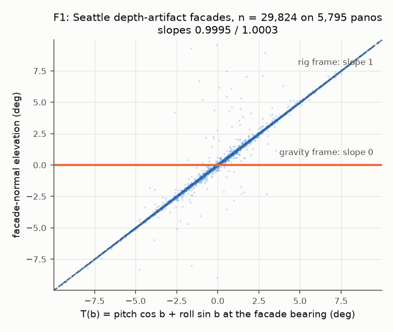
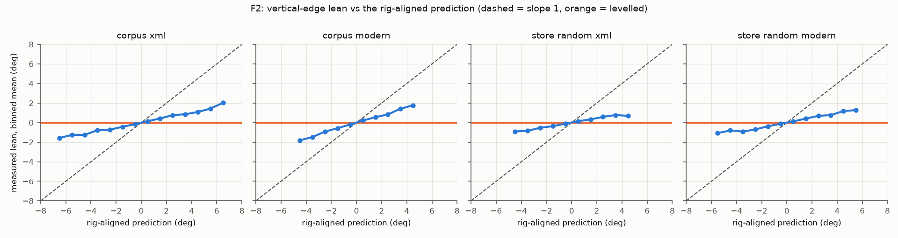
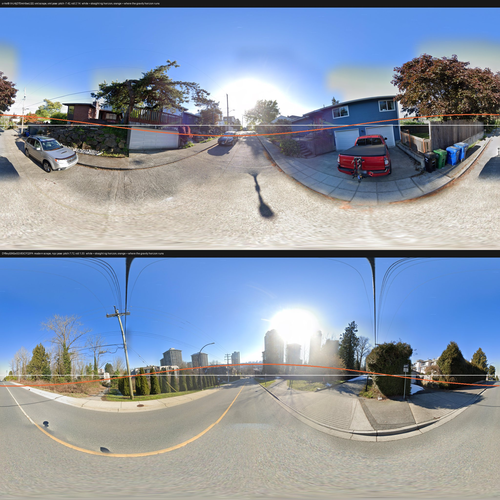
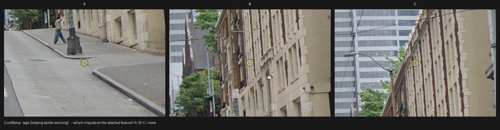

# Is the stored `pano_y` in the frame of the stored pixels? The tilt study (#54)

2026-09-26. Issue: [#54](https://github.com/ProjectSidewalk/sidewalk-panorama-tools/issues/54); upstream
diagnosis: [SidewalkWebpage#4784](https://github.com/ProjectSidewalk/SidewalkWebpage/issues/4784).
Scripts: `reports/scripts/tilt_geometry.py`, `tilt_pose_scan.py`, `tilt_frame.py`, `tilt_adjudicate.py`,
`tilt_remote_crop.py`, `tilt_error_study.py`, `tilt_figures.py`. Artifact:
[`data/2026-09-26-tilt-error-study.json`](data/2026-09-26-tilt-error-study.json). Every measured number
below is transcribed from it, and `tests/test_tilt_error_study.py` fails if one is not, matching each in
the words or table row it is quoted in. `tilt_error_study.py analyze` rebuilds the artifact from
committed data alone, and a test re-runs it.

**Jon: if you have not adjudicated endpoint C yet, read only "How to adjudicate" under C, and nothing
after it, until your verdicts are committed.**

## The question

#4784's diagnosis: Project Sidewalk turns a click into `pano_x`/`pano_y` with a formula that corrects for the
camera's heading but not for its pitch and roll. If Google's viewer showed the labeller a *levelled* view
while the stored JPEG's rows follow the camera *rig*, every stored `pano_y` is off by the rig's tilt at the
label's bearing,

    T(b) = pitch cos b + roll sin b,        b = (pano_x / pano_width) * 360 - 180,

and every crop CropRunner cuts is off-centre by that much. Three things have to be true for that to happen,
and this study measures each one separately:

* **F1** - which frame the depth artifact's planes are in (it fixes the sign convention of the pose);
* **F2** - which frame the stored tiles are in (if they were levelled, nothing could leak);
* **C** - whether the labelled feature sits at the stored `pano_y` or at the rig pixel. **This is the
  endpoint that decides #54.**

## What changed since the issue

* **Tilt is on the store for both eras.** The 2025-26 depth phase writes `pitch`/`roll` into every
  `.depth.npz`; the 2019-22 scrapes also left the dead XML endpoint's
  `<projection_properties pano_yaw_deg tilt_yaw_deg tilt_pitch_deg/>` beside every pano they wrote, whether
  or not Google still serves it. In the Seattle sample below, 19,885 posed panos are XML-era scrapes.
* **The XML convention,** fitted on 3,594 Seattle panos carrying both files: `pitch = -m cos(dir)`,
  `roll = -m sin(dir)`, `m = tilt_pitch_deg`, `dir = tilt_yaw_deg - pano_yaw_deg`. The median residuals
  against the npz pose are 0.088 deg (pitch) and 0.110 deg (roll). Every one of the seven other sign/axis
  readings misses by at least 2.00 deg on one axis. 6.5% of the overlap (235 panos) differs by more than
  1 deg as a vector: panos whose stitch changed between the two scrapes. This is not the same count as the
  2026-09-05 fover pilot's re-renders (a different population, and a restitch can keep its pose), and it
  bounds nothing about it.
* **Project Sidewalk's `camera_pitch` is the same number.** Across the corpus panos the stored
  `camera_pitch` matches the npz pitch to a median 0.026 deg and the XML-derived pitch to 0.010 deg.
  **PS stores no roll for GSV labels**: 0 of the 763 corpus labels carry `camera_roll`, and so do only
  402 of 1,350,017 rawLabels rows across 54 deployments (2026-09-12 pull), all of them Mapillary (402 of
  9,840 Mapillary rows; 0 of 1,333,972 GSV rows). Beside the car, where most sidewalk labels are, T is
  carried by the roll, so no PS field alone gives T.

## Method, per endpoint

**Samples, and which filter each count is under.** Seattle: a one-in-four sample, seed 20260926, of the
store's 4,096 two-character shards (43,725 pano ids), read in place on the store host
(`tilt_pose_scan.py`, niced, read-only). Pano ids are random, so a shard sample is a random pano sample;
it is a *sample*, not a sweep. Facade planes were read from a seeded 1,500 artifacts per scan process
(6,000 total). The corpus: the 661 panos of the 2026-08-12 study corpus in 35 cities, scanned by id. The
sampling parameters are in the artifact (`populations.seattle_pose_sample.sampling`).

**Label eras.** C's arms follow `rawlabels.era`, which buckets a label by `time_created`: `legacy` before
2021-01-01, `mid` from then to 2023-03-29, and `post179` after (the boundary is Project Sidewalk front-end
release 179; see the [era replay study](2026-08-09-era-replay-study.md)). The boundaries are PS releases,
not viewer changes. This repo does not record which Street View rendering the labelling viewer showed in
each era, and whether it was levelled is exactly what C tests. A SidewalkWebpage maintainer should
confirm the viewer per era before reading the arms as viewer comparisons.

**F1 - the depth planes.** Google's depth model is terrain plus extruded building footprints, so a facade
is plumb in the world. In the rig frame a plumb facade's normal is tilted by `+T(b_f)` at its bearing. For
every plane within 30 deg of vertical with at least 300 px of support, fit
`el_f = b_p (pitch cos b_f) + b_r (roll sin b_f)` with no intercept (normals are unoriented, and every term
flips sign with them) and CR1 standard errors clustered by pano. Rig frame: both CIs inside [0.9, 1.1];
gravity: inside [-0.1, 0.1].

**F2 - the tiles.** In a levelled equirectangular every world-vertical edge is a vertical column; in a
rig-frame one it leans by `roll cos b - pitch sin b`. `tilt_frame.py` measures the magnitude-weighted lean
of strong near-vertical edges in 12 bearing bins between -25 and +35 deg of elevation, at a 4096-wide
working decode. The fit uses pano fixed effects and the same two coefficients. It is calibrated by
re-measuring each pano after an exact +2 deg pitch warp (and +2 deg roll for one pano in four); the
analysis reads the added tilt from the rows the instrument wrote, not from a constant. Arms: the corpus
panos (on disk here), split by scrape era; on the store, 150 random plus the 150 most tilted posed Seattle
panos per scrape era. A JPEG with an `.xml` beside it is a 2019-22 stitch and is posed by that XML, never
by a 2026 npz that may describe a re-render.

**C - the crop.** `tilt_adjudicate.py` draws labels by the live measurable rule
(`rawlabels.study_measurable`, never the corpus CSV's stale column) from the four placement types, with a
pose matching the scrape era, stored dims equal to the JPEG's, and |T| >= 4 deg. It cuts the production v2
window (`crop_window_width` + `compute_crop_box` + `extract_crop`) three times: at the stored `pano_y`, at
the rig pixel `pano_y - T h/180` ("leak"), and at `pano_y + T h/180` ("antileak"). All three are the same
size, and each carries a ring where the label would sit. They are shown side by side as A/B/C in a random
order. A judge answers which ring sits on the labelled feature, or `none`. The order lives only in
`sealed/key.json`, which the `next`/`record` commands never read and which they refuse to run beside
(any key file outside `sealed/` stops them); the working folder carries a salted hash of it instead.
The corpus gave 19 eligible legacy+mid labels and 2 post179 ones, so each arm was topped up to 24 from
Seattle's store sample (2,716 and 258 eligible there; 5 and 22 taken), cut on the store host by
`tilt_remote_crop.py` from boxes computed here, and pinned pixel-identical to a local cut by a test.

**By design, the stored window's content always sits between the other two** (all three share `pano_x`,
centred at `y`, `y - s` and `y + s`), so a judge can pick out "stored" by content. The two outer windows
cannot be told apart without knowing the sign of T, which nothing on a sheet shows. So the contrast that
is blind even to a judge who knows the hypothesis is **leak against antileak**; stored against shifted is
blind only to a judge who does not. A follow-up instrument should use asymmetric decoys (for example
offsets of s and 2s, or a random second offset) so that the middle window is not always the stored one.

## Results

### F1: the depth planes are in the rig frame, exactly

| arm | facades | panos | b_p [95% CI] | b_r [95% CI] | median abs. residual (deg) |
|---|---|---|---|---|---|
| Seattle sample | 29,824 | 5,795 | 0.9995 [0.9945, 1.0045] | 1.0003 [0.9921, 1.0086] | 0.001 |
| corpus, 35 cities | 1,582 | 249 | 1.0037 [0.9995, 1.0079] | 0.9957 [0.9836, 1.0078] | 0.004 |

This fixes the sign: **streetlevel's `pitch > 0` means the camera's forward axis points below the
horizon, and `roll > 0` means the left side is up**, so a gravity-horizontal direction sits at rig
elevation `+T(b)`. The plan's hypothesis was the opposite, and so was its reading of the artifact's z
axis (the ray formula in docs/depth.md puts +z down). `tilt_geometry` now implements the measured sign,
and a test refits the committed facades against the module's own rotation.

### F2: the tiles are not levelled; the calibrated slopes are estimates

| arm | panos | raw b_p / b_r (smaller z) | calibration a (pitch / roll) | calibrated b_p [bootstrap 95% CI] | calibrated b_r [bootstrap 95% CI] |
|---|---|---|---|---|---|
| corpus, XML-era | 271 | 0.262 / 0.259 (10.6 SE) | 0.359 / 0.342 | 0.728 [0.613, 0.865] | 0.755 [0.608, 0.913] |
| corpus, modern | 170 | 0.345 / 0.396 (7.9 SE) | 0.423 / 0.360 | 0.814 [0.640, 1.025] | 1.098 [0.941, 1.336] |
| store random, XML-era | 150 | 0.187 / 0.197 (7.7 SE) | 0.295 / 0.306 | 0.634 [0.520, 0.771] | 0.643 [0.467, 0.881] |
| store random, modern | 150 | 0.219 / 0.260 (12.0 SE) | 0.293 / 0.290 | 0.747 [0.641, 0.855] | 0.895 [0.740, 1.107] |
| store top-tilt, XML-era | 150 | 0.156 / 0.125 (5.5 SE) | 0.002 / 0.173 | saturated | saturated |
| store top-tilt, modern | 150 | 0.184 / 0.205 (8.7 SE) | 0.077 / 0.191 | saturated | saturated |

**No arm is levelled.** Gravity-levelled tiles predict a raw slope of 0 whatever the calibration, and
every arm's raw slopes, the saturated ones included, exclude 0 by at least 5.5 standard errors. That is
what C needs from F2: the leak is possible in both scrape eras.

**The calibrated values are estimates, and why they fall short of 1 is open.** By the plan's pre-set
rule (both calibrated CIs inside [0.7, 1.3]) every readable arm is **undecided**; the readable
calibrated point estimates run from 0.634 to 1.098. The CIs are a pano-cluster bootstrap that resamples
the raw fit and the calibration slopes together, since `a` comes from a subset of each arm's panos (one
in four for roll). An earlier version of this report called the calibrated values lower bounds; that
argument does not hold (see Wrong turns), and a synthetic scene with world-leaning clutter shows noise,
not a systematic shortfall (`tests/test_tilt_frame.py`). Partial levelling, a mixture of levelled and
rig-aligned panos, and an instrument effect the synthetic does not model all remain possible. The
top-tilt arms (tilt magnitude 11.7-21.2 deg (XML-era) and 9.7-14.8 deg (modern)) have calibration
slopes near zero, so only their raw slopes are read. The estimator's +-12 deg edge window is the
suspected cause, but clean synthetic poles at that tilt still calibrate well, so the mechanism is not
pinned by a test.

### C: the crop endpoint (Jon's adjudication pending)

**The decision-bearing adjudication is Jon's and has not happened yet.** Jon: read the "How to
adjudicate" block and stop there; everything after it in this report is results you should not see
before judging.

**How to adjudicate** (about 30 minutes, from the repo root; nothing prints the key). The same five
steps are in the folder's own [`README.md`](data/2026-09-26-tilt-adjudication/README.md):

    python reports/scripts/tilt_adjudicate.py next   --out reports/data/2026-09-26-tilt-adjudication --judge jon
    # open the printed sheet; which ring sits on the labelled feature? then
    python reports/scripts/tilt_adjudicate.py record --out reports/data/2026-09-26-tilt-adjudication --judge jon <token> A|B|C|none
    # repeat until `next` prints "all judged"; commit verdicts_jon.jsonl; then re-run tilt_error_study.py analyze

Do not open `sealed/` (the key and the machine's verdicts), the study JSON, or the rest of this report
until you have committed your verdicts. One sheet, exactly as a judge sees it:

**On the blind.** The plan said to commit the key only after adjudication. The first version of this PR
committed it beside the sheets, copied it into a second JSON, and printed the key and the machine verdict
for 8 sheets in a report figure. The key is now sealed (`sealed/key.json`, with the machine verdicts and
the hash's salt), the figure is gone, and those 8 sheets are listed in the artifact as
`exposed_in_figure` and scored apart for every judge. The panel order is still derivable by re-running
`build_sheets` from the public seed; the blind protects a judge who follows the README.

#### Preliminary machine pass: split by the pre-set rule; leak 37, antileak 0

**Machine judge only; Jon's adjudication is pending and is the decision-bearing one.** The verdicts
below are a first pass by the implementing model (claude-opus-5-5), recorded through the same CLI and
sealed as `sealed/verdicts_claude-opus-5-5.jsonl`. That model knew the hypothesis, so only its
leak-against-antileak contrast is blind (see Method).

**Leak against antileak: leak 37, antileak 0, one-sided sign test p = 7.3e-12.** By where the leak
window sits: above the stored one: leak 16, antileak 0 of 23 sheets; below it: leak 21, antileak 0 of 25
sheets. A judge who preferred rings high or low in the frame could not produce both halves, and the
antileak window never winning is also the check on F1's sign.

| arm | n | stored / leak / antileak / none | pre-set verdict (>= 90% of all n) | post-hoc: leak share of non-`none` answers |
|---|---|---|---|---|
| legacy+mid | 24 | 2 / 17 / 0 / 5 | split | 89% |
| post179 | 24 | 1 / 20 / 0 / 3 | split | 95% |

Under the plan's rule (at least 90% of *all* n for one window, `none` kept in the denominator, as
pre-declared) both arms read **split**. The right-hand column is a post-hoc summary, not a rule
(`posthoc_decisive_share` in the artifact); even under it legacy+mid is below 90%. This report does not
explain the `none` answers: the machine judge's own after-the-fact reading (tall or linear referents,
where a vertical shift of a few degrees cannot be seen) has no committed record.

Split by exposure, the 8 exposed sheets: 0 / 6 / 0 / 2; the other 40: 3 / 31 / 0 / 6 (the machine judge
recorded its verdicts before the figure was drawn). The post179 arm includes 4 post179 labels whose
store JPEG is a 2019-22 XML-era stitch, posed by that XML: their click was made on whatever Google
served at click time, which may be a later render than the stored pixels (S2 shows the stitch changing
for some panos). They are listed per label in the artifact (`post179_xml_posed_tokens`); without them the
post179 arm reads 0 / 17 / 0 / 3 of 20.

The forced choice measures a direction and a rate, not a slope: any b between roughly 0.5 and 1.5 would
pick the leak window. The leak window also shifts y only, while the exact rig pixel
(`tilt_geometry.rig_pixel_from_gravity_pixel`) moves in x as well: over the 48 drawn labels by up to
163 px (6.8% of the window width; median 1.6%), and the first-order y is off by at most 0.6% of the
window height. That works against choosing leak, so it cannot have produced the result; it matters for
a correction (below).

### S1: the tilt prior, by scrape era (Seattle sample)

| scrape era (pose) | panos | abs. pitch p50 / p90 | abs. roll p50 / p90 | abs. T p50 / p90 / p99 |
|---|---|---|---|---|
| XML-era (xml) | 19,885 | 1.58 / 5.44 | 1.16 / 2.90 | 1.39 / 4.21 / 9.00 |
| modern (npz) | 9,236 | 1.70 / 5.71 | 1.05 / 2.61 | 1.38 / 4.30 / 8.61 |
| photometa census, 2026-08-09 (live, all eras) | 651 | 0.63 / 2.60 | 0.90 / 2.16 | not computed |

Degrees. Population: 29,121 posed of the 43,725 sampled pano ids (14,604 have no pose on the store). T is
evaluated at the bearings of all 763 corpus labels. Roll is wrapped to (-180, 180], so the photometa
census's 359.6 deg cannot recur. The last row is the prior these replace: 651 panos Google still served,
from live photometa. The two differ in population (the Seattle store sample, dead panos included,
against panos still served across cities), and this report does not separate the causes of the
difference.

### S3: what a leak of T costs a crop

The shift at the |T| p90 of each band, as a share of the v2 window's *height* (3:2 window). The ceiling
is b = 1 (the tiles fully rig-aligned). **C yields no b** (a forced choice measures a direction), so the
second share column is an **assumption, not a measurement**: F2's smallest readable calibrated estimate,
b = 0.634, and the shift scales linearly in b. The tagger column is the same shift against
sidewalk-tagger-ai's fixed 640 x 640 px crop on an 8192-high pano. Population: the Seattle sample's posed
panos, both scrape eras pooled, T at the corpus labels' bearings within each depression band.

| depression band | abs. T p90 (deg) | window height (deg) | shift at 8192 px | share of window height, b = 1 | share, b assumed from F2 | share of a 640-px tagger crop, b = 1 | RampNet sigmas, b = 1 |
|---|---|---|---|---|---|---|---|
| <5 | 4.84 | 12.8 | 220 | 37.8% | 24.0% | 34% | 9.2 |
| 5-15 | 4.38 | 17.4 | 199 | 25.2% | 16.0% | 31% | 8.3 |
| 15-30 | 3.98 | 29.4 | 181 | 13.5% | 8.6% | 28% | 7.5 |
| >30 | 3.81 | 60.0 | 174 | 6.4% | 4.0% | 27% | 7.2 |

The far labels are hit hardest: their windows are narrowest in angle. "RampNet sigmas" restates the
shift against the 12 px click sigma of RampNet's stage one on a 4096-high pano.

### S4: the extent-gold overlap

14 pairs of a PS CurbRamp label and a RampNet gold box: all of them in Paterson, none in São Paulo, whose 42
gold panos carry no PS labels. That is below the 30 the design required, so S4 is count-only and never
decision-bearing.

## What follows

Nothing here changes CropRunner. What follows depends on Jon's verdict:

* **A correction, if C is confirmed**, would move the crop centre to the rig pixel with
  `tilt_geometry.rig_pixel_from_gravity_pixel` on **both** axes, pose from the `.npz` or `.xml` beside the
  pano, behind a flag and off by default. The y-only sketch `pano_y_rig = pano_y - T(b) h/180` is its
  first-order y term; the x term above is first order too away from the horizon.
* **Where it lives** is Jon's decision (plan section 9.1): in CropRunner here, or in Planning#6's shared
  cropping library, which every consumer below would then inherit.
* **The #32 coupling.** `predict_crop_size` sizes the v2 window from `pano_y` (its depression), and the
  sizing constants were fit on stored `pano_y`. A y-correction therefore changes window size as well as
  centre, and the sizing fit would need re-running on corrected coordinates.
* **sidewalk-validator-ai** renders a perspective view centred on the label and reads depth at the label
  pixel; the [2026-08-09 consumer-requirements report](2026-08-09-cropper-consumer-requirements.md) puts
  its tolerance at about 6% of the crop upward, degrading to 2.4-7 deg beyond 20 m, which the S3 p90
  shifts (3.8-4.8 deg at b = 1) reach. Its training data would need regenerating.
* **sidewalk-tagger-ai** crops a fixed 640 px: the S3 ceiling shift is 27-34% of that side (column above),
  against the consumer report's ~10% practical and 19-42% hard ceilings. Regeneration question as above.
* **RampNet stage one**: at the p90 the ceiling shift is 7-9 of its click sigmas (S3), far over the
  consumer report's 0.5 deg target.
* **Follow-up issues to file** (not filed by this PR): the correction itself, if confirmed; ingesting
  the legacy `.xml` tilt as a first-class artifact (it is the only pose for dead panos); a fleet-wide
  pose scan (this study is Seattle plus the corpus); and an asymmetric-decoy version of the C instrument.

## Prior evidence

* **SidewalkWebpage#5174** found, on nine labels on five panos at |camera_pitch| 8.1-9.1 deg, the
  labelled feature at the stored `pano_y` in a self-hosted viewer, and nothing there when shifted by
  `camera_pitch`. It shifted by pitch alone, while the tilt at a label is `T(b) = pitch cos b + roll sin
  b`: near zero for a label beside the car even at 9 deg of pitch, and about ±9 deg for one ahead of or
  behind it. **Whether #5174 tests this mechanism could not be checked**: the issue names neither the
  city nor the panos of its nine labels (the ids in its comments are four other labels, at |camera_pitch|
  1.2-3.1 deg), and PS stores no roll, so T(b) cannot be computed for them offline. If any of the nine sat
  near b = 0 or 180 deg, #5174 contradicts C's preliminary pass, and the two should be reconciled before
  a correction is filed.

## Wrong turns

* The issue assumed per-pano tilt was fetchable only for panos Google still serves; the 2019-22 scrapes left the dead XML endpoint's tilt beside every pano they wrote, alive or not.
* The plan put the depth artifact's z axis up; the documented ray formula puts it down, and the plan's pose sign (pitch > 0 = nose up) was reversed with it. F1 measured slopes of -1.00 against that hypothesis before the module was switched to the measured sign.
* Instrument (b), RampNet extent gold as tilt gold, was void: RampNet points are pixel-frame detections, not Project Sidewalk clicks, so they carry no tilt term by construction.
* The planner's first depth-frame test used the ground plane, which is confounded by road grade (the rig sits on the road); facade planes were the fix.
* The full Seattle store scan would have run about 95 minutes; it was stopped and replaced by a seeded one-in-four shard sample across four niced processes.
* The first corpus lean run used the pre-F1 sign in its calibration warps; it was re-run after the sign was fixed, and only the re-run is committed.
* The first version of this report read the calibrated F2 slopes as lower bounds, arguing that the warp rotates world-leaning clutter that the real tilt does not. The real tilt rotates the whole image, clutter included, and a many-scene synthetic shows noise, not a shortfall (#158 review); the calibrated values are estimates, and why they read below 1 is open.
* The top-tilt store arms saturate the lean estimator (calibration slope near zero) and cannot be calibrated; they are kept in the artifact and flagged, and only their raw slopes are read.
* The corpus alone yielded 21 labels at |T| >= 4 deg, only 2 of them post179; each arm was topped up to 24 from the Seattle store sample at the same threshold instead of widening to 3 deg.
* The first version committed the adjudication key beside the sheets, copied it into a second JSON, and printed it for 8 sheets in a report figure above the judging instructions (#158 review). The key is sealed now and those 8 sheets are scored apart.
* The first version headlined C as "the labelled feature sits at the rig pixel". By the pre-set rule both arms are split, and the one contrast a judge who knows the hypothesis cannot steer is leak against antileak (#158 review).

## Deviations from the plan

Each with what was known when it was decided.

* F1 was planned as a sweep of every Seattle depth artifact; it ran on the seeded one-in-four shard sample, with facades read from a seeded subset of each scan process's artifacts. Decided on the scan's run time, before any F1 fit.
* F2's store arms were planned at 300 panos per stratum and ran at 150, on the store decode cost; decided before any lean was measured.
* C's draw was topped up from the Seattle store sample at the same |T| threshold when the corpus gave too few eligible labels; decided after the eligibility count and before any sheet was judged.
* The plan asked S3 for a fitted-beta row beside the ceiling. C yields no beta (a forced choice measures a direction, not a slope), so S3 gives the ceiling and a range assumed from F2's calibrated estimates, labelled as an assumption.
* The plan treated the +2 deg warp as a calibration that recovers the slope. It is kept, but its calibrated values are reported as estimates with the shortfall open, and "not levelled" rests on the raw slopes.
* #54 asked for the #4784 signature directly, a sinusoid in bearing with amplitude set by the tilt; the plan replaced it with the forced choice at |T| >= 4 deg (plan section 1.3). The by-direction split is this report's partial evidence for the sign flip with bearing.
* The plan said to commit the adjudication key only after adjudication. It was committed early, and is now sealed with a salted hash in its place.

## Consequences for older reports

* **The crop-priors prereg, §2.2** left the relative sign of the tilt term open. F1 measures it: el_rig =
  +T in streetlevel's sign. A §7 decision-log entry is Jon's to append; this PR does not touch the prereg.
* **The photometa census's tilt prior** is superseded by S1 (store-wide, both eras, wrapped).
* **docs/depth.md's frame statement**: plane normals are in the rig frame (F1), with +z down.

## Cross-repo consequences

* sidewalk-auto-labeler: `geo._world_ray`'s docstring and the premise of #52 that "streetlevel's GSV
  equirectangulars are already gravity-rectified" do not hold **for the stored tiles** (F2). F2 measured
  the cbk tiles this repo stitches, not the images streetlevel fetches for the auto-labeler; whether the
  two come from the same tile endpoint, and so whether the finding reaches the auto-labeler's images, is
  unverified here.
* SidewalkWebpage#4784's mechanism is consistent with C's preliminary pass (split by the pre-set rule;
  leak 37, antileak 0), pending Jon's adjudication; see Prior evidence for #5174.
* label-latlng-estimation: a depression angle read off `pano_y` is rig-relative, off by T(b), if C holds.
* RampNet stage one: the S3 shifts are 7-9 of its click sigmas at the p90, at b = 1.

## Open questions

* C's decision-bearing verdict (Jon), and with it everything under "What follows".
* Why the calibrated F2 slopes fall short of 1 (see F2).
* Mapillary: Richmond's labels are human, but whether PS's Mapillary viewer renders levelled is a
  SidewalkWebpage fact this repo cannot check offline; the Pannellum wrapper ignoring `cameraPitch`
  (auto-labeler #42) suggests the question is live. Left open.
* The 19,885-pano XML-era pose in this sample alone is the only tilt record for dead panos, and nothing
  ingests it.
