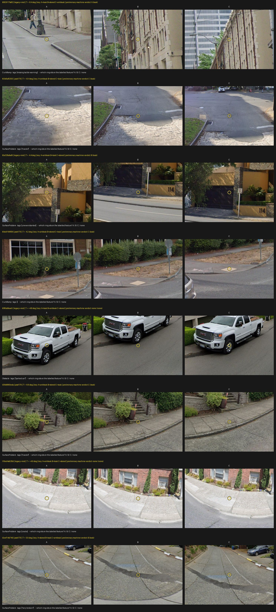

# Is the stored `pano_y` in the frame of the stored pixels? The tilt study (#54)

2026-09-26. Issue: [#54](https://github.com/ProjectSidewalk/sidewalk-panorama-tools/issues/54); upstream
diagnosis: [SidewalkWebpage#4784](https://github.com/ProjectSidewalk/SidewalkWebpage/issues/4784).
Scripts: `reports/scripts/tilt_geometry.py`, `tilt_pose_scan.py`, `tilt_frame.py`, `tilt_adjudicate.py`,
`tilt_remote_crop.py`, `tilt_error_study.py`, `tilt_figures.py`. Artifact:
[`data/2026-09-26-tilt-error-study.json`](data/2026-09-26-tilt-error-study.json); every number below is
transcribed from it and `tests/test_tilt_error_study.py` fails if one is not.

## The question

#4784's diagnosis: Project Sidewalk turns a click into `pano_x`/`pano_y` with a formula that corrects for the
camera's heading but not for its pitch and roll. If Google's viewer showed the labeller a *levelled* view
while the stored JPEG's rows follow the camera *rig*, every stored `pano_y` is off by the rig's tilt at the
label's bearing,

    T(b) = pitch cos b + roll sin b,        b = (pano_x / pano_width) * 360 - 180,

and every crop CropRunner cuts is off-centre by that much. Three things have to be true for that to happen,
and this study measures each one separately:

* **F1** - which frame the depth artifact's planes are in (it fixes the sign convention of the pose);
* **F2** - which frame the stored tiles are in (if they were levelled, nothing could leak);
* **C** - whether the labelled feature sits at the stored `pano_y` or at the rig pixel. **This is the
  endpoint that decides #54.**

## What changed since the issue

* **Tilt is on the store for both eras.** The 2025-26 depth phase writes `pitch`/`roll` into every
  `.depth.npz`; the 2019-22 scrapes also left the dead XML endpoint's
  `<projection_properties pano_yaw_deg tilt_yaw_deg tilt_pitch_deg/>` beside every pano they wrote, whether
  or not Google still serves it. In the Seattle sample below, 19,885 posed panos are XML-era scrapes.
* **The XML convention, fitted on 3,594 Seattle panos carrying both files:** `pitch = -m cos(dir)`,
  `roll = -m sin(dir)`, `m = tilt_pitch_deg`, `dir = tilt_yaw_deg - pano_yaw_deg`. The median residuals
  against the npz pose are 0.088 deg (pitch) and 0.110 deg (roll). Every one of the seven other sign/axis
  readings misses by at least 1.99 deg on one axis. 6.5% of the overlap differs by more than 1 deg as a
  vector: the re-render the 2026-09-05 pilot found, seen from the pose side.
* **Project Sidewalk's `camera_pitch` is the same number.** Across the corpus panos the stored
  `camera_pitch` matches the npz pitch to a median 0.026 deg and the XML-derived pitch to 0.010 deg.
  **PS stores no roll for GSV labels**: 0 of the 763 corpus labels carry `camera_roll`, and so do only
  402 of 1,350,017 rawLabels rows across 54 deployments (2026-09-12 pull). That is why a test that shifts labels by
  `camera_pitch` alone (SidewalkWebpage#5174) cannot test this mechanism: beside the car, where most
  sidewalk labels are, T is carried by the roll.

## Method, per endpoint

**Samples, and which filter each count is under.** Seattle: a seeded one-in-four sample of the store's
4,096 two-character shards (43,725 pano ids), read in place on the store host (`tilt_pose_scan.py`, niced,
read-only). Pano ids are random, so a shard sample is a random pano sample; it is a *sample*, not a sweep.
Facade planes were read from a seeded 1,500 artifacts per scan process (6,000 total). The corpus: the 661
panos of the 2026-08-12 study corpus in 35 cities, scanned by id.

**F1 - the depth planes.** Google's depth model is terrain plus extruded building footprints, so a facade
is plumb in the world. In the rig frame a plumb facade's normal is tilted by `+T(b_f)` at its bearing. For
every plane within 30 deg of vertical with at least 300 px of support, fit
`el_f = b_p (pitch cos b_f) + b_r (roll sin b_f)` with no intercept (normals are unoriented, and every term
flips sign with them) and CR1 standard errors clustered by pano. Rig frame: both CIs inside [0.9, 1.1];
gravity: inside [-0.1, 0.1].

**F2 - the tiles.** In a levelled equirectangular every world-vertical edge is a vertical column; in a
rig-frame one it leans by `roll cos b - pitch sin b`. `tilt_frame.py` measures the magnitude-weighted lean
of strong near-vertical edges in 12 bearing bins between -25 and +35 deg of elevation, at a 4096-wide
working decode. The fit uses pano fixed effects and the same two coefficients, and it is calibrated by
re-measuring each pano after an exact +2 deg pitch warp (and +2 deg roll for one pano in four). Arms: the
corpus panos (on disk here), split by scrape era; on the store, 150 random plus the 150 most tilted posed
Seattle panos per scrape era. A JPEG with an `.xml` beside it is a 2019-22 stitch and is posed by that XML,
never by a 2026 npz that may describe a re-render.

**C - the crop.** `tilt_adjudicate.py` draws labels by the live measurable rule
(`rawlabels.study_measurable`, never the corpus CSV's stale column) from the four placement types, with a
pose matching the scrape era, stored dims equal to the JPEG's, and |T| >= 4 deg. It cuts the production v2
window (`crop_window_width` + `compute_crop_box` + `extract_crop`) three times: at the stored `pano_y`, at
the rig pixel `pano_y - T h/180` ("leak"), and at `pano_y + T h/180` ("antileak"). All three are the same
size, and each carries a ring where the label would sit. They are shown side by side as A/B/C in a random
order. A judge answers which ring sits on the labelled feature, or `none`. The order lives only in `key.json`,
which the `next`/`record` commands never read. The corpus gave 19 eligible legacy+mid labels and 2 post179
ones, so each arm was topped up to 24 from Seattle's store sample (2,716 and 258 eligible there; 5 and 22
taken), cut on the store host by `tilt_remote_crop.py` from boxes computed here, and pinned
pixel-identical to a local cut by a test.

## Results

### F1: the depth planes are in the rig frame, exactly

| arm | facades | panos | b_p [95% CI] | b_r [95% CI] | median abs. residual (deg) |
|---|---|---|---|---|---|
| Seattle sample | 29,824 | 5,795 | 0.9995 [0.9945, 1.0045] | 1.0003 [0.9921, 1.0086] | 0.001 |
| corpus, 35 cities | 1,582 | 249 | 1.0037 [0.9995, 1.0079] | 0.9957 [0.9836, 1.0078] | 0.004 |

This fixes the sign: **streetlevel's `pitch > 0` means the camera's forward axis points below the
horizon, and `roll > 0` means the left side is up**, so a gravity-horizontal direction sits at rig
elevation `+T(b)`. The plan's hypothesis was the opposite, and so was its reading of the artifact's z
axis (the ray formula in docs/depth.md puts +z down). `tilt_geometry` now implements the measured sign.

### F2: the tiles are not levelled; the calibrated slope is a lower bound

| arm | panos | raw b_p / b_r | calibration a | calibrated b_p [95% CI] | calibrated b_r [95% CI] |
|---|---|---|---|---|---|
| corpus, XML-era | 271 | 0.262 / 0.259 | 0.359 | 0.728 [0.596, 0.861] | 0.755 [0.616, 0.894] |
| corpus, modern | 170 | 0.345 / 0.396 | 0.423 | 0.814 [0.612, 1.016] | 1.098 [0.978, 1.218] |
| store random, XML-era | 150 | 0.187 / 0.197 | 0.295 | 0.634 [0.493, 0.775] | 0.643 [0.478, 0.807] |
| store random, modern | 150 | 0.219 / 0.260 | 0.293 | 0.747 [0.625, 0.869] | 0.895 [0.759, 1.032] |
| store top-tilt, XML-era | 150 | 0.156 / 0.125 | 0.002 | saturated | saturated |
| store top-tilt, modern | 150 | 0.184 / 0.205 | 0.077 | saturated | saturated |

By the plan's pre-set rule (both calibrated CIs inside [0.7, 1.3]) every arm is **undecided**. What the
data does decide is the other half of the rule: **no arm is levelled**. Every calibrated CI sits above the
gravity band [-0.3, 0.3], the per-pano slopes are unimodal (no mixture of levelled and rig panos), and the
phase of the lean follows the pose in both scrape eras. The calibrated values read below 1 for a reason
the design missed: the +2 deg warp rotates *every* near-vertical edge, including trees and off-plumb poles
that carry no tilt signal in the unwarped image, so it over-counts the response. A synthetic scene with
world-leaning clutter reproduces this, and `tests/test_tilt_frame.py` pins it. The top-tilt arms (10-21 deg)
lean past the estimator's +-12 deg window and are unreadable. F2 therefore says what C needs from it: the
leak is possible in both eras.

### C: the labelled feature sits at the rig pixel, not the stored `pano_y` (preliminary)

**The decision-bearing adjudication is Jon's and has not happened yet.** The verdicts below are a
first pass by the implementing model (claude-opus-5-5), judged blind through the same CLI. They are
committed as `verdicts_claude-opus-5-5.jsonl` and are **not decision-bearing**.

| arm | n | stored / leak / antileak / none | leak share of decisive answers |
|---|---|---|---|
| legacy+mid | 24 | 2 / 17 / 0 / 5 | 89% |
| post179 | 24 | 1 / 20 / 0 / 3 | 95% |

Split by where the leak window sits: leak chosen 16 of 23 when it is above the stored window (T > 0), and
21 of 25 when it is below. So a judge who simply preferred rings lower in the frame could not produce
this. The antileak window was never chosen, which is the check on F1's sign. Under the plan's rule (at
least 90% of *all* n for one window) both arms read `split`, because `none` stays in the denominator. The
`none` answers are almost all referents that are tall (a pole, a tree, a parked car) or linear (a straight
curb), where a vertical shift of a few degrees cannot be seen. The forced choice measures a direction and a
rate, not a slope: any b between roughly 0.5 and 1.5 would pick the leak window.

**For Jon - how to adjudicate** (about 30 minutes; from the repo root; nothing prints the key):

    python reports/scripts/tilt_adjudicate.py next   --out reports/data/2026-09-26-tilt-adjudication --judge jon
    # open the printed sheet; then
    python reports/scripts/tilt_adjudicate.py record --out reports/data/2026-09-26-tilt-adjudication --judge jon <token> A|B|C|none
    # repeat until `next` prints "all judged"; then re-run tilt_error_study.py analyze and commit verdicts_jon.jsonl

Do not open `key.json` before finishing.

### S1: the tilt prior, by scrape era (Seattle sample)

| scrape era (pose) | panos | abs. pitch p50 / p90 | abs. roll p50 / p90 | abs. T p50 / p90 / p99 |
|---|---|---|---|---|
| XML-era (xml) | 19,885 | 1.58 / 5.44 | 1.16 / 2.90 | 1.39 / 4.21 / 9.00 |
| modern (npz) | 9,236 | 1.70 / 5.71 | 1.05 / 2.61 | 1.38 / 4.30 / 8.61 |

Degrees. T is evaluated at the bearings of all 763 corpus labels. Roll is wrapped to (-180, 180], so the
photometa census's 359.6 deg cannot recur. These replace the 651-pano sampled prior.

### S3: what a leak of T costs a crop

The ceiling, b = 1: the shift is the whole |T| p90 of each band, as a share of the v2 window's *height*
(3:2 window). C's preliminary verdict says the ceiling is the likely value.

| depression band | abs. T p90 (deg) | window height (deg) | shift at 8192 px | share of window height | RampNet sigmas |
|---|---|---|---|---|---|
| <5 | 4.84 | 12.8 | 220 | 37.8% | 9.2 |
| 5-15 | 4.38 | 17.4 | 199 | 25.2% | 8.3 |
| 15-30 | 3.98 | 29.4 | 181 | 13.5% | 7.5 |
| >30 | 3.81 | 60.0 | 174 | 6.4% | 7.2 |

The far labels are hit hardest: their windows are narrowest in angle. "RampNet sigmas" restates the
shift against the 12 px click sigma of RampNet's stage one on a 4096-high pano.

### S4: the extent-gold overlap

14 pairs of a PS CurbRamp label and a RampNet gold box: all of them in Paterson, none in São Paulo, whose 42
gold panos carry no PS labels. That is below the 30 the design required, so S4 is count-only and never
decision-bearing.

## Wrong turns

* The issue assumed per-pano tilt was fetchable only for panos Google still serves; the 2019-22 scrapes left the dead XML endpoint's tilt beside every pano they wrote, alive or not.
* The plan put the depth artifact's z axis up; the documented ray formula puts it down, and the plan's pose sign (pitch > 0 = nose up) was reversed with it. F1 measured slopes of -1.00 against that hypothesis before the module was switched to the measured sign.
* Instrument (b), RampNet extent gold as tilt gold, was void: RampNet points are pixel-frame detections, not Project Sidewalk clicks, so they carry no tilt term by construction.
* The planner's first depth-frame test used the ground plane, which is confounded by road grade (the rig sits on the road); facade planes were the fix.
* SidewalkWebpage 5174 shifted labels by the full camera_pitch, but the tilt at a label is T(b) = pitch cos b + roll sin b, near zero for labels beside the car, and PS stores no roll.
* The full Seattle store scan would have run about 95 minutes; it was stopped and replaced by a seeded one-in-four shard sample across four niced processes.
* The first corpus lean run used the pre-F1 sign in its calibration warps; it was re-run after the sign was fixed, and only the re-run is committed.
* The warp calibration the plan specified does not divide out world-leaning clutter, so the calibrated F2 slopes are lower bounds, not estimates (tests/test_tilt_frame.py pins this).
* The top-tilt store arm (10-21 deg) saturates the lean estimator, calibration slope near zero, and cannot be read; it is kept in the artifact and flagged, not used.
* The corpus alone yielded 21 labels at |T| >= 4 deg, only 2 of them post179; each arm was topped up to 24 from the Seattle store sample at the same threshold instead of widening to 3 deg.

## Consequences for older reports

* **The crop-priors prereg, §2.2** left the relative sign of the tilt term open. F1 measures it: el_rig =
  +T in streetlevel's sign. A §7 decision-log entry is Jon's to append; this PR does not touch the prereg.
* **The photometa census's tilt prior** is superseded by S1 (store-wide, both eras, wrapped).
* **docs/depth.md's frame statement**: plane normals are in the rig frame (F1), with +z down.

## Cross-repo consequences

* sidewalk-auto-labeler: `geo._world_ray`'s docstring and the premise of #52 that "streetlevel's GSV
  equirectangulars are already gravity-rectified" do not hold for the stored tiles (F2).
* SidewalkWebpage#5174 (the stored panoramas are gravity-aligned) tested pitch only, at labels where T is
  mostly roll. SidewalkWebpage#4784's mechanism is supported at crop level by C's preliminary pass.
* label-latlng-estimation: a depression angle read off `pano_y` is rig-relative, off by T(b).
* RampNet stage one: the S3 shifts are 7-9 of its click sigmas at the p90.

## Open questions

* C's decision-bearing verdict (Jon), and with it whether a crop-time correction
  (`pano_y_rig = pano_y - T(b) h/180`, pose from the `.npz` or `.xml` beside the pano) is filed. That
  correction is a separate PR, not this one.
* Mapillary: Richmond's labels are human, but whether PS's Mapillary viewer renders levelled is a
  SidewalkWebpage fact this repo cannot check offline; the Pannellum wrapper ignoring `cameraPitch`
  (auto-labeler #42) suggests the question is live. Left open.
* The 19,885-pano XML-era pose in this sample alone is the only tilt record for dead panos, and nothing
  ingests it.
