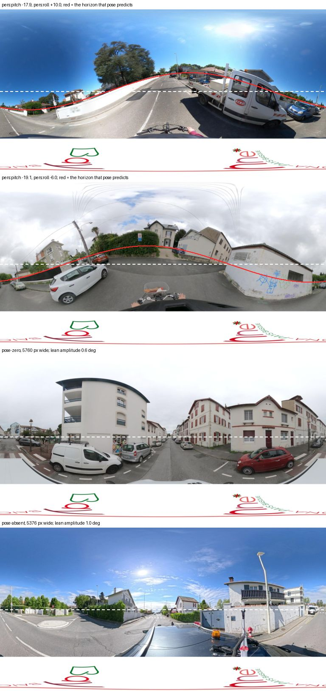

# Are Mapillary and Panoramax panoramas levelled? A desk check for #190

**2026-10-06** · Scoped-down follow-up to the tilt study
([#54](https://github.com/ProjectSidewalk/sidewalk-panorama-tools/issues/54),
[#158](https://github.com/ProjectSidewalk/sidewalk-panorama-tools/pull/158)) for the non-GSV sources
([#190](https://github.com/ProjectSidewalk/sidewalk-panorama-tools/issues/190))

> **Reproduce:** `pytest tests/test_non_gsv_levelling_study.py` offline. The live measurement is
> ```bash
> python reports/scripts/non_gsv_levelling.py fetch      # 51 sequential requests, 2 s apart, no key
> python reports/scripts/non_gsv_levelling.py analyze \
>     --write reports/data/2026-10-06-non-gsv-levelling.json \
>     --figure reports/figures/2026-10-06-panoramax-horizons.jpg
> ```
> The raw API responses are committed, gzipped, in
> [`data/2026-10-06-non-gsv-levelling/`](data/2026-10-06-non-gsv-levelling/); `fetch` re-downloads the
> 2048-wide images into the gitignored `scripts/.cache/`. No Mapillary token was used.

## The answer

| Source | Served pixels levelled? | Where the per-image pose lives | Crop-time correction possible? |
|---|---|---|---|
| **Panoramax** (Bayonne) | **No**, for pictures that carry a non-zero pose: levelling with their own pose flattens **10 of 14**. Pictures with a 0/0 pose or none show **no measurable tilt** at n = 5 each | STAC `properties.pers:pitch` / `pers:roll`, mirrored exactly into Project Sidewalk's `pano_data.camera_pitch` / `camera_roll`. **Not** in the uploaded file's EXIF | **Yes**, from either copy. Convention measured here: streetlevel pitch = −`pers:pitch`, streetlevel roll = +`pers:roll` |
| **Mapillary** (Richmond, Laurens) | **Unknown by measurement** (no token, so no pixels). Every desk signal says no | Graph API `computed_rotation` (token). Project Sidewalk keeps a pitch/roll derived from it, but only for **313** of **9,282** Richmond panos and **863** of **4,579** Laurens ones; the rest are null | **Yes in principle**, via `computed_rotation`. From PS's own copy, only for the panos that have one |

**Recommendation: close #190 with this report, and file one narrower follow-up for the Panoramax
endpoint-C arm** (Decisions for Jon, in the PR). The reasoning is in [What it means](#what-it-means-for-the-stored-pano_y).

## The question

The tilt study's endpoint C showed that a tilted GSV pano's stored `pano_y` leaks towards the rig pixel,
and F2 showed that GSV's stored tiles are not gravity-levelled
([tilt study](2026-09-26-tilt-error-study.md)). C is GSV-only, because its shifted windows are cut from a
pose read out of the `.depth.npz` or `.xml` beside the pano, and Mapillary and Panoramax have neither.
#190 asked three questions. Jon scoped this to the first two:

* **Q1.** Are each source's served equirectangular images gravity-levelled?
* **Q2.** Does a per-image pose exist, and where?

Q3 (whether C's instrument carries over) is not answered here. The code reading in
[What it means](#what-it-means-for-the-stored-pano_y) says what this desk check implies for it.

## Method

**Desk.** The Mapillary API reference (image fields), the Panoramax STAC items themselves, the Panoramax
viewer issue and forum thread on horizon correction, and Project Sidewalk's own viewer code at
SidewalkWebpage `develop` @ [`f87b9f3`](https://github.com/ProjectSidewalk/SidewalkWebpage/tree/f87b9f30a4fd80675c790aa500cd0762e72db283).

**What Project Sidewalk stores.** `/adminapi/panos` for `bayonne-fr`, `richmond-va` and `laurens-ia`, one
request each, summarised per city by pose class: `pose-nonzero`, `pose-zero` (pitch 0 and roll present
and 0), and `pose-absent` (no roll stored).

**Panoramax pixels.** A hash-ordered draw (seed 190) from Bayonne's pano list of **14** `pose-nonzero`,
**5** `pose-zero` and **5** `pose-absent` pictures (**24** in all). For each: `GET /api/pictures/<id>` on
the federated catalog, then the `sd` asset (2048 × 1024). The instrument is F2's,
`tilt_frame.lean_profile`, imported rather than restated: the magnitude-weighted lean of near-vertical
edges in 12 bearing bins. A levelled pano gives a flat profile, and a rig-frame one gives the sinusoid
`roll cos b − pitch sin b` (streetlevel's sign, `pano_pose`). Each profile is fitted freely as
`c0 + A cos b + B sin b`, and read two ways:

1. **The levelling test, which gives the verdict.** Resample the picture into the gravity frame with its
   own stored pose (`level_with_pose`) and re-measure. A rig-frame picture with a correct pose flattens.
   A levelled picture gets *worse*, because the correction re-tilts it. This needs no gain calibration,
   and it asks exactly what a crop-time correction would ask. The docs do not fix how `pers:roll` relates
   to streetlevel's roll, so the test runs under both roll signs. A picture counts as *flattened* when
   its amplitude after is under half its amplitude before.
2. **The raw slopes, a cross-check on the convention.** These are the through-origin slopes of B on
   `pers:pitch` and of A on `pers:roll`, across pictures, with a picture-cluster bootstrap. Levelled
   pixels give 0. Rig-frame pixels give a positive pitch slope (`pers:pitch` is positive-up), and a roll
   slope whose sign is the roll convention.

Two departures from F2, both pinned by tests. The lean window is **30°**, not 12°, because Bayonne's
pitches reach 20° and the 12° window truncates them. And F2's warp calibration is recorded but **not
divided out**: on noiseless synthetic poles at 18° of pitch its local gain reads 1.30, inflated by the
geometry's own nonlinearity (see Wrong turns).

## Results: Panoramax

### Where the pose lives

* **In the STAC item.** **19** of the **24** sampled items carry `pers:pitch`/`pers:roll`, and **14** of
  them are non-zero. Every one of the 19 equals Project Sidewalk's stored `camera_pitch`/`camera_roll`
  (**19** of 19). That is expected: [`PanoramaxViewer.js`](https://github.com/ProjectSidewalk/SidewalkWebpage/blob/f87b9f30a4fd80675c790aa500cd0762e72db283/frontend/js/common/pano-viewer/PanoramaxViewer.js#L203-L207)
  copies them straight across.
* **Not in the uploaded file.** All **14** non-zero items record `Xmp.GPano.PosePitchDegrees` and
  `PoseRollDegrees` as `0.0` in the EXIF block the catalog serves. So the pose was set after upload, not
  by the camera. The Panoramax project's horizon-correction work is the likely source: the
  [forum thread](https://forum.geocommuns.fr/t/poc-panoramax-correction-dhorizon/2405) (from May 2025)
  proposes vanishing-point and neural estimators, and keeping the correction in metadata so that the
  pixels are never re-encoded. The viewer issue asking for exactly that
  ([web-viewer#281](https://gitlab.com/panoramax/clients/web-viewer/-/issues/281)) closed on 2026-01-14.
  This check did not establish which estimator produced Bayonne's values.
* **Who has a pose in Bayonne.** Of **73** panos (**34** labelled): **26** are `pose-nonzero` (**16**
  labelled), **12** are `pose-zero` (**9** labelled) and **35** are `pose-absent` (**9** labelled). The
  tilts are large: |pitch| p90 **17.9**° (max **20.2**°), |roll| p90 **6.0**° (max **10.0**°). The
  sample's posed pictures show a GoPro Max on bicycle handlebars, pitched well forward. All 24 sampled
  pictures are from `sig_bayonne`, `etalab-2.0`. The `pose-absent` ones are 5376 wide, and the other two
  classes are 5760 wide.

### Q1: the pixels are in the rig frame wherever the pose is non-zero

| Levelling the 14 `pose-nonzero` pictures with their own pose | roll sign +1 (streetlevel roll = +`pers:roll`) | roll sign −1 |
|---|---|---|
| lean amplitude before, median (deg) | 3.50 | 3.50 |
| lean amplitude after, median (deg) | **0.47** | 3.65 |
| lean amplitude after, max (deg) | 2.90 | 5.93 |
| flattened (after < ½ before) | **10 of 14** | 2 of 14 |

So the served pixels are not levelled, the stored pose describes them, and the roll sign is **+1**. The
four that did not flatten are not counter-evidence. Two have poses under 2.5° (`f517c893`, `cdafa20a`),
which sit at the instrument's floor before and after. One (`8ae6f346`, 4.1° of pitch) went 1.67 → 0.99,
and the opposite sign did a little better on it. The last (`a752d58b`, −12.5° / +1.1°) went 3.50 → 2.90,
but on inspection its predicted horizon sits on the visible one. The scene is road and sky with few
vertical edges, and its warp gain is 0.11, so the instrument cannot read it.

The raw slopes agree. B on `pers:pitch` is **0.31** [0.25, 0.38], and A on `pers:roll` is **0.22**
[0.06, 0.49]. Both exclude 0 and both are positive, which gives the same convention as the levelling
test. The pitch slope sits close to the median warp gain across all 24 pictures (**0.34**), as it should
if the pose is the whole tilt. F2's raw GSV slopes were in the same 0.2–0.4 range.



*The two most tilted posed pictures, one `pose-zero` and one `pose-absent`. Dashed: the image mid-line,
where a levelled horizon sits. Red: the gravity horizon that the stored pose predicts on a rig-frame image,
under the measured convention. Images: sig_bayonne via Panoramax, Licence Ouverte / Etalab 2.0,
downsampled.*

### The pictures with a 0/0 pose or none

| class | pictures | lean amplitude median (deg) | range (deg) |
|---|---|---|---|
| `pose-nonzero` (before levelling) | 14 | 3.50 | 0.51–8.24 |
| `pose-zero` | 5 | 0.84 | 0.48–0.90 |
| `pose-absent` | 5 | 1.17 | 0.45–2.79 |

Neither class shows a tilt the instrument can see. Their medians are near the posed pictures' levelled
floor (0.47), not near the posed pictures' raw 3.50. The one `pose-absent` reading at 2.79
(`e2e79e8b`) is a vegetation-heavy scene that looks level by eye. At n = 5 per class this cannot rule
out a tilt of a degree or two. **So `pose-zero`/`pose-absent` are "not measurably tilted", not "verified
levelled".** Note also that the explicit 0/0 is on the same 5760-wide handlebar rig as the posed
pictures. Whether those pictures were measured as level or simply never estimated is not recorded in
the item.

## Results: Mapillary (desk only)

**Pixels: not measured.** Mapillary's Graph API and its image URLs require an access token, and none was
used. The desk evidence all points one way:

* **The API separates the image from its pose.** The [API reference](https://www.mapillary.com/developer/api-documentation)
  defines `computed_rotation` as the "corrected orientation of the image as an axis-angle rotation
  vector". That is a pose *of* the image, solved by SfM on its pixels. A non-zero pitch or roll in it
  therefore says those pixels are not level. `thumb_original_url` and `thumb_2048_url` are thumbnails of
  the upload, and nothing in the reference says the pixels are rectified.
* **Project Sidewalk's own developer already tested it.** [`MapillaryViewer.extractPitchRoll`](https://github.com/ProjectSidewalk/SidewalkWebpage/blob/f87b9f30a4fd80675c790aa500cd0762e72db283/frontend/js/common/pano-viewer/MapillaryViewer.js#L345-L381)
  turns `computed_rotation` into pitch/roll, and its comment records the check: the extracted values are
  right "by transforming the original image" with `ffmpeg v360 … pitch=-extractedPitch:roll=-extractedRoll`.
  You only need to rotate an original to level it if the original is not level.
* RampNet's horizon finding on the same Richmond imagery
  ([Mapillary census](2026-08-11-mapillary-census.md#what-does-not-transfer)) is consistent with the
  same conclusion.

**What Project Sidewalk stores** (`/adminapi/panos`, which is `pano_data`):

| city | panos | with pitch/roll | null pitch and roll | labelled | labelled, with pitch/roll | labelled, null | \|pitch\| p90 / max | \|roll\| p90 / max |
|---|---|---|---|---|---|---|---|---|
| richmond-va | 9,282 | 313 | 8,969 | 4,739 | 169 | 4,570 | 6.8 / 19.1 | 4.8 / 12.0 |
| laurens-ia | 4,579 | 863 | 3,716 | 1,324 | 663 | 661 | 2.8 / 77.9 | 5.1 / 27.8 |

Two things in this table matter for any correction built on PS's copy. **Coverage is thin**: most
Mapillary `pano_data` rows have a null pitch and roll, including **4,570** of Richmond's labelled panos.
That sits awkwardly beside the [Mapillary census](2026-08-11-mapillary-census.md), which found
`camera_roll` on 267 of 267 Richmond *label* rows in August. Why the pano table lacks what the label rows
carried is an open question for SidewalkWebpage. And **there are outliers**: Laurens's 77.9° pitch is not
a camera on a car, so SfM failures would need a guard.

## What it means for the stored `pano_y`

*This section is code reading, not measurement, and it is exactly what an endpoint-C arm would test.*

* **Panoramax.** For a picture whose pitch and roll are both non-zero, `PanoramaxViewer` rotates the
  sphere by `-pers:pitch`/`-pers:roll` (`sphereCorrection`), so the labeller sees a levelled view.
  [`getPov`](https://github.com/ProjectSidewalk/SidewalkWebpage/blob/f87b9f30a4fd80675c790aa500cd0762e72db283/frontend/js/common/pano-viewer/PanoramaxViewer.js#L250-L255)
  then reports that levelled pitch, and the stored `pano_y` is computed from it as if the image were
  level. On pixels that this report shows are in the rig frame, that is GSV's situation again, at full T
  and with Bayonne's tilts of 10–20°. It would be far larger than anything C measured on GSV, and it would
  apply to the **16** labelled `pose-nonzero` Bayonne panos. The correction this needs exists already:
  `pano_pose.corrected_pixel`, with the pose from `pers:*` under the convention above.
* **Mapillary.** [`getPov`](https://github.com/ProjectSidewalk/SidewalkWebpage/blob/f87b9f30a4fd80675c790aa500cd0762e72db283/frontend/js/common/pano-viewer/MapillaryViewer.js#L779-L795)
  reads the view centre in the image's own coordinates (`viewer.getCenter()`), so a label clicked at
  the centre of the view lands on its true pixel. The off-centre part of a click is a screen-space offset,
  and whether MapillaryJS renders that screen levelled or in the rig frame decides whether it picks up a
  rotation. If it does, the error is a rotation of the offset, which is second-order and far smaller than
  the Panoramax case. Not established here.

## Recommendation

**Close #190 with this report.** Q1 and Q2 are answered for Panoramax and answered from the desk for
Mapillary. Then **file one follow-up for the Panoramax endpoint-C arm**: does a labelled feature on a
`pose-nonzero` Bayonne pano sit at its stored `pano_y` or at the rig pixel? The predicted leak is 10–20°,
roughly an order of magnitude past C's GSV windows, so a small blind batch would settle it. It also
needs no new pose reader beyond the `pers:*` one this script already has. Bayonne's 34 labelled panos
were not in the 2026-09-12 rawLabels cache, so the label pool would need a fresh pull.

Lower priority:

* **The Mapillary pixel check**, if someone with a token wants it. It is the same script's `fetch` half,
  pointed at `thumb_2048_url` and `computed_rotation`.
* **The SidewalkWebpage question** about null `camera_pitch`/`camera_roll` on most Mapillary `pano_data`
  rows.

## Tests

`tests/test_non_gsv_levelling_study.py`, network-free:

* **The instrument, on synthetic poles from `test_tilt_frame.render_poles`.** A levelled picture reads
  no tilt. A rig-frame one reads (A, B) = (roll, −pitch). The 30° window reads an 18° pitch that the
  12° one truncates.
* **The levelling test.** A rig-frame picture flattens under the true roll sign only, for either sign.
  Reading `pers:pitch` with the wrong sign doubles the tilt rather than removing it. A level picture
  gets worse under both signs. The summary counts `flattened` per sign.
* **The slopes.** They recover the gain and roll sign, are zero for levelled rows, and are undefined
  below 3 pictures.
* **The readers.** An absent `pers:*` is None, not 0. The three pose classes. The hash draw is
  order-independent and stratified. The per-city summary counts.
* **`TestTheReportMatchesTheArtifact`.** Every number above that comes from the artifact appears in
  this file, and the verdict (sign +1 flattens the majority, −1 does not, and both slopes exclude 0)
  still holds on the committed data.

**Discrimination.** Each of these mutations made the named tests fail, and each was restored:

* swapping `cos`/`sin` in `fit_sinusoid`
* flipping the pitch sign in `pers_to_streetlevel`
* swapping `gravity_to_rig` for `rig_to_gravity` in `level_with_pose`
* making `pose_class` treat a 0/0 pose as non-zero

## Wrong turns

* **The first draw counted an explicit 0/0 pose as a pose.** The first stratifier asked "is there a
  `camera_roll`?". Twelve Bayonne pictures have `pers:pitch: 0, pers:roll: 0`, so the 5760-wide
  unposed stratum came out empty, and 0/0 pictures were eligible for the posed draw (by hash order,
  none landed in it). It was re-stratified into the three classes above. That cost 10 more requests,
  and nothing fetched went unused.
* **Calibrating as F2 did.** The first analysis divided the slopes by F2's warp gain, which gave a
  "beta". A synthetic check before the run showed that at 18° of pitch the +2° warp's local gain reads
  1.30 on noiseless poles. The lean is not linear in tilt that far out, so beta was biased low exactly
  where Bayonne's tilts sit. The levelling test replaced it as the verdict, because it needs no gain at
  all. The raw slopes stay as the convention check.
* **Expecting the pose in the EXIF.** #111's note read the Bayonne pitch/roll off the STAC item, and the
  natural assumption was that it came from the camera. The EXIF says 0.0 for all 14. It is post-upload
  metadata, so whatever estimated it, not the GoPro, is what a correction would be trusting.
* **Reading `a752d58b` as a wrong pose.** It was the one large-tilt picture that did not flatten. Drawn
  out, its predicted horizon matches the scene. The instrument has too few vertical edges there to read.

## Open questions

* Which estimator set Bayonne's `pers:*`, and how accurate is it? The levelling test says it is right to
  within the instrument's floor on 10 of 14 pictures, which is about 0.5° of lean amplitude, roughly 1.5°
  of tilt at the 0.34 gain.
* Are `pose-zero` pictures level, or just unestimated? At n = 5 they are not measurably tilted.
* Why does Mapillary `pano_data` mostly lack the pitch/roll that `MapillaryViewer` computes?
* Does MapillaryJS render a levelled view? That decides whether Mapillary's off-centre clicks carry a
  rotation.
